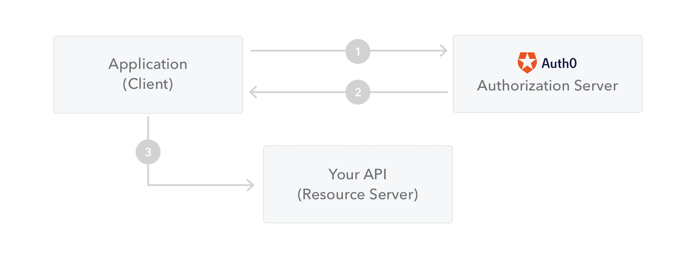
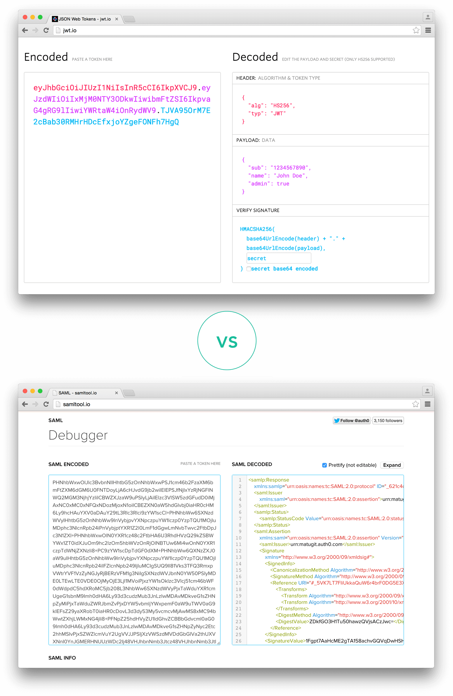
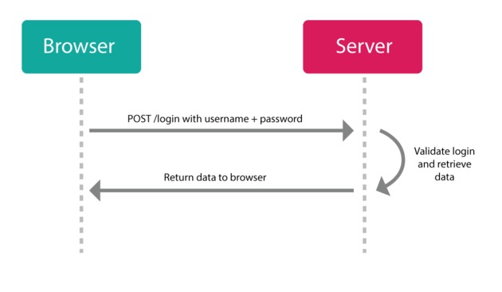
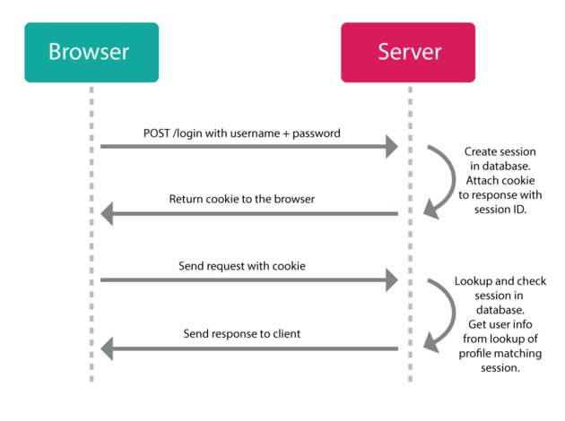

## 简介

&emsp;&emsp;jwt 全称 JSON WEB TOKEN，它的作用是是一套开放的标准（RFC 7519），它定义了一种紧凑且自URL安全的方式，以JSON对象的方式在各方之间安全地进行信息传输。由于此信息是经过数字签名的，因此是可以被验证和信任的。可以使用密钥（secret）（使用HMAC算法）或者使用RSA或ECDSA的公有/私有密钥对JWT进行签名。

&emsp;&emsp;虽然可以对JWT进行加密用来在各方之间提供保密性，但我们还是重点关注下签名的令牌(token)本身，签名的令牌可以验证其中包含的声明的完整性，而加密的令牌则将这些声明在其他方的面前进行隐藏，以提供安全性。当使用公钥/私钥对对令牌进行签名时，签名还可以证明只有持有私钥的一方才是对其进行签名的一方。

## JWT 应用场景

一些常用到JWT的情况：
- 授权：这是使用JWT的最常见方案。一旦用户登录，每个后续请求将包括JWT，从而允许用户访问该令牌允许的路由，服务和资源。单点登录是当今广泛使用JWT的一项功能，因为它的开销很小并且支持跨域。
- 信息交换：JWT是在各方之间安全地传输信息的好方法。因为可以对JWT进行签名（例如，使用公钥/私钥对）。此外，由于签名是使用Header和Payload计算的，因此还可以验证内容是否遭到篡改。

## JWT 数据结构

JSON Web Token以紧凑的形式由三部分组成，这些部分由点（.）分隔，分别是：
- Header
- Payload
- Signature

大致格式如：`xxxxx.yyyyy.zzzzz`

### Header

&emsp;&emsp;Header通常由两部分组成的一个JSON对象：令牌的类型（即JWT）和所使用的签名算法，例如HMAC SHA256或RSA。例如：
```json
{
  "alg": "HS256",
  "typ": "JWT"
}
```
最后，将上面的 JSON 对象使用Base64URL编码（转成字符串作为第一部分。

### Payload

第二部分是包含声明的Payload（有效载荷），声明是有关实体（通常是用户信息）以及一些额外数据的说明，用来传递实际的数据。声明有三种类型：
- **标准注册的声明**：这些是一组非强制性的但建议使用的预定义字段集，用来提供有用、可互操作的声明。以下官方提供的一些字段，完整字段可以[查看标准文档](https://www.iana.org/assignments/jwt/jwt.xhtml)
    - iss: jwt签发者
    - sub: jwt所面向的用户
    - aud: 接收jwt的一方
    - exp: jwt的过期时间，这个过期时间必须要大于签发时间
    - nbf: 定义在什么时间之前，该jwt都是不可用的.
    - iat: jwt的签发时间
    - jti: jwt的唯一身份标识，主要用来作为一次性token,从而回避重放攻击。
- **公共的声明**：这些声明可以由使用JWT的人进行自定义. 但是为了避免冲突，这些声明应该在[IANA JSON Web Token Registry](https://www.iana.org/assignments/jwt/jwt.xhtml)中定义过，或者被定义为包含一个抗冲突名称空间的URI。
- **私有的声明**：这些是自定义的声明，用于在双方同意使用它们的情况下共享信息，而不是注册或公开声明。一般不建议存放敏感信息，因为base64是对称解密的，意味着该部分信息可以归类为明文信息。

例如，定义一个payload：
```json
{
  "sub": "1234567890", // 标准声明
  "name": "John Doe", // 公共声明
  "admin": true  // 自定义
}
```
&emsp;&emsp;然后，同样地对payload进行Base64Url编码，作为JSON Web Token的第二部分。

&emsp;&emsp;对于已签名的令牌(token)，尽管信息可以防止篡改，但任何人都可以读取。除非将其加密，否则请勿将敏感信息放入JWT的Payload或Header元素中。


### Signature

&emsp;&emsp;Signature 部分是对前两部分的签名，防止数据篡改。

&emsp;&emsp;要生成签名部分，需求根据编码的Header，编码的Payload，一个指定的密钥（secret），通过Header指定的算法（默认是HMAC SHA256算法），然后生成签名。

&emsp;&emsp;例如，如果要使用HMAC SHA256算法，则将通过以下方式创建签名：

```js
HMACSHA256(
  base64UrlEncode(header) + "." +
  base64UrlEncode(payload),
  secret)
```


## 生成 JWT

&emsp;&emsp;最后把 Header、Payload、Signature 三个部分拼成一个字符串，每个部分之间用"点"（.）分隔，就可以返回给用户。

&emsp;&emsp;输出是三个由点分隔的Base64-URL字符串，可以在HTML和HTTP环境中轻松传递这些字符串，与基于XML的标准（例如SAML）相比，它更紧凑。

&emsp;&emsp;下面显示了一个JWT，它已对先前的Header和Payload进行了编码，并用一个密钥（secret）进行签名。


```text
eyJhbGci0iJIUzI1NiIsInR5cCI6IkpXVCJ9.
eyJzdWIi0iIxMjMONTY30DkwIiwibmFtZSI6IkpvaG4gRG9lIiwiaXNTb2NpYWwi0nRydWV9.
4pcPyMD89o1PSyXnrXcjTwXyr4BsezdI1AVTmud2fu4
```

如果你想实践下，可以使用[jwt.io.debugger](https://jwt.io/)在线解码、验证及生成JWT。


## Base64URL

&emsp;&emsp;前面提到，Header 和 Payload 串型化的算法是 Base64URL。这个算法跟 Base64 算法基本类似，但有一些小的不同。

&emsp;&emsp;JWT 作为一个令牌（token），有些场合可能会放到 URL（比如 api.example.com/?token=xxx）。Base64 有三个字符+、/和=，在 URL 里面有特殊含义，所以要被替换掉：=被省略、+替换成-，/替换成_ 。这就是 Base64URL 算法。

## JWT如何使用？

&emsp;&emsp;在身份验证中，当用户使用其凭据成功登录后，将返回JSON Web Token。由于令牌（token）是凭据，因此必须格外小心以防止安全问题。通常，令牌的有效时间不应超过要求的时间。

&emsp;&emsp;由于缺乏安全性，也不应该将敏感的会话数据存储在浏览器中。

&emsp;&emsp;当用户想访问受保护的路由或者资源时，用户代理（比如浏览器）需要带上JWT，一般是在请求头里加入Authorization，并加上Bearer标注：
```js
headers: {
    'Authorization': 'Bearer ' + token
}
```
&emsp;&emsp;在某些情况下，这可以是无状态授权机制。服务器的受保护路由将在Authorization标头中检查有效的JWT ，如果存在，则将允许用户访问受保护的资源。如果JWT包含必要的数据，则可以减少查询数据库中某些操作的需求，尽管这种情况并非总是如此。   
&emsp;&emsp;如果令牌是在Authorization标头中发送的，则不会有跨域资源共享（CORS）的问题，因为不使用cookie。  
&emsp;&emsp;另一种做法是，跨域的时候，JWT 就放在 POST 请求的数据体里面。  
&emsp;&emsp;下图显示了如何获取JWT并将其用于访问API或资源：  




1. 应用程序或客户端向授权服务器请求授权。
2. 授予授权后，授权服务器会将访问令牌返回给应用程序。
3. 该应用程序使用访问令牌来访问受保护的资源（例如API）。

## 为什么要使用 JWT

### SWT 和 SAML 对比

&emsp;&emsp;让我们谈谈与简单Web令牌（Simple Web Tokens，SWT）和 安全性声明标记语言令牌（Security Assertion Markup Language Tokens，SAML）相比，JSON Web令牌（JWT）的好处。

&emsp;&emsp;由于JSON不如XML冗长，在编码时JSON的大小也较小，从而使JWT比SAML更为紧凑。这使得JWT是在HTML和HTTP环境中传递的不错的选择。

&emsp;&emsp;在安全方面，SWT只能使用HMAC算法的共享密钥对其进行对称签名。但是，JWT和SAML令牌可以使用X.509证书形式的公用/专用密钥对进行签名。与签名JSON的简单性相比，使用XML数字签名对XML进行签名而不引入一些的安全漏洞是非常困难的。

&emsp;&emsp;JSON解析器在大多数编程语言中都很常见，因为它们直接映射到对象。相反，XML没有自然的文档到对象映射。与SAML断言相比，JWT更加简单易用。

编码的JWT和编码的SAML的长度比较：



### 传统Session/Cookie的认证对比

#### 基于Cookie的身份认证

身份认证的一般流程：



&emsp;&emsp;但是http是无状态协议，这就意味着如果用户向我们的应用提供了用户名和密码来进行用户认证，那么下一次请求时，用户还要再一次进行用户认证才行，因为根据http协议，我们并不能知道是哪个用户发出的请求。
传统的解决方案是创建所谓的“会话（Session）”，会话分为两个部分：
1. 存储在服务端上的对象，用于记住用户是否仍在登录，对其个人资料的引用等。
2. 客户端上的cookie，其中存储了某种ID，可以在服务器上根据会话对象的ID对其进行引用。

身份验证过程如下：



&emsp;&emsp;通过从登录页面向服务端发送用户名/密码组合来创建新会话。如果服务器可以使用该用户名和密码来匹配用户，它将在服务器上生成一个新的会话对象，并在客户端上设置一个带有该会话ID的cookie。后续用户发出的请求需要带上cookie，服务端就可以验证是哪个用户以及验证会话是否有效。

#### 基于Cookie认证的缺点

&emsp;&emsp;以上模式在单机上没有问题。问题在于扩展性不好，存在以下问题：

- 多个服务端：当使用多个后端进行身份验证时，事情可能会变得复杂（例如，可以通过中央应用服务器代理所有请求，然后需要了解每个辅助服务的所有逻辑，或者每个服务都可以实现复杂的服务器间通信（和CORS），以使用中央身份验证服务器验证传入的会话ID。在任何一种情况下，都需要在应用服务器上增加额外的负载，并且需要维护更复杂的互连）。
- 会话：需要存储在内存，数据库或Redis之类的键值存储中的某个位置；并且需要对其进行管理，以使其在到期或无效时被删除。
- 可伸缩性差：扩展服务器时需要扩展会话存储，增加了复杂性。
- 性能问题：当会话需要存储在服务器上时，每个数据库请求都需要进行很多数据库/存储查找，这会使服务器陷入瘫痪。
- CSRF：如果正在使用cookie，则需要额外的安全性来防止跨站点请求攻击，因为cookie会随该站点的任何请求一起自动发送到服务器。
- CORS：Cookie + CORS在不同的域中表现不佳（实际上，真正的跨域根本不起作用）。

而使用JWT，你可以使用应用程序注册自己（与使用老式应用程序几乎相同），然后使用凭据（例如，用户名/密码或第三方OAuth）登录。但是服务器不会进行会话和设置Cookie，而是向你发送JSON Web令牌。然后，你可以使用该令牌来完成对服务器的任何操作。


## 基于 Nodejs + Express 实践


安装：
```shell
npm i jsonwebtoken
```

往客户端发送jwt：
```js
const express = require('express');
const router = express.Router();
const db = require('../utils/db');
const jwt = require('jsonwebtoken');

router.post('/getuser', function (req, res) {
    let mysql = 'SELECT s_id,s_disable FROM o_student WHERE s_tel = ? AND s_password = ?;';
    db(mysql, [req.body.phone, req.body.password], function (err, data) {
        if (err) {
            return res.send({
                code: 500
            })
        }
        if (data.length) {
            return res.send({
                code: 200,
                data: data,
                token: jwt.sign({ data: data[0] }, 'PrivateKey', { expiresIn: '168h' })
            })
        }

    })
})
```

:::details 查看 jwt.sign 类型
```ts
export function sign(
    payload: string | Buffer | object,
    secretOrPrivateKey: Secret,
    options?: SignOptions,
): string;

export type Secret =
    | string
    | Buffer
    | KeyObject
    | { key: string | Buffer; passphrase: string };


export interface SignOptions {
    /**
     * Signature algorithm. Could be one of these values :
     * - HS256:    HMAC using SHA-256 hash algorithm (default)
     * - HS384:    HMAC using SHA-384 hash algorithm
     * - HS512:    HMAC using SHA-512 hash algorithm
     * - RS256:    RSASSA using SHA-256 hash algorithm
     * - RS384:    RSASSA using SHA-384 hash algorithm
     * - RS512:    RSASSA using SHA-512 hash algorithm
     * - ES256:    ECDSA using P-256 curve and SHA-256 hash algorithm
     * - ES384:    ECDSA using P-384 curve and SHA-384 hash algorithm
     * - ES512:    ECDSA using P-521 curve and SHA-512 hash algorithm
     * - none:     No digital signature or MAC value included
     */
    algorithm?: Algorithm | undefined;
    keyid?: string | undefined;
    /** expressed in seconds or a string describing a time span [zeit/ms](https://github.com/zeit/ms.js).  Eg: 60, "2 days", "10h", "7d" */
    expiresIn?: string | number;
    /** expressed in seconds or a string describing a time span [zeit/ms](https://github.com/zeit/ms.js).  Eg: 60, "2 days", "10h", "7d" */
    notBefore?: string | number | undefined;
    audience?: string | string[] | undefined;
    subject?: string | undefined;
    issuer?: string | undefined;
    jwtid?: string | undefined;
    mutatePayload?: boolean | undefined;
    noTimestamp?: boolean | undefined;
    header?: JwtHeader | undefined;
    encoding?: string | undefined;
    allowInsecureKeySizes?: boolean | undefined;
    allowInvalidAsymmetricKeyTypes?: boolean | undefined;
}

// https://github.com/auth0/node-jsonwebtoken#algorithms-supported
export type Algorithm =
    | "HS256"
    | "HS384"
    | "HS512"
    | "RS256"
    | "RS384"
    | "RS512"
    | "ES256"
    | "ES384"
    | "ES512"
    | "PS256"
    | "PS384"
    | "PS512"
    | "none";

// standard names https://www.rfc-editor.org/rfc/rfc7515.html#section-4.1
export interface JwtHeader {
    alg: string | Algorithm;
    typ?: string | undefined;
    cty?: string | undefined;
    crit?: Array<string | Exclude<keyof JwtHeader, "crit">> | undefined;
    kid?: string | undefined;
    jku?: string | undefined;
    x5u?: string | string[] | undefined;
    "x5t#S256"?: string | undefined;
    x5t?: string | undefined;
    x5c?: string | string[] | undefined;
}
```
:::


后台拿到前端的 JWT 进行解密：
```js
const express = require("express");
const router = express.Router();
const jwt = require("jsonwebtoken");
const db = require("./db");

// 拦截所有请求
router.all("*", function (req, res, next) {
	const token = req.headers.token;
   
	if (req.url.startsWith("/login")) {  // 对如果是登录请求进行放行
		next();
	} else if (!token) { // 非登录接口但是请求头不携带token的返回错误
		//没有token
		res.status(401).end();
	} else {
		//非登录接口并且请求头携带token，进行解密token
		jwt.verify(token, "PrivateKey", (err, decoded) => {
			if (err) {
				// res.status(401).send({ msg: 'token错误,验证失败' }).end()
				res.status(401).end();
			} else {
                // token验证成功根据之前保存的信息，查询一遍是不是自己平台的用户
				let sql = "select * from o_student where s_id=" + decoded.data.s_id + ";";
				db(sql, null, function (err, data) {
					if (err) {
						res.status(401).end();
					} else {
						if (data.length) {
							next();
						} else {
							res.status(401).end();
						}
					}
				});
			}
		});
	}
});

module.exports = router;

```

:::details 查看 jwt.verify 类型

```ts
export function verify(token: string, secretOrPublicKey: Secret, options: VerifyOptions & { complete: true }): Jwt;

export type Secret =
    | string
    | Buffer
    | KeyObject
    | { key: string | Buffer; passphrase: string };

// https://github.com/auth0/node-jsonwebtoken#algorithms-supported
export type Algorithm =
    | "HS256"
    | "HS384"
    | "HS512"
    | "RS256"
    | "RS384"
    | "RS512"
    | "ES256"
    | "ES384"
    | "ES512"
    | "PS256"
    | "PS384"
    | "PS512"
    | "none";

export interface VerifyOptions {
    algorithms?: Algorithm[] | undefined;
    audience?: string | RegExp | Array<string | RegExp> | undefined;
    clockTimestamp?: number | undefined;
    clockTolerance?: number | undefined;
    /** return an object with the decoded `{ payload, header, signature }` instead of only the usual content of the payload. */
    complete?: boolean | undefined;
    issuer?: string | string[] | undefined;
    ignoreExpiration?: boolean | undefined;
    ignoreNotBefore?: boolean | undefined;
    jwtid?: string | undefined;
    /**
     * If you want to check `nonce` claim, provide a string value here.
     * It is used on Open ID for the ID Tokens. ([Open ID implementation notes](https://openid.net/specs/openid-connect-core-1_0.html#NonceNotes))
     */
    nonce?: string | undefined;
    subject?: string | undefined;
    maxAge?: string | number | undefined;
    allowInvalidAsymmetricKeyTypes?: boolean | undefined;
}

export interface Jwt {
    header: JwtHeader;
    payload: JwtPayload | string;
    signature: string;
}

// standard names https://www.rfc-editor.org/rfc/rfc7515.html#section-4.1
export interface JwtHeader {
    alg: string | Algorithm;
    typ?: string | undefined;
    cty?: string | undefined;
    crit?: Array<string | Exclude<keyof JwtHeader, "crit">> | undefined;
    kid?: string | undefined;
    jku?: string | undefined;
    x5u?: string | string[] | undefined;
    "x5t#S256"?: string | undefined;
    x5t?: string | undefined;
    x5c?: string | string[] | undefined;
}

// standard claims https://datatracker.ietf.org/doc/html/rfc7519#section-4.1
export interface JwtPayload {
    [key: string]: any;
    iss?: string | undefined;
    sub?: string | undefined;
    aud?: string | string[] | undefined;
    exp?: number | undefined;
    nbf?: number | undefined;
    iat?: number | undefined;
    jti?: string | undefined;
}

```

:::


## 参考连接

- [Introduction to JSON Web Tokens](https://jwt.io/introduction/)
- [base64url介绍](https://base64.guru/standards/base64url)
- [jwt手册](https://auth0.com/resources/ebooks/jwt-handbook)