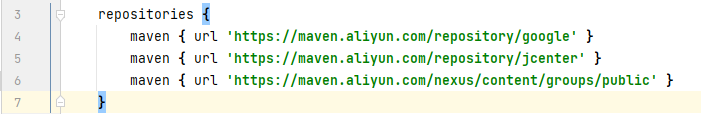

<!-- more -->

错误图：
  
你可以一直等，但是显然这是非常影响开发效率的，下面是解决方案：

首先找到fultter sdk所在文件夹的位置：依次进flutter\packages\flutter_tools\gradle  文件夹，然后打开flutter.gradle文件，如下图：  
    

然后进行以下修改：
1. 60行左右进行第一次修改：
 
```text
repositories {
    /* google()
    mavenCentral()*/
    maven { url 'https://maven.aliyun.com/repository/google' }
    maven { url 'https://maven.aliyun.com/repository/jcenter' }
    maven { url 'https://maven.aliyun.com/nexus/content/groups/public' }
}
```
2. 87行左右进行第二次修改：
 
```text
/* private static final String DEFAULT_MAVEN_HOST = "https://storage.googleapis.com";*/
private static final String DEFAULT_MAVEN_HOST = "https://mirrors.tuna.tsinghua.edu.cn/help/flutter/";
```
3. 回到flutter项目文件中的android/build.gradle
  
修改以下：
  
```text
repositories {
    // google()
    // mavenCentral()
    maven { url 'https://maven.aliyun.com/repository/google' }
    maven { url 'https://maven.aliyun.com/repository/jcenter' }
    maven { url 'https://maven.aliyun.com/nexus/content/groups/public' }
}
```

4. 再次在项目目录路径下终端运行`flutter run`