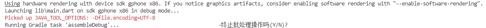
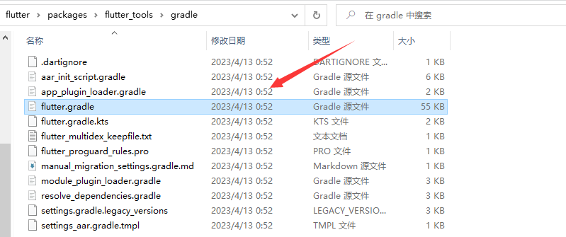
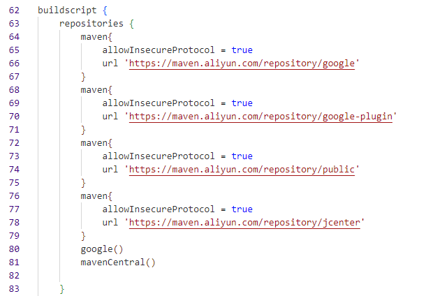
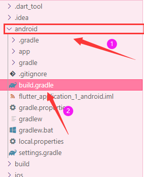
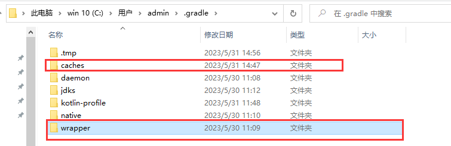
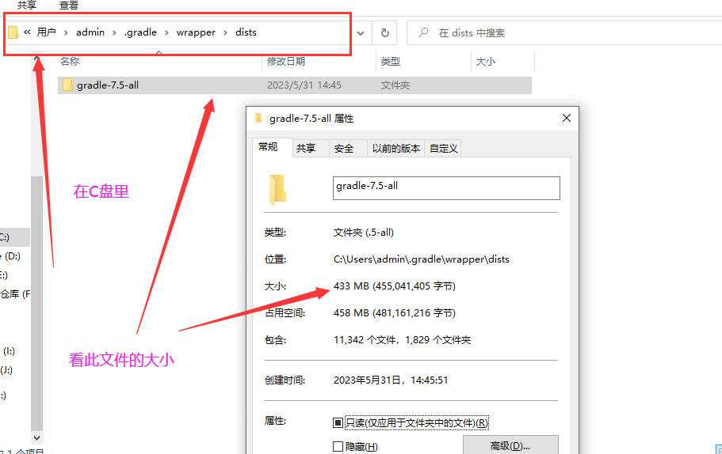
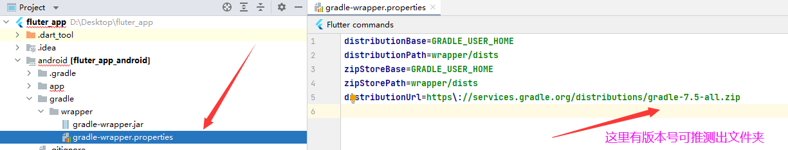

<!-- more -->

错误图：
  
你可以一直等，但是显然这是非常影响开发效率的，下面是解决方案：

首先找到fultter sdk所在文件夹的位置：依次进flutter\packages\flutter_tools\gradle  文件夹，然后打开flutter.gradle文件，如下图：  
    

然后进行以下修改：
1. 60行左右进行第一次修改：
 
```json
repositories {
    maven{
        allowInsecureProtocol = true
        url 'https://maven.aliyun.com/repository/google' 
    }
    maven{
        allowInsecureProtocol = true
        url 'https://maven.aliyun.com/repository/google-plugin' 
    }
    maven{
        allowInsecureProtocol = true
        url 'https://maven.aliyun.com/repository/public' 
    }
    maven{
        allowInsecureProtocol = true
        url 'https://maven.aliyun.com/repository/jcenter'
    }
    google()
    mavenCentral()
}
```
2. 87行左右进行第二次修改：
 
```text
//原镜像
//private static final String DEFAULT_MAVEN_HOST = "https://storage.googleapis.com";
//网上也有人说有这个，但是又说不可用了，所以最好用下面的清华同方或者腾讯云镜像
//private static final String DEFAULT_MAVEN_HOST = "https://storage.flutter-io.cn";
//清华同方镜像
private static final String DEFAULT_MAVEN_HOST = "https://mirrors.tuna.tsinghua.edu.cn/flutter";
//腾讯云镜像
//private static final String DEFAULT_MAVEN_HOST = "https://mirrors.cloud.tencent.com/flutter";
```


3. 回到flutter项目文件中的android/build.gradle
  
修改此文件的两个地方，分别是`buildscript.repositories`和`allprojects.repositories`：
```json
buildscript {
    repositories {
        maven{
            allowInsecureProtocol = true
            url 'https://maven.aliyun.com/repository/google'
        }
        maven{
            allowInsecureProtocol = true
            url 'https://maven.aliyun.com/repository/google-plugin'
        }
        maven{
            allowInsecureProtocol = true
            url 'https://maven.aliyun.com/repository/public'
        }
        maven{
            allowInsecureProtocol = true
            url 'https://maven.aliyun.com/repository/jcenter'
        }
        google()
        mavenCentral()
    }

}

allprojects {
    repositories {
        maven{
            allowInsecureProtocol = true
            url 'https://maven.aliyun.com/repository/google'
        }
        maven{
            allowInsecureProtocol = true
            url 'https://maven.aliyun.com/repository/google-plugin'
        }
        maven{
            allowInsecureProtocol = true
            url 'https://maven.aliyun.com/repository/public'
        }
        maven{
            allowInsecureProtocol = true
            url 'https://maven.aliyun.com/repository/jcenter'
        }
        google()
        mavenCentral()
    }
}
```

4. 再次在项目目录路径下终端运行`flutter run`


若上述步骤都试过无效，删除下面路径的两个文件，分别是`caches`和`wrapper/dists`：


:::warning 注意
上面步骤修改完，无论是AS上运行，还是终端上输入`flutter run`命令，可能还是会觉得有点慢`Running Gradle task 'assembleDebug'`，此时你可以看`wrapper/dists`文件下的文件大小是否在增长，若增长可观，就代码等待一会，一般大小会是400M左右，具体可看下图。
:::

 


有可能你的`wrapper/dists`下有多个文件，你知道看哪一个，可以在项目的android文件夹下要下载哪个文件：
 

还可以可能会提示报错如`Could not get source at xxxx`和`xecution failed for task '':app:checkDebugAarMetadata'`，大致意思意思不能在阿里云获取资源啥的，但是跑一会就莫名奇妙没报错了。以上也是我最终成功跑起来的配置。

上面的方法都是笔者总结出来的，然后最终运行成功：

 