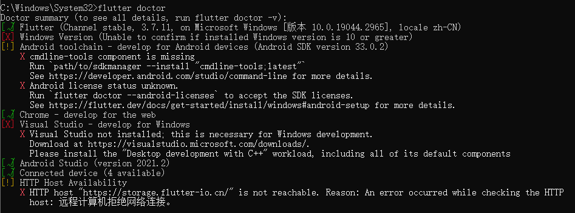
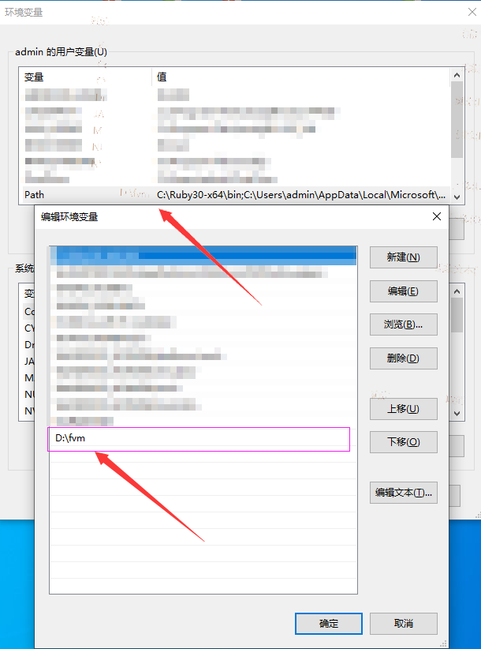
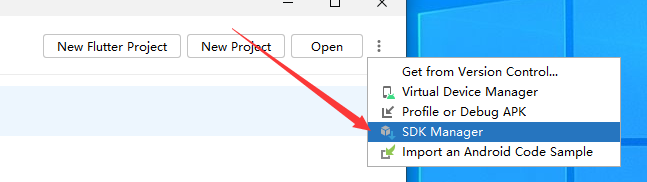
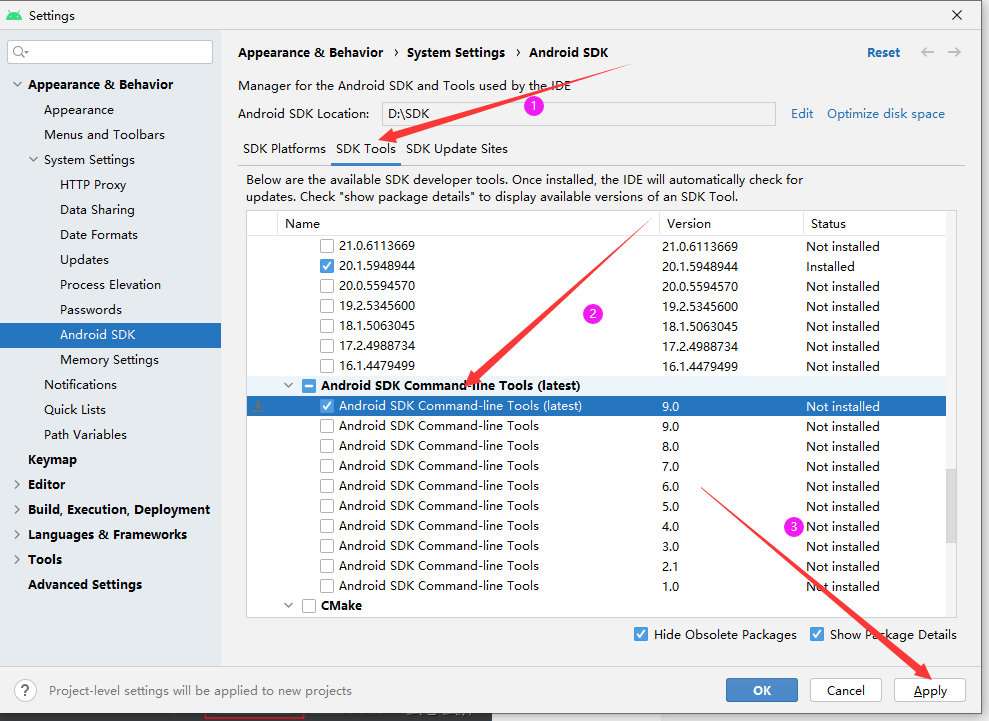
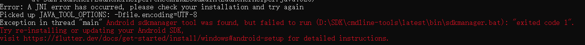
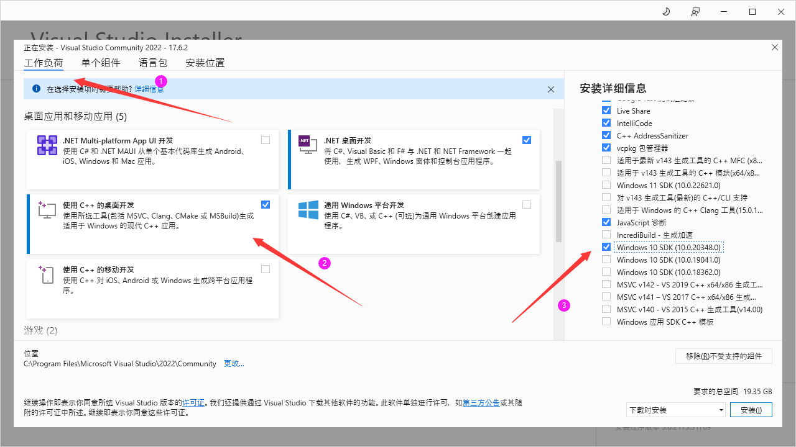
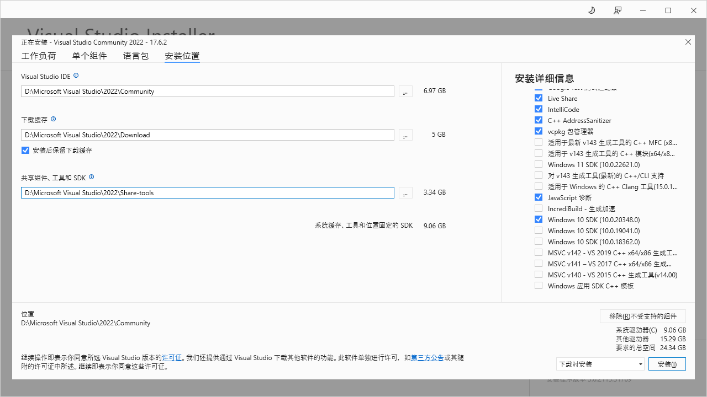

<!-- more -->

报错截图：  



## 解决Windows Version报错
无法确认安装的Windows版本是否为10或更高，解决方案：降低flutter版本（当前版本为3.3.3）

可安装fvm进行flutter版本管理 
1. [下载地址](https://github.com/fluttertools/fvm/releases)，根据自己操作系统进行下载。下载速度慢要么搭梯子，[来此链接下载](https://d.serctl.com/?dl_start)。
2. 桌面左下角搜索框输入`env`后回车
3. 添加你的fvm安装目录到环境变量

4. cmd终端输入`fvm`不报错即代表环境添加成功
5. [fvm参考文档](https://fvm.app/)

```bash
git config --global --unset http.proxy 

git config --global --unset https.proxy 
```


## 解决 Android toolchain 警告

1. 打开SDK管理

2. 找到下图所示，然后进行下载

注意：如果报以下错误，上图版本可以切换试试下载其它版本，笔者不能安装最新版本

3. 终端运行`flutter doctor --android-licenses`，在提示一直输入y后回车都行。

## 解决 Visual Studio 报错

:::warning 注意
若flutter不是用于桌面开发，可以不解决这个问题
:::

1. 下载安装工具，[下载地址Visual Studio](https://visualstudio.microsoft.com/zh-hans/downloads/)
2. 工作负荷tab页，如下操作：

3. 安装位置tab可参考设置，也可以默认路径，然后点击安装(安装按钮在窗口右下角)



## 解决  HTTP Host Availability 报错

1. 打开flutter目录，如`flutter\packages\flutter_tools\lib\src\http_host_validator.dart`
2. 打开`http_host_validator.dart`文件，将`https://maven.google.com/`修改为`https://dl.google.com/dl/android/maven2/`
3. 还是这个文件，将kPubDevHttpHost的值改为`https://pub.flutter-io.cn/`，将kgCloudHttpHost的值改为`https://mirrors.tuna.tsinghua.edu.cn/help/flutter/`。
4. 关闭所有打开了flutterSDK的程序，找到`flutter\bin\cache`目录下的flutter_tools.snapshot文件，永久删除。
5. 重新运行终端执行flutter doctor，自动下载文件，解决问题。


