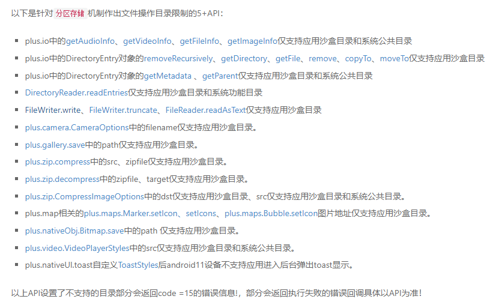
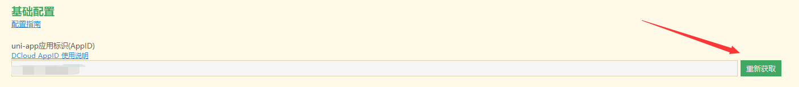
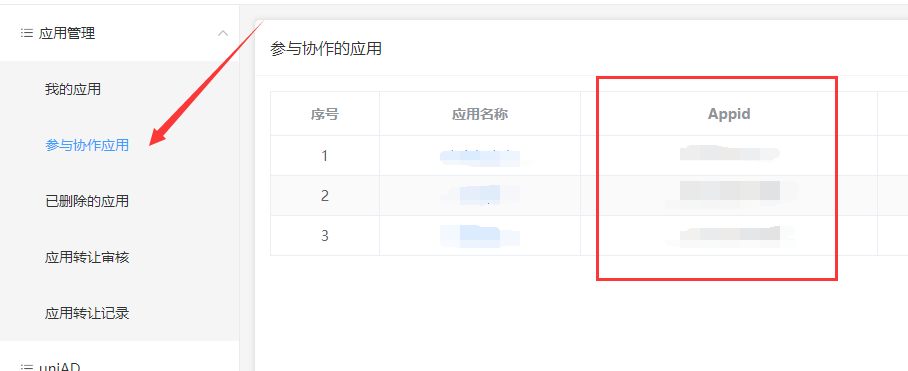

该问题出现场景是开发的uniapp在选取图片的时候，一些手机系统版本在选取图片的时候，勾选原图能够转换成功base64，一些手机版本勾选原图上传图片就会转换base64失败。这个的原因在于手机系统的targetSDKVersion。  
在测试手机中，鸿蒙3勾选原图上传失败，鸿蒙2勾选原图上传成功，magic ui 7上传勾选原图失败。涉及测试机型有华为p40系列，华为meta系列，荣耀magic系列。

下面附出报错提示：
```json
{
    "type": "error",
    "bubbles": false,
    "cancelBubble": false,
    "cancelable": false,
    "lengthComputable": false,
    "loaded": 0,
    "total": 0,
    "target": {
        "fileName": "/storage/emulated/0/DCIM/Camera/1672501955961.jpg",
        "readyState": 2,
        "result": null,
        "error": {
            "code": 15,
            "message": "targetSdkVersion设置>=29后在Android10+系统设备不支持当前路径。请更改为应用运行路径！具体请看:https://ask.dcloud.net.cn/article/36199"
        },
        "onloadstart": null,
        "onprogress": null,
        "onload": null,
        "onabort": null,
        "onerror": "function() { [native code] }",
        "onloadend": "function() { [native code] }"
    }
}
```

使用的组件是uview 1.x版本的上传组件，上传时候勾选原图与不勾选原图返回的参数区别：
- 不勾选原图
```javascript
{
    "path": "file:///storage/emulated/0/Android/data/io.dcloud.HBuilder/apps/HBuilder/doc/uniapp_temp/compressed/1681887063303_1672501955961.jpg",
    "size": 109166
}
```
- 勾选原图
```javascript
{
    "path": "file:///storage/emulated/0/DCIM/Camera/1672501955961.jpg",
    "size": 109166
}
```

从以上path的值不仅看出长短的变化，还看到了路径是从哪里开始变化的，即是从`file:///storage/emulated/0/`后开始变化的。

根据选择完图片后的路径，我们还要借助HTML5+ API的一个函数来帮我们将路径转化为file文件对象。即[resolveLocalFileSystemURL](https://www.html5plus.org/doc/zh_cn/io.html)：通过URL参数获取目录对象或文件对象。

到这里我们再看到上面的报错信息，**targetSdkVersion设置>=29后在Android10+系统设备不支持当前路径**，后面还跟了一个[链接](https://ask.dcloud.net.cn/article/36199)可以打开看看。

在此链接我们可以知道一些概念：
1. 什么是分区存储？为什么要分区存储？哪些系统版本用到了分区存储？
2. 什么是系统公共目录？公共目录的路径示例，什么是应用沙盒目录？
3. 介绍了哪些方法仅能够访问公共目录、仅能够访问应用沙盒目录、系统公共目录和沙盒目录都能够访问。

具体概念可点击[链接](https://ask.dcloud.net.cn/article/36199)查看，这里简单记录一下：

公共目录对照表：
- Downloads 对应的绝对路径 `file:///storage/emulated/0/Download`
- Documents 对应的绝对路径 `file:///storage/emulated/0/Documents`
- Pictures 对应的绝对路径 `file:///storage/emulated/0/Pictures`
- DCIM 对应的绝对路径 `file:///storage/emulated/0/DCIM`
- Movies 对应的绝对路径 `file:///storage/emulated/0/Movies`
- Music 对应的绝对路径 `file:///storage/emulated/0/Music`
- Ringtones 对应的绝对路径 `file:///storage/emulated/0/Ringtones`

应用沙盒目录分为：
- 内部存储空间目录
  - plus.io.PRIVATE_WWW 对应绝对路径 `file:///data/user/0/%PACKAGENAME%/files/apps/%APPID%/www`
  - plus.io.PRIVATE_DOC对应绝对路径 `file:///data/user/0/%PACKAGENAME%/files/apps/%APPID%/doc`
- 外部存储空间目录
  - plus.io.PUBLIC_DOCUMENTS 对应绝对路径 `file:///storage/emulated/0/Android/data/%PACKAGENAME%/.%APPID%/documents`
  - plus.io.PUBLIC_DOWNLOADS 对应绝对路径 `file:///storage/emulated/0/Android/data/%PACKAGENAME%/.%APPID%/downloads`

以及列举了各个方法能够访问的路径：具体可参考[HTML5+ API文档](https://www.html5plus.org/doc/h5p.html)  


根据以上分析，简单来说，就是勾选原图的时候，访问的是公共目录，而`resolveLocalFileSystemURL`这个函数访问不了，不勾选原图的时候，访问的是应用沙盒目录，这时`resolveLocalFileSystemURL`才能访问。

那又如何解决用户能够勾选原图上传呢？这里我们再参考上面图片列举出的方法，然后选择了[plus.zip.CompressImageOptions](https://www.html5plus.org/doc/zh_cn/zip.html#plus.zip.CompressImageOptions)方法，
因为它的参数`src`不仅能够访问到系统公共目录，还能够访问应用沙盒目录，而`dst`可以将压缩后的图片生成到应用沙盒目录里，这时候`resolveLocalFileSystemURL`函数就可以访问经过`plus.zip.CompressImageOptions`函数压缩过后的图片了。

[plus.zip.CompressImageOptions](https://www.html5plus.org/doc/zh_cn/zip.html#plus.zip.CompressImageOptions)函数使用示例，这里不对它的参数做说明，具体点击前面的链接参考：
```javascript
const pathTobase64 = (path)=>{
    const pathArr = path.split("/");
    plus.zip.compressImage(
        {
            src: path,
            dst: "file:///storage/emulated/0/Android/data/io.dcloud.HBuilder/apps/HBuilder/doc/uniapp_temp/compressed/" + pathArr[pathArr.length-1],
            overwrite: true,
            format: "jpg",
            quality: 60,
        },
        success => {
            //压缩成功
            const compressedPath = success.target;
             plus.io.resolveLocalFileSystemURL(compressedPath, entry => {
                entry.file(file => {
                    let fileReader = new plus.io.FileReader();
                    fileReader.onloadend = evt => {
                        console.log(evt.target.result); //转换成功后的base64
                    };
                    fileReader.onerror = error => {
                        console.log("fileReader.onerror error: ",error) //转换失败
                    };
                },error =>{
                    console.log("entry.file error: ",error)
                })
             }, error =>{
                console.log("plus.io.resolveLocalFileSystemURL error: ",error)
             })
        },
        error => {
            //压缩失败
        }
    )
}
```


到这里如果你成功了，本地真机测试没问题了，但是如果你一打正式包再测试，那就会出问题了，为什么呢，原因很简单，从上面的方法中也看到，压缩后的输出路径是有问题的，  
本地你再怎么测试，`file:///storage/emulated/0/Android/data/io.dcloud.HBuilder/`路径下都是没问题的，  
但是你一打包再测试，应用的沙盒路径就不是这个路径了，而是`file:///storage/emulated/0/Android/data/uni.你的appid/`，这里的`uni.你的appid`就是你打包过后的apk包名，而你测试的apk包名都是`io.dcloud.HBuilder`。
[关于apk包名说明链接](https://uniapp.dcloud.net.cn/tutorial/run/run-app.html#%E5%9F%BA%E5%BA%A7%E9%97%AA%E9%80%80%E8%8E%B7%E5%8F%96%E6%97%A5%E5%BF%97)，如果你不喜欢打包后的apk报名，你还可以自定义基座，具体的自己研究，要用到Android studio。

言归正传，所以有些开发者可能就想，那改成`file:///storage/emulated/0/Android/data/uni.你的appid/`不就行了吗？答案也是不建议的：
1. 直接改是可以，但是万一你后面接收的人不知道这个问题的，那就会debug很久才找出这个原因。
2. 还有就是apk包名是基于`uni.你的appid`，如果有开发者在打包时候，在`manifest.json`文件里不小心点击了重新获取appid，那打包后的路径也是错的。   
      
在这里也普及一下，公司开发的app，最好归到公司的账号名下，不要以自己账号来创建应用，你作为协同开发者就行了，与原生微信小程序一样的道理，[DCloud开发者中心登录](https://dev.dcloud.net.cn/pages/common/login)，

在这里也可以看到appid，所以一般不要在`manifest.json`文件里点击重新获取，否则可能app就归到你自己账号名下了。    
    


所以，压缩后的路径我们就需要动态获取，依靠[requestFileSystem](https://www.html5plus.org/doc/zh_cn/io.html#plus.io.requestFileSystem)函数。  
修改后的代码：
```javascript
const pathTobase64 = (path)=>{
    plus.io.requestFileSystem(plus.io.PRIVATE_DOC,
        res => {
            const pathArr = path.split("/");
            plus.zip.compressImage(
                {
                    src: path,
                    dst: res.root.fullPath + pathArr[pathArr.length-1],
                    overwrite: true,
                    format: "jpg",
                    quality: 60,
                },
                success => {
                    //压缩成功
                    const compressedPath = success.target;
                    plus.io.resolveLocalFileSystemURL(compressedPath, entry => {
                        entry.file(file => {
                            let fileReader = new plus.io.FileReader();
                            fileReader.onloadend = evt => {
                                console.log(evt.target.result); //转换成功后的base64
                            };
                            fileReader.onerror = error => {
                                console.log("fileReader.onerror error: ",error) //转换失败
                            };
                        },error =>{
                            console.log("entry.file error: ",error)
                        })
                    }, error =>{
                        console.log("plus.io.resolveLocalFileSystemURL error: ",error)
                    })
                },
                error => {
                    //压缩失败
                }
            )
        },
        error => {
            console.log("plus.io.requestFileSystem error: ",error)
        }
    )
}
```

至此这个错误就相对完美解决了