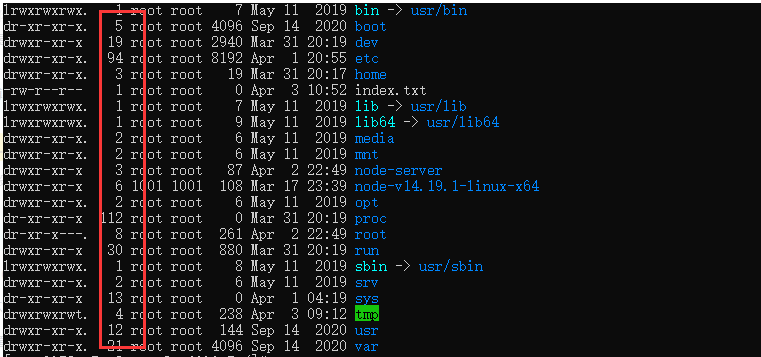
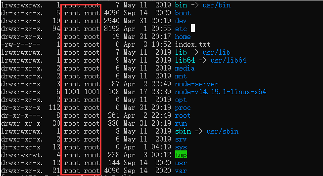
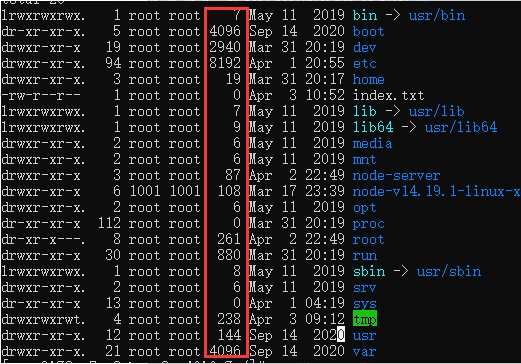
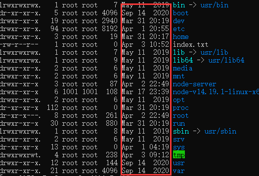
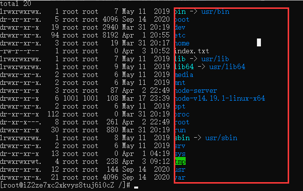
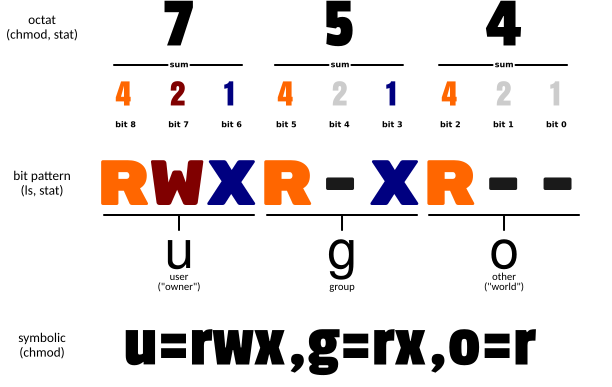

<!-- more -->

## 常用命令
### 操作系统命令

1. `ls`查看当前文件下的文件
2. `ls -l`或简写`ll`，列举文件且查看每个文件的文件信息
3. `pwd`获取当前路径
4. `cd ..`返回上级路径
5. `mkdir xxx`创建文件夹
6. `touch xxx.js`创建文件
7. `cd xxx`打开某一文件
8. `vim xxx.js`编辑某一文件，`i`开启编辑模式，`按ese`退出编辑模式，`wq`保存并退出
9. `wget 网址`根据这个网址下载东西
10. `cd ~`
11. `cd etc`配置环境变量在这里配置
12. `vim profile`编辑profile文件，然后`esc`取消编辑，`:wq`保存并退出，`source profile`重启环境变量配置文件
13. `echo $path`查看系统的环境变量，以`:`进行分隔环境变量
14. `adduser xxx`创建新用户
15. `passwd xxx`为该用户设置密码
16. `chmod 777 index.txt`创建index.js文件，此创建文件方式，所有用户权限都是一样的，777涵义看下面文件权限的说明。
17. `cat index.txt`查看index.txt文件中的内容
18. `sudo`提升当面指令操作权限
19. `rm [选项] 文件名`：如`sudo rm -rf file`

rm的选项参数：
-f，--force，强制删除，不需要确认
-i，每删除一个文件或进入一个子目录都要求确认
-l，在删除超过三个文件或者递归删除前要求确认
-r，-R递归删除子目录
-d，--dir  删除空目录
-v，-verbose 显示删除结果

`rm -rf [path]`——删除某个文件夹

20. `mv 原文件名 新文件名`重命名文件
21. `mv nginx /usr/local/`将nginx文件移动到`ur/local`路径下
22. `ps -ef | grep nginx`查找有关nginx的进程
23. `kill -9 进程号`杀死指定进程
24. `netstat -ntlp |grep 80` 查询端口进程，，如没有提示则：`yum install net-tools`，`kill 20246`

### 解压命令tar

1. `-c`压缩。
2. `-x`解压。
3. `-t`：查看内容
4. `-r`：向压缩归纳文件末尾追加文件
5. `-u`：更新原压缩包中的文件
6. `-z`：有gzip属性的
7. `-j`：有bz2属性的
8. `-Z`：有compress属性的
9. `-v`：显示所有过程
10. `-O`：将文件解开到标准输出
11. `-f`：使用档案名字，这个参数是最后一个参数，后面只能接档案名

使用示例：

1. tar -cf all.tar tar *.jpg——将所有.jpg文件打成一个名为all.tar的包。-c是表示产生新的包，-f指定包的文件名。
2. tar -rf all.tar *.gif——将所有.gif的文件增加到all.tar的包里面去。-r是表示增加文件的意思。
3. tar -uf all.tar logo.gif——更新原来tar包all.tar中的logo.gif文件，-u表示更新文件的意思。
4. tar -tf all.tar——列出all.tar包中所有的文件，-t是列出文件的意思。
5. tar -xf all.tar——接出all.tar包中所有的文件，-x是解开的意思。

压缩：

1. tar -cvf jpg.tar *.jpg ——将目录所有jpg文件打包成tar.jpg。
2. tar -czf jpg.tar.gz *.jpg ——将目录里所有jpg文件打包成jpg.tar后，并且将其用gzip压缩，生成一个gzip压缩过的包，命名为jpg.tar.gz
3. tar -cjf jpg.tar.bz2 *.jpg —— 将目录里所有jpg文件打包成jpg.tar后，并且将其用bzip2压缩，生成一个bzip压缩过的包，命名为jpg.tar.bz2
4. tar -cZf jpg.tar.Z *.jpg——将目录里所有jpg文件打包成jpg.tar后，并且将其用compress压缩，生成一个umcompress压缩过的包，命名为jpg.tar.Z
5. rar a jpg.rar *.jpg——rar格式的压缩，需要先下载rar for Linux
6. zip jpg.zip *.jpg——zip格式的压缩，需要先下载zip for Linux

解压：

1. tar -xvf file.tar——解压tar包
2. tar -xzvf file.tar.gz ——解压tar.gz
3. tar -xjvf file.tar.bz2——解压tar.bz2
4. tar -xZvf file.tar.Z——解压tar.Z
5. unrar e file.rar——解压rar
6. unzip file.zip——解压zip

解压node压缩包：`tar -xvf node-v14.19.1-linux-x64.tar.xz`

## Linux文件属性
`ls -l`打印出文件和文件信息

1. `-`开头代表文件的意思，如`index.txt`文件
2. `d`开头代表的是文件夹的意思
3. `l`开头代表超级链接的意思，指向后面的路径,通俗讲就是快捷方式的意思
4. `b`开头代表U盘的意思
5. `c`开头代表鼠标键盘等硬件

**文件属性解读：**
如某文件是：`-rw-r--r--`，以每三个为一组，那拆分出来的就是：`rw-`、`r--`、`r--`
第一组代表的意思是：该文件创建者的所属权限。
第二组代表的意思是：该文件所在用户组的权限。
第三组代表的意思是：该文件所在其它用户权限。

`r`代表的是可读
`w`代表的是可写
`x`代表的是可执行
如果不可执行就不会显示x

第二行的数量 代表你有多少文件 和目录里面有多少文件

第三行表示
创建该文件用户的名字  第二个是改文件所属用户组的名字
第一个就是用户名 第二个就是组名

第四行表示改文件和文件夹所属的体积

第五行表示 创建该文件的日期

第六行代表的就是文件或者文件夹等一系列的名称

# Linux文件权限
若此时创建一个文件`chmod 777 index.txt`，那么此时index.txt文件所有用户都是读读写的。
777的涵义是什么？由上面我们知道，r代表可读，w代表可写，x代表可执行，其中r又可以用4代替，w可以用2代表，1代表的可执行。也就是说，4+2+1=7，就是可读可写可执行。3个7代表了归属，其它用户和群组

## Linux防火墙
### 1、firewalld的基本使用

- systemctl start firewalld——启动防火墙
- systemctl status firewalld——查看防火墙状态
- systemctl stop firewalld——关闭防火墙
- systemctl disable firewalld——禁用防火墙

### 2、systemctl基本使用

- 启动一个服务：systemctl start firewalld.service
- 关闭一个服务：systemctl stop firewalld.service
- 重启一个服务：systemctl restart firewalld.service
- 显示一个服务的状态：systemctl status firewalld.service
- 在开机时启用一个服务：systemctl enable firewalld.service
- 在开机时禁用一个服务：systemctl disable firewalld.service
- 查看服务是否开机启动：systemctl is-enabled firewalld.service
- 查看已启动的服务列表：systemctl list-unit-files|grep enabled
- 查看启动失败的服务列表：systemctl --failed

 
### 3、firewalld-cmd基本命令

- 查看版本： firewall-cmd --version
- 查看帮助： firewall-cmd --help
- 显示状态： firewall-cmd --state
- 查看所有打开的端口： firewall-cmd --zone=public --list-ports
- 更新防火墙规则： firewall-cmd --reload
- 查看区域信息:  firewall-cmd --get-active-zones
- 查看指定接口所属区域： firewall-cmd --get-zone-of-interface=eth0
- 拒绝所有包：firewall-cmd --panic-on
- 取消拒绝状态： firewall-cmd --panic-off
- 查看是否拒绝： firewall-cmd --query-panic
- 添加80端口：firewall-cmd --zone=public --add-port=80/tcp --permanent    （--permanent永久生效，没有此参数重启后失效）
- 重新载入：firewall-cmd --reload
- 查看80端口：firewall-cmd --zone= public --query-port=80/tcp
- 删除80端口：firewall-cmd --zone= public --remove-port=80/tcp --permanent

## 下载OpenSSH（选看）
windows下需要下载工具：[OpenSSH](http://www.mls-software.com/opensshd.html)。  
mac电脑自带，无需下载。

## 连接服务器
在终端输入以下命令后回车：
`ssh 用户名@公网IP地址`
如：`ssh root@101.xx.xx.xx`

回车后就会提示你输入连接密码，输入密码后继续回车，若显示`[用户名@xxxx]`则证明连接成功。

