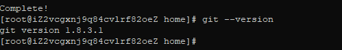
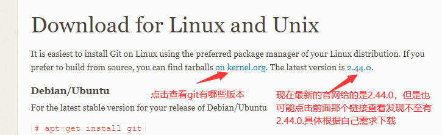
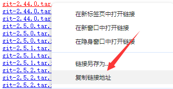
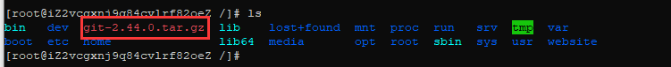
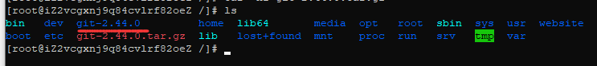

:::info 摘要
通过本文学习如何在Centos上安装Git
:::


在Centos系统上安装Git，可以通过Yum源安装或从代码编译安装。本文将介绍两种安装方式。


## 1 通过Yum源安装

1. 使用`yum remove git`命令卸载已有的Git版本，确保系统上不再安装有Git。
2. 然后通过`yum install git -y`命令安装Git及其依赖项，如`curl-devel`、`expat-devel`、`gettext-devel`、`openssl-devel`、`zlib-devel`等；
3. 等待安装成功后，可以通过运行`git --version`命令来检查Git是否安装成功，如果显示Git版本号，则说明Git已成功安装。




## 2 通过源代码编译安装

从源代码编译安装这个过程是个非常繁琐且复杂的过程，它需要你手动下载源代码，然后解压、编译、安装、添加环境变量等操作，因此一般清空下建议直接用`yum install git -y`来进行安装，并且会直接为你安装最新版本的Git。

但是，通过学习源代码编译安装也是有好处的，它可以帮助你在的你服务器上安装指定版本的Git，避免因为新版本的不稳定特性影响使用，通过一个一个步骤，也会让你明白，安装一个软件需要配置哪些东西。

从源代码编译安装。首先，需要更新系统软件包和存储库：
1. 使用`sudo yum update -y`命令可以进行更新操作；
2. 然后，安装必要的依赖项，`yum install curl-devel expat-devel gettext-devel openssl-devel zlib-devel gcc perl-ExtUtils-MakeMaker -y`
3. 下载git，可以先看一下目前git有哪些版本和官网给出的最新版本，[点击跳转到Git官网](https://git-scm.com/download/linux)，如下图：  
   
4. 选择你想要下载的版本，但是需要注意的是，只有是`git-xx.xx.xx.tar.gz`这种格式才是你该选择的，以最新的版本号：`git-2.44.0.tar.gz`为例，我们右键选择`复制链接`，如下图：  
   
5. 回到连接的服务器终端，推荐可以下载到根目录下进行操作，`cd /`，然后`wget 你复制的链接`如输入`wget https://mirrors.edge.kernel.org/pub/software/scm/git/git-2.44.0.tar.gz`回车后开始下载：  
   
6. 等待下载完成，输入`ls`可以看到下载的文件：  
   
7. 解压。输入`tar -xf git-2.44.0.tar.gz`开始解压，解压完成后再输入`ls`看到`git-2.44.0`就是解压完成的：  
   
8. 解压完成后，进入目录`cd git-2.44.0`，在该目录里输入`make prefix=/usr/local/git all`命令编译git，再输入`make prefix=/usr/local/git install`命令安装git，安装路径为`/usr/local/git`，然后等待编译完成。
9. 添加环境变量：`echo "export PATH=$PATH:/usr/local/git/bin" >> /etc/profile`，将git的bin添加到系统环境变量中去。
10. 重启环境变量使我们刚刚的配置生效：`source /etc/profile`
11. 检查是否安装成功，输入`git --version`看是否能够打印出git版本号，能够打印出来代表安装完成
12. 删除编译资源和下载的git压缩包：`rm -rf git-2.44.0 git-2.44.0.tar.gz`，如下图：  
    

至此，你的git已安装完成。


## 3 Git配置

```bash
# 配置用户名 和邮箱

# 在使用 Git 之前，需要先配置用户名和邮箱，这样在提交代码时，Git 就知道是谁提交的了。可以使用以下命令来配置：

git config --global user.name "Your Name"
git config --global user.email "your_email@example.com"
# 其中，--global 表示全局配置，即对所有 Git 仓库生效。如果只想对当前仓库生效，可以去掉 --global 参数。

# 配置完成后，可以使用以下命令来查看配置信息：


git config --list
# 如果需要修改配置信息，可以再次运行上述命令并修改对应的值即可。
```