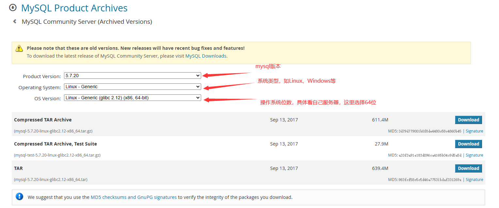
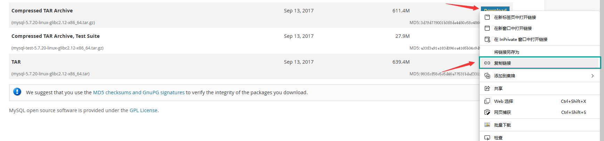
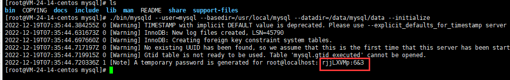
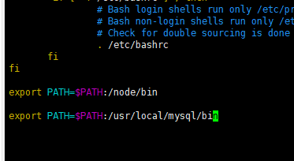
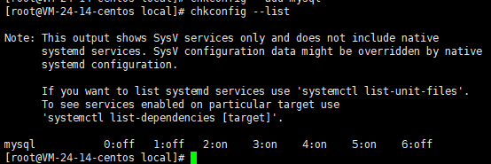
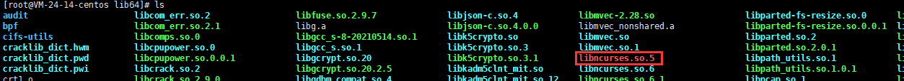
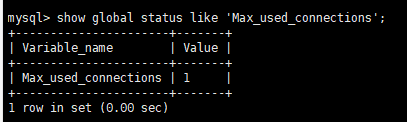

<!-- more -->


:::tip 注意
此教程使用的操作系统是，Centos 8，不同版本可能有些许差异，请尽量与本教程采用一致的版本。
:::


## tar方式安装
### 1、选择下载版本
[选择下载版本链接](https://downloads.mysql.com/archives/community/)


选择“**Compressed TAR Archive**”右键下载，然后复制链接：


### 2、下载解压mysql

进入Centos：
下载：
`wget https://downloads.mysql.com/archives/get/p/23/file/mysql-5.7.20-linux-glibc2.12-x86_64.tar.gz`

解压：
`tar -zxvf mysql-5.7.20-linux-glibc2.12-x86_64.tar.gz`

重命名文件：
`mv mysql-5.7.20-linux-glibc2.12-x86_64.tar.gz mysql`

移动文件：
`mv mysql /usr/local/`

### 3、创建mysql用户
首先删除系统已有的mysql：
```c
#删除mariadb
# rpm -qa|grep mariadb
mariadb-libs-5.5.68-1.el7.x86_64
# rpm -e --nodeps mariadb-libs-5.5.68-1.el7.x86_64
#和删除mariadb一样，列出了多少个，就一个个通过：rmp -e --nodeps来删除
# rpm -qa|grep mysql

```
创建一个不需要登录的mysql账号，给对应的目录授予权限。
```c
# 创建不需要登录的一个mysql账号，启动MySQL服务时会使用该账号
# groupadd mysql
# useradd -r -g mysql -s /bin/false mysql
#与上面作用一样 useradd -r -g mysql -s /sbin/nologin mysql
#授予权限——返回到 /usr/local
# mkdir -p /data/mysql
# chown -R mysql:mysql /usr/local/mysql
# chown -R mysql:mysql /data/mysql

```

### 4、安装依赖
`yum -y install libaio`

### 5、初始化
1、`cd /usr/local/mysql`
2、`./bin/mysqld --user=mysql --basedir=/usr/local/mysql --datadir=/data/mysql/data --initialize`
初始化的时候会显示初始的root账户密码，如下红框所示。`rjjLXVMp:6&3`即为默认root账户密码：


### 6、添加环境变量
1、`cd /etc`
2、`vim profile`，点击`i`进入编辑模式
3、`export PATH=$PATH:/usr/local/mysql/bin`

还有就是变量的写法：
```c
export MYSQL_HOME=/usr/local/mysql
export PATH=$PATH:${MYSQL_HOME}/bin
```
4、输完后点击`esc`退出编辑模式，再次输入`:wq`保存并退出
5、运行`source profile`重新加载环境变量配置文件

### 7、添加到系统服务
```c
[root@mother-board mysql]# cd support-files
#修改mysql.server中的basedir、datadir、mysqld_pid_file_path对应的值
[root@mother-board support-files]# vim mysql.server
basedir=/usr/local/mysql
datadir=/data/mysql/data
mysqld_pid_file_path=/data/mysql/mysql.pid

```


### 8、设置开机启动
```c
#启动mysql，设置开机启动
[root@mother-board support-files]# cp mysql.server /etc/init.d/mysql
[root@mother-board support-files]# chmod 755 /etc/init.d/mysql
[root@mother-board support-files]# service mysql start
[root@mother-board support-files]# chkconfig --add mysql
[root@mother-board support-files]# chkconfig --list

```


### 9、登录mysql
`mysql -u root -p`
可能遇到的报错：
1、
```c
mysql: error while loading shared libraries: libncurses.so.5: cannot open shared object file: No such file or directory
```
解决方式：`ln -s libncurses.so.6.1 libncurses.so.5`，创建一个软链接
注意：可能你的电脑并不一定是`libncurses.so.6.1`，正如我网上找的教程是`libncurses.so.6.2`，需要自己看看，具体方法：`cd /usr/lib64`，然后`ls`查看文件。
如果软件链接创建错误，在`ls`的时候会标红：

可以选择删掉，如：`sudo rm -rf libncurses.so.5`

2、
```c
mysql: error while loading shared libraries: libtinfo.so.5: cannot open shared object file: No such file or directory
```
解决方式：`sudo ln -s /usr/lib64/libtinfo.so.6.1 /usr/lib64/libtinfo.so.5`
注意事项同上

### 10、修改密码

1. `mysql -u root -p`
2. 输入密码，第一次是你初始化时候看到的密码，我这里是：`rjjLXVMp:6&3`
3. 修改密码：`alter user 'root'@'localhost' identified by 'qyxcmysql';`

`alter user '用户名'@'localhost' identified by '新密码';`，记得一定要带上分号，但新密码默认不能过于简单。
但可以敲入以下命令来取消约束：
`set global validate_password_policy=0;`
`set global validate_password_length=1;`

4. 


### 11、远程访问
```c
mysql> use mysql
Reading table information for completion of table and column names
You can turn off this feature to get a quicker startup with -A

Database changed
mysql> select host,user from user;
+-----------+---------------+
| host      | user          |
+-----------+---------------+
| localhost | mysql.session |
| localhost | mysql.sys     |
| localhost | root          |
+-----------+---------------+
3 rows in set (0.00 sec)

mysql> update user set host = '%' where user = 'root';
Query OK, 1 row affected (0.00 sec)
Rows matched: 1  Changed: 1  Warnings: 0

mysql> flush privileges;
Query OK, 0 rows affected (0.00 sec)

mysql> select host,user from user;
+-----------+---------------+
| host      | user          |
+-----------+---------------+
| %         | root          |
| localhost | mysql.session |
| localhost | mysql.sys     |
+-----------+---------------+
3 rows in set (0.00 sec)

mysql>
```
此方法是修改root连接方式进行远程连接。

```c
mysql> grant all privileges on *.* to 'remote'@'%' identified by 'remotemysql' with grant option;
Query OK, 0 rows affected, 1 warning (0.00 sec)

mysql> select host,user from user;
+-----------+---------------+
| host      | user          |
+-----------+---------------+
| %         | remote        |
| %         | root          |
| localhost | mysql.session |
| localhost | mysql.sys     |
+-----------+---------------+
4 rows in set (0.00 sec)

mysql> flush privileges;
Query OK, 0 rows affected (0.00 sec)

mysql>

```
此方法是添加一个新用户可以进行远程连接
### 12、配置防火墙

1. `systemctl start firewalld`——打开防火墙
2. `firewall-cmd --zone=public --list-ports`——查看所有已打开的端口
3. `firewall-cmd --zone=public --add-port=3306/tcp --permanent`——添加3306端口，显示为success即代表设置成功
4. `systemctl restart firewalld.service`——重启防火墙
5. 重启完可以再用第二条命令查看所有已打开的端口。注：刚设置完查看也看不到的，需要重启防火墙再查看

### 12、设置连接数

1. 查询当前连接数：`show global status like 'Max_used_connections';`



2. 设置最大连接数：
   1. 第一种方法

此方法重启后失效：
` set GLOBAL max_connections=1000;`

   2. 第二种方法：

修改`my.cnf`文件添加如下配置(注意：最大连接数不要设置过大，有可能会在启动的时候爆掉哦)，然后执行命令：`service mysql restart`
`max_connections=1000`

### 13、退出mysql
`quit`回车

