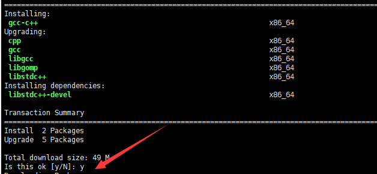
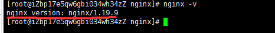
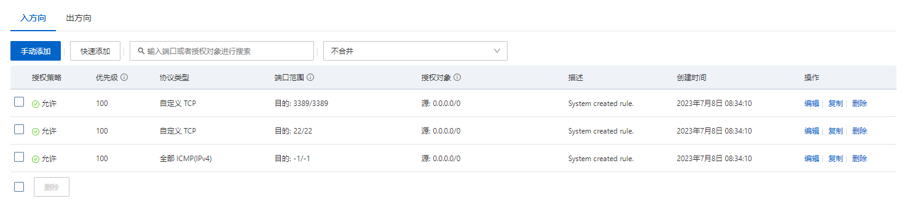
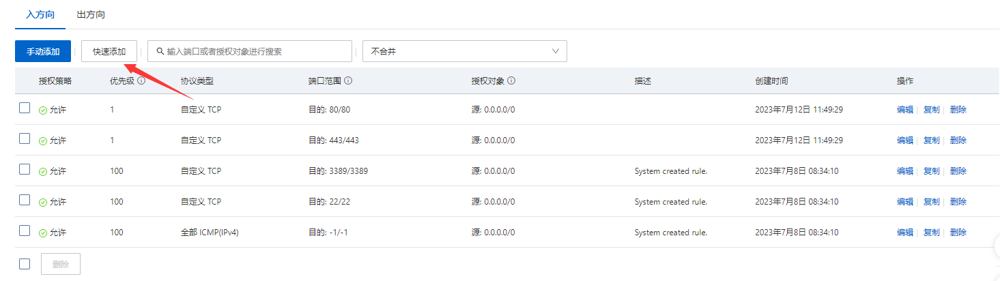
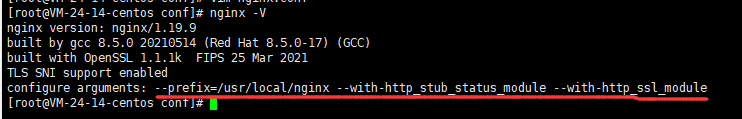

通过此文章，你将学会如何在服务器为Centos下安装nginx。

<!-- more -->


了解此文章的前置知识是需要了解[nginx常用命令](../nginx.md)

## 安装编译Nginx依赖

**1、安装gcc**

安装Nginx需要先将官网下载的源码进行编译，编译依赖gcc环境，如果没有gcc环境，则需要安装：

`yum install gcc-c++`

不然可能就会报错：`Invalid C++ compiler or C++ compiler flags.`

中途可能会让你选择`y/n`，按`y`后回车即可。 



**2、PCRE pcre-devel安装**

PCRE是一个（Perl Compatible Regular Expressions）是一个Perl库，包括perl兼容的正则表达式。nginx的http模块使用pcre来解析正则表达式，所以需要在linux上安装pcre库，pcre-devel是使用pcre开发的一个二次开发库。nginx也需要此库。命令：

`yum install -y pcre pcre-devel`

不然可能报错：`the HTTP rewrite module requires the PCRE library.`

**3、zlib安装**

zlib库提供了很多种压缩喝解压缩的方式，nginx使用zlib对http包的内容进行gzip，所以需要在Centos上安装zlib库。

`yum install -y zlib zlib-devel`

不然可能报错：`the HTTP gzip module requires the zlib library.`

**4、OpenSSL安装**

OpenSSL是一个强大的安全套接字层密码库，囊括主要的密码算法、常用的密钥和证书封装管理功能及SSL协议，并提供丰富的应用程序供测试或其它目的使用。

nginx不仅支持http协议，还支持https（即在ssl协议上传输http），所以需要在Centos安装OpenSSL库。

`yum install -y openssl openssl-devel`


## 下载安装运行Nginx
**1、下载Nginx**

`wget https://nginx.org/download/nginx-1.19.9.tar.gz`

**2、解压Nginx**

`tar -zxvf nginx-1.19.9.tar.gz`

**3、执行configure文件**

`cd nginx-1.19.9 && ./configure`


**4、make命令编译**
执行完后会有一个MakeFile文件

make是一个命令工具，它解释MakeFile中的指令（应该说是规则）。在Makefile文件中描述了整个工程所有文件的编译顺序、编译规则。

`make`

`make install`

**5、查询Nginx安装目录**

`whereis nginx`

**6、执行Nginx**

根据以上方法进入Nginx安装路径，参考路径：`/usr/local/nginx`

进入sbin文件：`cd sbin`

执行Nginx：`./nginx`

**7、关于Nginx更多命令在Centos下的命令**

- 关于命令输入
如果你是在`/usr/local/nginx`目录下，启动Nginx的命令为：`./sbin/nginx`

但是如果是在`/usr/local/nginx/sbin`目录下，启动Nginx的命令为：`./nginx`

由此可见，有没有`sbin`取决于你在哪一级的目录

- 查看nginx是否运行成功
`ps -ef | grep nginx`

- 维护命令
`cd /usr/local/nginx`——进入安装路径

`./sbin/nginx`——启动命令

`./sbin/nginx -s reload`——重载

`./sbin/nginx -s stop`——关闭

`./sbin/nginx -s quit`——优雅关闭（当请求被处理完成之后才关闭）

**8、配置Nginx环境变量**

上一步骤可以看到，`./路径名/路径名`非常的繁琐，但我们可以通过环境变量来配置一下，使得我们可以像在window下使用命令，如`nginx -s reload`——重载配置文件、`nginx -s quit`——优雅地停止、`nginx -v`——查看版本号。

而且这个命令的使用不管你在哪个路径下都可以使用

1. 回到根目录：`cd /`，打开环境变量配置文件：`vim profile`，
2. 添加环境变量：`export PATH=$PATH:/usr/local/nginx/sbin`，然后按`esc`退出编辑模式，按`:wq`保存并推出预览模式
3. 重新加载环境变量：`source profile`
4. 此时你再输入`nginx -V`，如果显示版本号，说明环境变量已经生效了。


注意点：虽然我这里的环境变量是`export PATH=$PATH:/usr/local/nginx/sbin`，因为这是我的nginx安装路径下的sbin文件夹里面，实际路径要看你安装的路径在哪里，也可能你不是安装的默认路径，此时环境变量这里的路径需要灵活变动。


**9、多个环境变量**

`export PATH=$PATH:/node-v14.19.1-linux-x64/bin:/usr/local/nginx/sbin`

修改完环境变量记得运行`source profile`重新加载环境变量配置文件。

此时`nginx -v`即可打印出nginx的版本号

## yum404解决方案
该情况可能出现在Centos7，而Centos 8应该是不会出现的，如果出现了可以安装下面的方式试试：
```c
// 进入配置文件夹
cd /etc/yum.repos.d/
// 删除旧的配置文件
rm *.repo
// 输入“y”回车确认
```

使用ls命令确保该目录下的.repo文件已完全删除

下载可以用的.repo文件

`wget -O /etc/yum.repos.d/CentOS-Base.repo https://mirrors.aliyun.com/repo/Centos-vault-8.5.2111.repo`

如果你没有安装wget，也可以用下面的命令：

`curl -o /etc/yum.repos.d/CentOS-Base.repo https://mirrors.aliyun.com/repo/Centos-vault-8.5.2111.repo`

运行yum makecache生成缓存

`yum makecache`


**10、访问我们的页面**

通过上述步骤，相信你已经学会学会安装nginx和启动nginx了，这一步，将让你可以在你的电脑上，通过公网IP地址或域名访问我们的页面。

注：默认安装好后，nginx里面的html文件夹下是有两个文件的。方便我们验证nginx是否启动成功。

当你成功启动nginx后，上面也说到了，访问页面可以在本机通过公网IP地址或域名访问到我们的页面。这里同样有几个注意点：

域名解析注意点：
- 如果通过域名访问，你需要购买域名、域名备案、备案完成后添加域名解析记录解析你的服务器IP地址。
- 域名备案这个过程需要先买服务器才能进行备案，因为这需要你的服务器公网IP地址，否则是备案不了的，这个备案完成过程大概在20-30天左右完成。
- 如果你需要使用到域名解析，首次备案所花费的时间需要你自己合理安排。
- 当然，如果你已经有一个备案的域名了，一个顶级域名下，可以拥有多个二级域名或三级域名的，此时你只需添加域名解析记录即可。
- 为什么要添加域名解析记录，这里涉及到DNS域名解析过程，这里不详细展开讲，但可以查看此网站的相关文章。
- 也许你会注意到，为什么我没有首次域名备案，就添加了域名解析记录，但还是可以通过浏览器输入我的域名访问到我的网站。但别高兴太早，只是别人服务商没有及时检测出来你有没有备案，当检测到你没有备案后，会访问不了你的网站的，且会提示你去域名备案。

一般我们输入都是`协议:域名:端口号/页面路径。`这里也有需要注意的点：
- 协议分为http和https，http默认端口号为80，https默认端口号为443，服务器提供商默认都会开启这两个端口号，同时你也可以进行修改，但是修改后的端口号，你要看看是否开启了端口号访问，阿里云里面叫安全组，腾讯云里面叫防火墙。同时你可以在此面板看到可以访问的端口号，如下图我列举在阿里云安全组查看可以访问的端口号：



图中3389默认都为window系统远程桌面连接开启的端口号，而22是Linux系统默认远程连接开启的端口号，可见我并没有开启80端口号和443端口号的访问，我这里只实现http协议的访问，所以我先新增一个80端口号的访问。



由图中点击`快速添加`按钮，勾选HTTP和HTTPS，点击确定。

此时，打开你的浏览器，地址栏里输入`http://xx.xx.xx.xx:80`（你的公网IP），如`http://192.168.1.1:80`，由于浏览器默认为http协议，端口80或端口443都可以省略不写。即`xx.xx.xx.xx`。

如果你是域名访问，端口默认80可以省略，如`http://www.example.com`或端口默认443可以省略，如`http://www.example.com`。

如果http端口号不是80，`http://www.example.com:你设置的端口号`，https端口号不是443，则是`https://www.example.com:你设置的端口号`。

至此，你学会了部署你的网站到服务器后，如何通过浏览器进行访问了。


## Centos 8配置https

1、查看http模块是否安装：`nginx -V`，若`configure arguments:`右边为空则证明没有安装

2、安装http_ssl模块，需要找到源码文件，注意不是安装目录，源码文件夹下有个`configure`文件，也就是通过`wget http://xxx`这种方式下载解压过后的文件。

先执行这段话：

`./configure --prefix=/usr/local/nginx --with-http_stub_status_module --with-http_ssl_module`

然后编译：

`make`

先停止服务：

`nginx -s quit`或`nginx -s stop`

覆盖原有`sbin`文件夹下的`nginx`文件

`cp ./objs/nginx /usr/local/nginx/sbin/`

前面为生成的nginx，后面是你安装目录下的nginx，若不知道你sbin文件夹下的nginx文件，可以通过此命令查找：`whereis nginx`

此时再通过`nginx -V`查看`configure arguments:`右边是否为空，



显示这些证明安装成功

然后进入到安装目录，这里参考我的安装目录：`cd /usr/local/nginx/conf`

配置nginx的文件就是此目录下的`nginx.conf`文件，`vim nginx.conf`

配置完成后通过`nginx -t`检查是否配置错误

重启nginx：`nginx -s reload`


