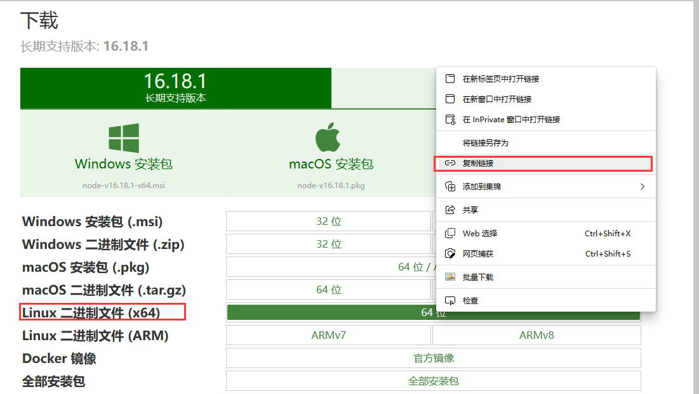
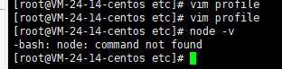
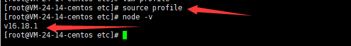

<!-- more -->

## 下载node
1. 复制下载连接，[node下载网址](http://nodejs.cn/download/)。
2. 选择图示node版本，右键选择“复制链接”：

1. 进入Centos，输入`wget https://npmmirror.com/mirrors/node/v16.18.1/node-v16.18.1-linux-x64.tar.xz`后回车

## 解压node

1. 上述步骤下载完成，`ls`回车可以发现多一个文件`node-v16.18.1-linux-x64.tar.xz`
2. `tar -xvf node-v16.18.1-linux-x64.tar.xz`后回车
3. `ls`可查看多出文件：`node-v16.18.1-linux-x64`
4. 删除下载的压缩包：`sudo rm -rf node-v16.18.1-linux-x64.tar.xz`，`ls`可查看是否删除。
5. 重命名解压出node的文件名：`mv node-v16.18.1-linux-x64 node`
6. 移动解压后node文件夹：`mv node /usr/local/`
7. 打开node文件下的bin：`cd /usr/local/node/bin`
8. 输入`pwd`查看node下的bin文件夹的当前目录
9. 复制路径：`/usr/local/node/bin`

## 配置环境变量

1. 切到etc文件夹下以配置环境变量：`cd /etc`
2. 编辑profile文件，`vim profile`，按`i`进入编辑模式
3. 新增`export PATH=$PATH:/usr/local/node/bin`
4. 确认无误后按`esc`退出编辑模式，输入`:wq`保存并退出

## 查看node版本

1. 此时输入`node -v`发现还是查看不了

2. 重启服务器或者重新加profile文件：`source profile`——重新加载profile文件
3. 此时再输入`node -v`即可查看到版本号

