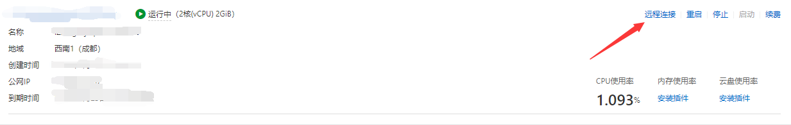
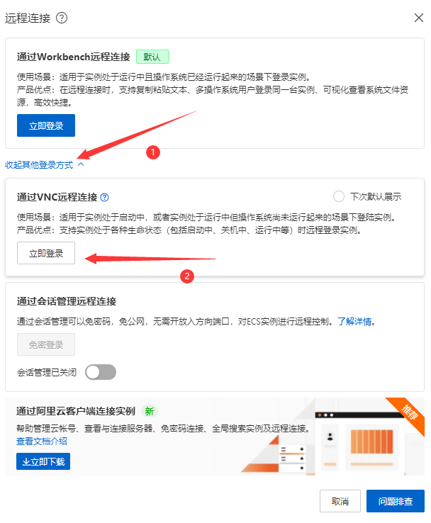
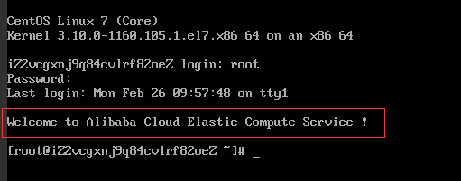
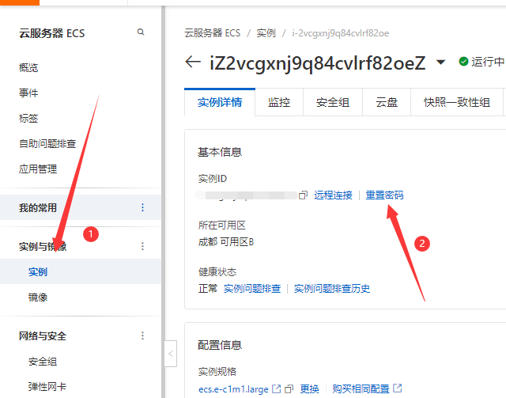
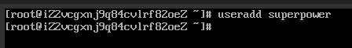
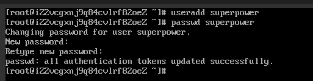
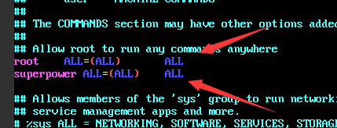
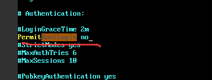

<!-- more -->

:::info 摘要
通过本文了解如何设置centos以其它用户名远程连接服务器，并且关闭默认用户名root的远程连接服务器的权限。
:::

## 1 登录服务器提供商网站

本文以阿里云举例：
1. 进入`云服务器ECS`，选择`远程连接`如下图：  
   
2. 点击`展开其它登录方式`，选择`通过VNC远程连接`，如下图：  
   
3. 然后依次输入用户名和密码，用户名默认为密码，如果忘记密码或者购买服务器的时候没有设置应先重置密码，否则无法连接。若出现如下图信息，则代表远程连接服务器成功：  
   

**补充重置实例密码方法，实例密码可用户远程连接服务器：**  

## 2 添加新的用户名

1. 确保已经远程连接服务器成功
2. 继续在连接终端输入`useradd 用户名`，如输入`useradd superpower`后回车，此步骤是为系统添加一个新用户，如下图：  
   
3. 为此用户设置远程连接登录密码：`passwd 新用户名`，如`passwd superpower`后回车，然后输入密码，会让你输入两次，第二次输入是确认密码，如下图：  
     
   直到看到`passwd:all authentication tokens updated successfully.`就是代表密码设置完成了。

## 3 为新用户添加sudo权限

1. 继续在终端输入`vim /etc/sudoers`后回车，输入`i`进入编辑模式(`vim`打开的默认是预览模式，还无法进行编辑)，然后找到`root`，跟着这一行在下面为我们的新用户添加权限，如下图示例：  
   
2. 按`esc`退出编辑模式，输入`:wq!`保存并退出。一般是`:wq`就行了，但是因为这个文件是只读的，我们可以加`!`以此来覆盖原来的文件，使我们修改的配置生效。

## 4 关闭root远程登录权限

此步骤可做可不做，但是处于安全起见，可以把root的远程登录权限关闭，以后可以使用我们新建的用户`superpower`来进行远程登录

1. `vim /etc/ssh/sshd_config`
2. 输入`/`开始搜索，关键字为：`RootLogin`
3. 找到对应位置后，输入`i`进入编辑模式，将`PermitRootLogin`签名的`#`去掉，即取消注释，将`yes`改为`no`，如下图:  
   
4. 按`esc`退出编辑模式，输入`:wq`保存并退出，然后输入`service sshd restart`重启该服务，使得刚刚我们修改的配置生效。
5. 输入`exit`退出即可
6. 接下来我们就可以通过本地安装的软件进行远程连接了，如OpenSSH等等