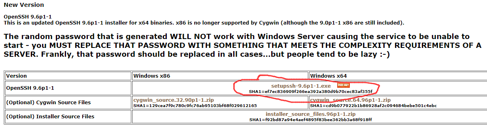
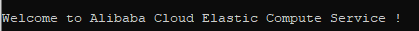

:::info 摘要
通过文本将了解在window操作系统下如何通过OPENSSH连接服务器，以及OPENSSH常用的基本指令。
:::

## 1 安装OPENSSH

1. [OPENSSH下载地址](https://www.mls-software.com/opensshd.html)  

2. 根据自己所需进行下载，这里选择最新版的：  

3. 安装OPENSSH，安装完成后没有桌面快捷方式的，只是以后你可以直接通过cmd连接服务器。安装完成后，可以在cmd输入`ssh`看是否安装成功。

## 2 连接服务器

1. 连接服务器基本命令格式：`ssh 用户名@服务器公网ip地址`，如`ssh root@192.168.8.1`。
2. 输入登录密码后回车，密码输入过程是看不到的，输完直接回车即可。一般登录成功后会显示`welcome`、`success`等字样代表你了解成功，如下图有个`welcome`字样：  
   
3. 至此，通过OPENSSH远程连接服务器成功，操作命令可参考此文：[centos常用命令](./centos-Introduction.md)

## 3 上传文件

将本地的文件上传到服务器当中去。  上传文件基本命令格式`scp 本地文件路径 用户名@服务器公网ip地址:服务器的路径`
开始之前需要先退出连接服务器，