这里所介绍连接的服务器操作系统为：Centos。

前提知识：需要了解[Centos基本操作指令](./centos-Introduction.md)，否则不建议直接学习此文章。

在开始之前，需要在[此网站](https://www.xshell.com/zh/free-for-home-school/)下载两个东西，分别为：SHELL和XFTP

<!-- more -->

## 远程登录前提

远程登录你的服务器，需要知道你的服务器**公网IP地址**、**远程登录用户名**、**远程登录密码**，如果你是阿里云服务商请登陆进控制台查看自己的服务器。

常见的服务器提供商有：
- [阿里云](https://account.aliyun.com/login/login.htm?spm=5176.28055625.J_3207526240.13.e939154at19JzO&oauth_callback=https%3A%2F%2Fwww.aliyun.com%2F)
- [腾讯云](https://cloud.tencent.com/login?s_url=https%3A%2F%2Fcloud.tencent.com%2F)
- [华为云](https://auth.huaweicloud.com/authui/login.html?locale=zh-cn&service=https%3A%2F%2Fwww.huaweicloud.com%2F#/login)

第一次创建好自己的云服务器实例，可以修改为你自己记得住的实例密码，后面使用XSHELL登录你的服务器时需要使用。

在进入下一步之前，我们想直接通过XHELL使用远程登录密码进行登录，但是默认是不支持的，只能输入Public Key，如下图：
  

因此我们先要在对应的服务商控制台远程登录一下，修改一下配置，使得我们可以通过远程登录密码直接连接。

1. 进入控制台选择对应的产品，有些人买的是云服务器，有些人买的轻量应用服务器，具体看你选购的时候选择什么，我这里以云服务器举例：
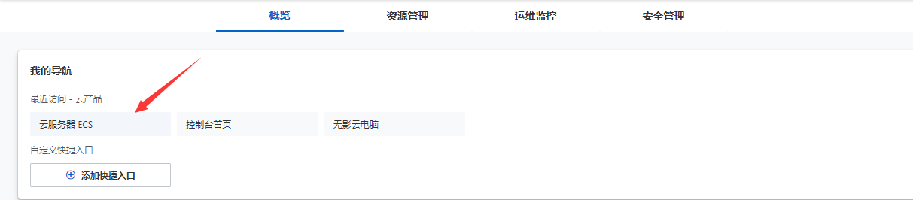
2. 选择远程连接
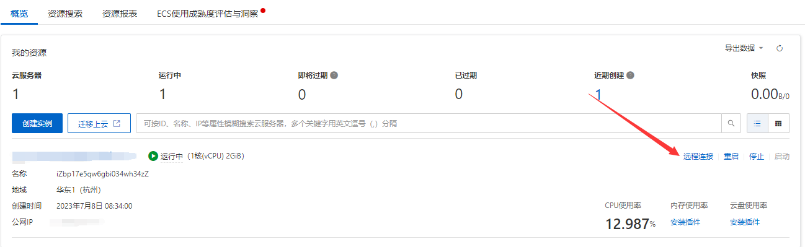
3. 选择VNC远程连接
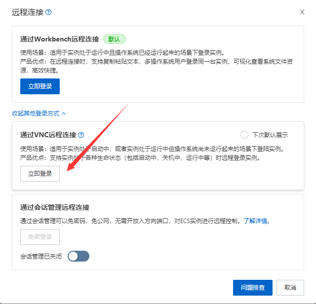
4. 首先输入用户名，默认为`root`，然后输入你的密码(password)，如果不知道你的密码，可以先重置你的实例密码再进行登录。
5. 登录成功后，首先输入`cd /`回车，再输入`ls`回车，如果你显示的跟下图一样，证明服务器是连接成功了的。
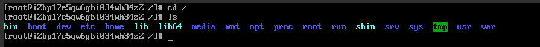  
此命令意思是打开根目录，然后列出根目录下的文件夹，有`bin`、`boot`文件夹等其它文件夹
6. 输入`cd /etc/ssh/`回车，再输入`ls`，看看此目录下有没有`sshd_config`配置文件，如下图：
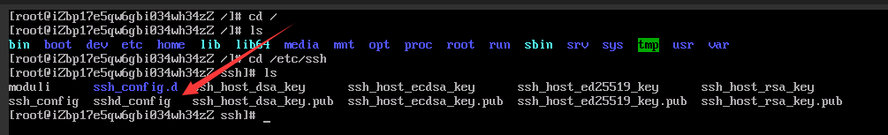
7. 输入`vim sshd_config`编辑该配置文件，默认是先进入预览模式，可以再输入`i`进入编辑模式，按向下箭头，差不多在末尾，有个`PasswordAuthentication`，默认它的值为`no`，如下图：
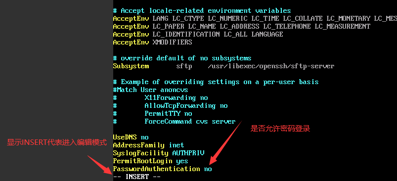  
此时我们将`PasswordAuthentication`的值改为`yes`，然后按`esc`推出编辑模式，再输入`:wq`保存并退出。此时又回到命令行了，如下图：
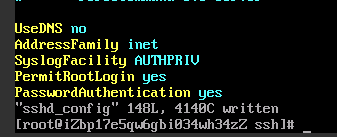
8. 输入`service sshd restart`重启sshd服务。
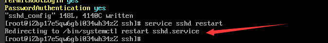

至此，就方便我们下一步骤使用密码进行登录了。

## 远程登录服务器

上述步骤获取到你的服务器**公网IP地址**、**远程登录用户名**、**远程登录密码**后，现在可以打开XHELL软件进行远程登录服务器了。

1. 打开软件会自动弹出一个窗口，可以按照图示箭头点击：
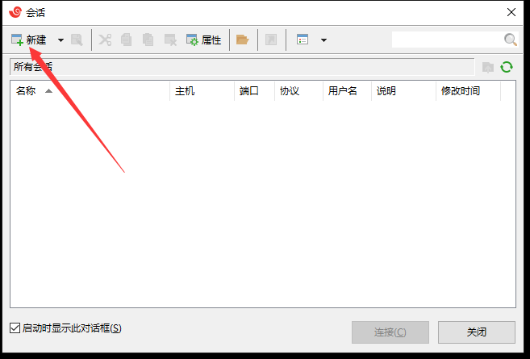  
如果没有弹出窗口，可以看上图箭头指的图标，然后在顶部菜单栏点击相应的图标来新建会话。
2. 此时会弹出新的窗口，按如下进行操作：
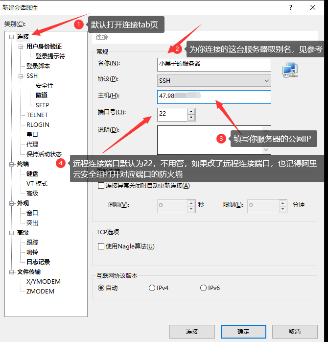
3. 然后根据如下填写你远程连接的用户名和登录密码
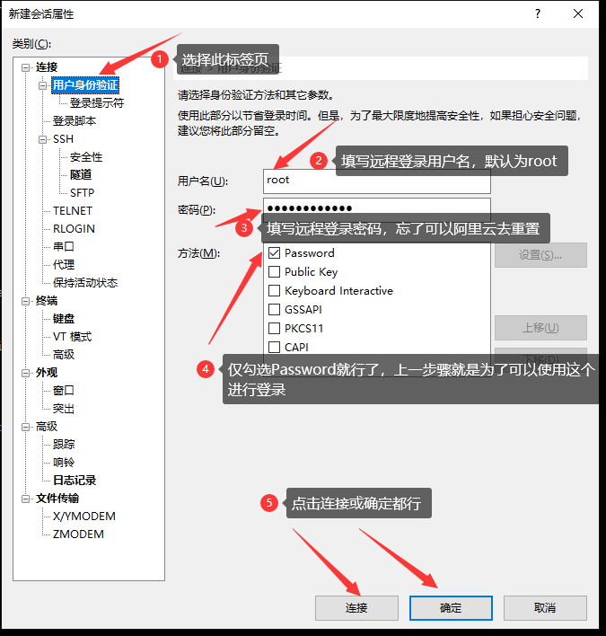
4. 连接服务器并查看是否连接成功
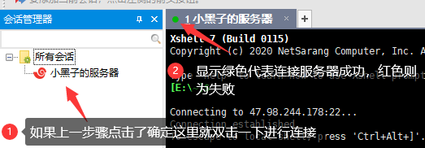
5. 同样的，在命令行输入`cd /`回车后，再输入`ls`看看有没有`bin`和`root`等其它文件夹来进一步判断是否连接成功。
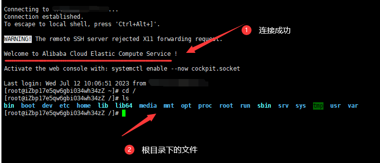

至此，恭喜你已经成功利用XSHELL连接上你的服务器了，往后，你就可以直接使用XSHELL连接上你的服务器。当然，连接服务器的工具还有很多，不过看你个人喜好，这里还可以再推荐一些连接服务器的工具：

- [FinalShell](http://www.hostbuf.com/t/988.html)
- [OpenSSH](http://www.mls-software.com/opensshd.html)

当然我这里推荐使用的话就是XSHELL，配合XFTP一直使用，简直不要太舒服。

关于XFTP的使用，主要介绍如何XFTP向你的服务器部署你的网站。你的前置知识需要了解[如何在Centos安装nginx](./centos-install-nginx.md)，然后再来学习如何[利用XFTP部署你的网站](./how-to-reploy-your-website.md)。

