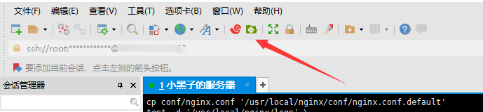
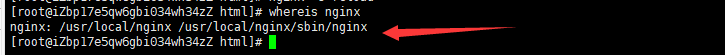
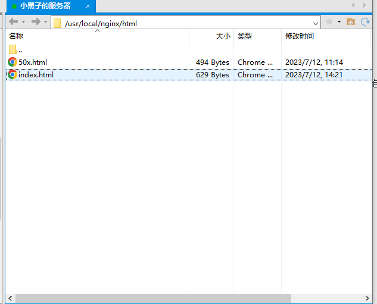
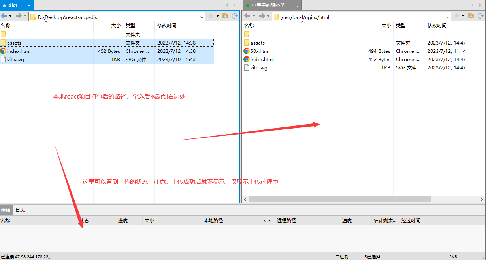
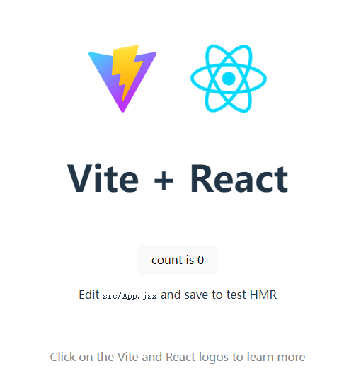
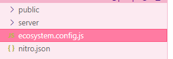
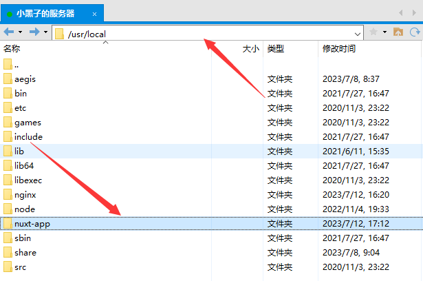
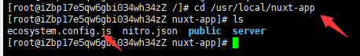
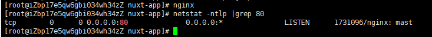
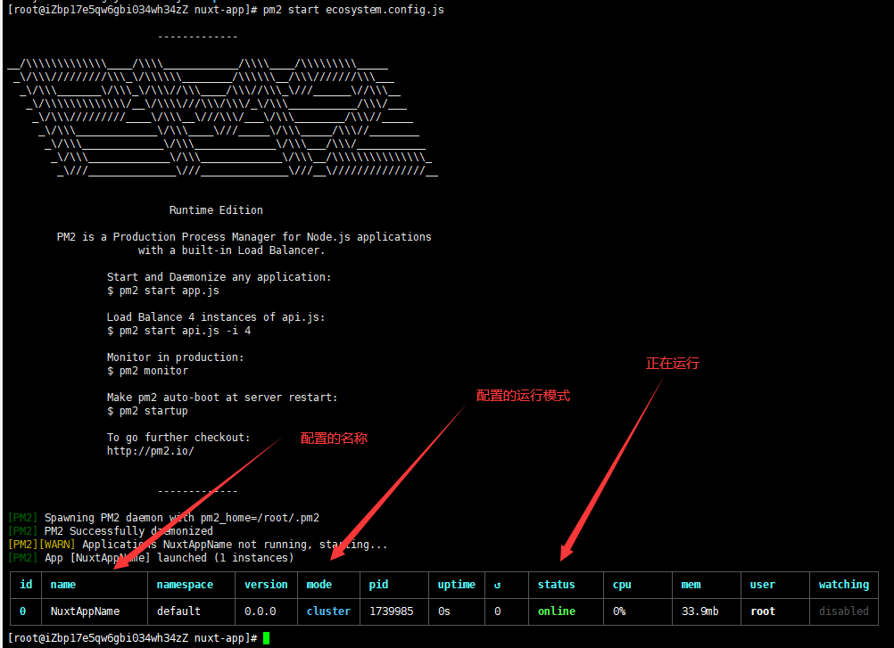

通过此文章，你将学会如何利用XFTP部署你的静态网站。

可以用作部署Web的服务器有很多，如Tomcat、Nginx，Node、Apache、Cloudflare、OpenResty等

<!-- more -->

这里我们以常用的Nginx举例，Nginx适用于多个HTML构成的网站、或者通过webpack、vite等构建工具打包后的网站，不适用于部署使用。

在了解此文章之前，你需要具备的前置知识：
1. [了解基本的Centos操作命令](./centos-Introduction.md)
2. [如何使用XSHELL远程连接服务器](./how-to-connect-server.md)
3. [nginx的基本使用](../nginx.md)
4. [如何使用在Centos上安装nginx](./centos-install-nginx.md)
5. 安装好[XFTP](https://www.xshell.com/zh/free-for-home-school/)

若了解如何部署SSR框架打包构建的网站，如Nuxt、Next，则需要了解的前置知识：[Centos安装node](./centos-install-node.md)

## 准备打包后的网站

```bash
# step 1
npm init vite react-app -- --template react

# step 2
cd react-app && npm install

# step 3 
npm run build
```

以上命令构建了一个react框架打包后的项目

## 利用XFTP上传打包后的项目

1. 打开连接的XSHELL，可以看到XFTP的图标，使用这个需要你提前安装好[XFTP](https://www.xshell.com/zh/free-for-home-school/)才能使用。如下图。  

2. 将本地打包好的页面上传到服务器上的nginx前，你需要知道服务器的nginx安装在哪里的，如果不知道可以利用`whereis nginx`命令回车后来查看：如下图：
  
上图的空格左边是nginx的根目录，右边是nginx执行文件，运行这个可以直接运行起来nginx。
3. 利用XSHELL知道nginx安装目录后，在XFTP进入nginx根目录下的html文件夹下：

4. 如下图上传文件到服务器

5. 运行nginx，然后在本地浏览器中输入你的服务器公网IP地址，域名备案了且添加解析记录了可以用域名访问。
6. 如果没有react和vite的logo证明没有成功，需要检查上面的步骤。如果出来了，证明部署成功了。



## 打包SSR框架构建的网站

学习此小节请确保你的服务器安装了node，如果没有你可以查看[此教程](./centos-install-node.md)。

这里我选择初始化[Nuxt3](https://nuxt.com/docs/getting-started/installation)项目。但是由于官方给的方法初始化项目会失败，可以在此直接[下载模板](https://codeload.github.com/nuxt/starter/tar.gz/refs/heads/v3)


或者进入[此网页](https://github.com/nuxt/starter/tree/v3)下载代码，即为Nuxt3模板。

1. 安装依赖并打包
```bash
# step 1 确保node版本大于16.10.0
node -v

# step 2 进入你下载的nuxt3文件目录，安装依赖，这个过程会非常漫长，需要耐心等待
npm install

# step 3 安装好后依赖，进行打包
npm run build

```

2. 按以上步骤完成后，可以看到项目根目录下多个一个`.output`文件夹，进入该文件夹，在此文件夹新建`ecosystem.config.js`，并添加以下代码：
```js
module.exports = {
  apps: [
    {
      name: "NuxtAppName",// 进程名
      port: "80",// 进程端口号
      exec_mode: "cluster", // 运行模式
      // instances: "max", // 分配的线程，会自动根据CPU的内核数量进行分配
      script: "././server/index.mjs", //运行的js文件路径。
    },
  ],
};
```
文件层级可查看下图，以确保文件层级正确：


3. 然后你可以将`.output`文件夹更改下文件名，比如`nuxt-app`，就可以按上述介绍到的方法，将`nuxt-app`文件夹上传到服务器，上传路径见下：

4. 在XSHELL先安装pm2，如果不知道装没装可以使用`pm2 -v`命令看看能不能打印的出版本号，如果不能就安装：`npm i pm2 -g`。
5. 进入`ecosystem.config.js`所在的路径：

6. 由于`ecosystem.config.js`里配置端口号为80，因此我们先看看80端口有没有占用，查看80端口有没有占用：`netstat -ntlp |grep 80`，见下图：
  
如果是跟nginx冲突，nginx停止运行命令：`nginx -s quit`。当然如果不是nginx，就像上图的`kill 1731096`就可以杀死80端口的进程
7. 运行项目`pm2 start ecosystem.config.js`，如下图：

8. 此时可以在自己电脑浏览器通过公网IP或域名进行访问。

至此，你学会了nuxt3的node-server部署方式。nuxt部署方式还有很多，部署方式有：服务端渲染部署、静态应用部署、单页面应用部署。nuxt2和nuxt3部署方式也稍有不同。

更多部署方式查看本博客相关文章。
