实现https需要有SSL证书，SSL证书可以自己生成，也可以通过CA机构免费获得。两者的区别是：自生成的证书在浏览器通过https访问网页的时候会提示网页不安全，而CA机构认证的SSL证书则不会。

<!-- more -->

## 准备工作

但由于我的域名是腾讯云的，在阿里云下没有备案，我的服务器又来自于阿里云的，所以这里演示的是自生成的SSL证书。

在开始之前，你需要知道的是，在本博客[nginx介绍](../nginx.md)里面，已经介绍到如何开启https了，只不过不同的是，centos下的nginx不能直接这么进行配置，需要先进行一些操作。以下就对此步骤进行演示说明：

1. 先停止nginx服务：`nginx -s quit`
2. 查看http模块是否安装，可以通过`nginx -V`进行查看
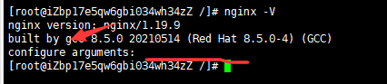  
上图可以看到，如果`configure arguments:`右边值为空，代表没有安装。
3. 找到之前下载nginx的解压后目录，注意不是安装目录，安装目录是你之前下载nginx解压后的文件夹，这里我的解压后的文件夹在根目录下，所以`cd /`然后`ls`就可以看到了
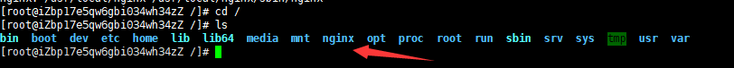
4. 你可以进入目录里面看看，如果有`configure`这个文件，证明这个文件夹就是解压后的nginx文件夹。如果没有，你可以[重新安装nginx](../centos/centos-install-nginx.md)

5. 执行这行命令：`./configure --prefix=/usr/local/nginx --with-http_stub_status_module --with-http_ssl_module`，注意点是要进入`configure`这个所在的文件夹，还有就是这样命令要注意你nginx安装的路径，安装路径可以使用`whereis nginx`查看。
6. 然后运行`make`进行编译。
7. 等待编译完成后，覆盖原有`sbin`文件夹下的`nginx`文件：`cp ./objs/nginx /usr/local/nginx/sbin/`，它会询问你是否确认覆盖，输入`y`后回车就行，同样需要注意你实际的nginx安装路径
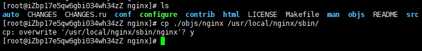
8. 此时再运行`nginx- V`，可以看到`configure arguments:`右边的值已经不为空了，证明配置成功了。
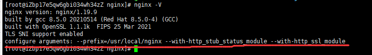

至此，让nginx支持https的准备工作已经完成了，下面准备自签名证书。

## 自生成SSL证书

自生成SSL证书可以在自己电脑进行完成，无需在服务器上安装。

在开始之前，需要下载openssl工具，这里提供两个地方，[英文版官网下载](https://www.openssl.org/source/)，[中文网下载](https://www.oomake.com/download/openssl)

如果你是window64位系统的，直接[点此下载](https://gzc-download.weiyun.com/ftn_handler/13fd989e288bc0f15ae119956d73d673212e7934727908516ae87b22d2ca2595aa56239c3fb41aea000f42908c25c4ec889faa8bda7094d32f07ce9a8acc96d5/Win64OpenSSL-3_0_0.exe?fname=Win64OpenSSL-3_0_0.exe&from=30113&version=3.3.3.3)

下载完进行安装，安装好后，需要配置以下环境变量或者你可以利用cmd进入`openssl.exe`所在的目录，不过我还是建议加进电脑环境变量里面。
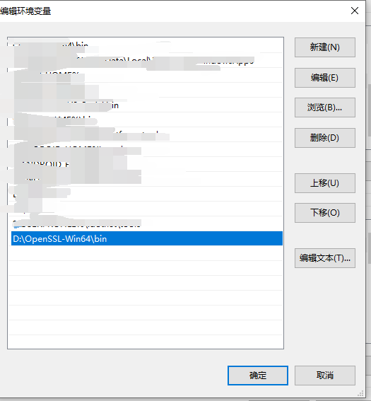

1. 可以新建一个空文件夹，因为生成证书过程中，会产生新的文件，避免你自己找不到对应的文件，然后进入空文件夹。
2. 进入空文件夹后，输入这个命令：`openssl genrsa -out private.key 2048`，这命令意思是生成私钥文件(private key)，此时文件夹里会多一个`private.key`文件。
3. 然后根据私钥文件生成证书签名请求文件（Certificate Signing Request，简称CSR文件）：`openssl req -new -key private.key -out cert.csr`，这一步我让你输入一些信息，分别是你的国家(CN)、省名、城市名、公司名、单位名称、你的名字、你的邮箱、输入密码、可选的公司名称。至此完成，会多一个`cert.csr`文件。
4. 最后根据私钥对证书申请进行签名从而生成证书文件（pem文件）：`openssl x509 -req -in cert.csr -out cacert.pem -signkey private.key`，这一步会新增`cacert.pem`文件。
5. 实际我们用到的就是`cacert.pem`文件和`private.key`文件。
6. 利用XFTP进入nginx的安装目录，新增ssl文件夹，然后将`cacert.pem`文件和`private.key`文件上传到ssl文件夹下，并记录下该路径，待会配置`nginx.conf`配置文件的时候需要使用。
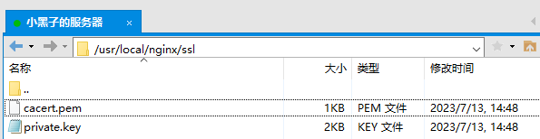
7. 利用XSHELL进入nginx安装目录，进入`nginx.conf`所在的文件夹。
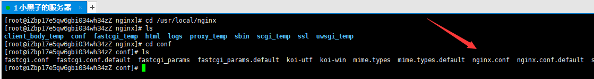
8. `vim nginx.conf`编辑该文件，输入`i`从预览模式进入编辑模式，光标向下移动是可以看到`HTTPS SERVER`的配置项的，只不过是被注释了的。
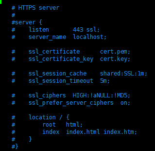
9. 根据下图配置好https：
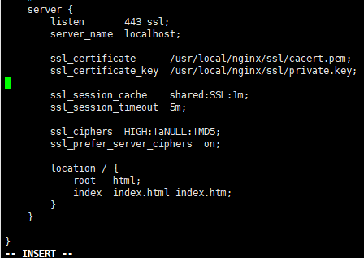
10. 按`esc`退出编辑模式，输入`:wq`保存并退出。
11. 输入`nginx -t`查看配置是否错误，显示有`successful`代表配置没有错
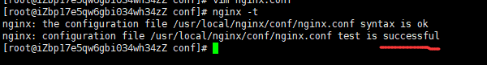
12. 此时如果nginx在运行，你可以直接`nginx -s reload`回车后来重载配置文件，如果不在运行，直接`nginx`回车后运行。
13. 然后在浏览器输入`https://你的服务器公网ip地址:端口号`，如`https://47.98.244.xx/`，如果显示下图，可以点击`高级`后，再点击`继续前往xx.xx.xx.xx（不安全）`
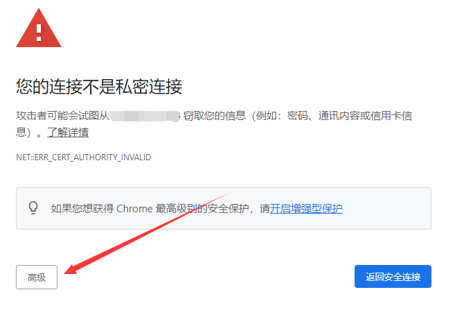
14. 如果加载出页面了，说明至此，你的步骤完全正确，地址栏处显示https`不安全`是正常的，因为我们的ssl证书没有经过CA机构认证的。

## CA机构获得SSL证书

获取证书的方式可参考[此文章](./window-nginx-https.md)，只是证书来源不同，一个是CA机构认可的证书，一个是自生成的证书，但是实际都会用到那两个文件的。
