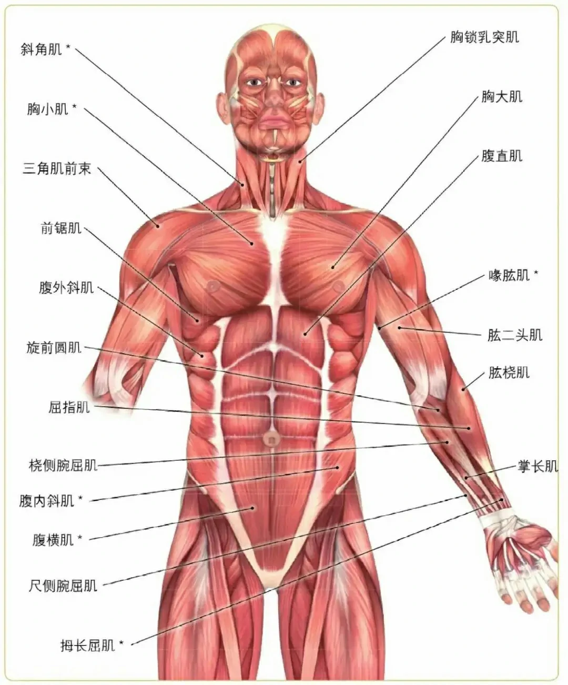
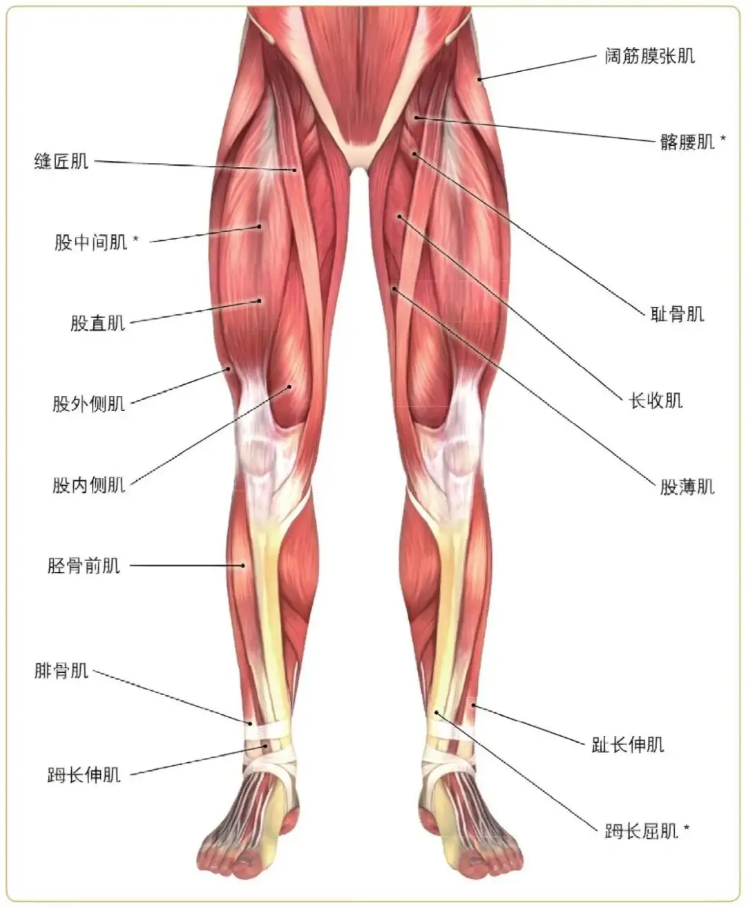
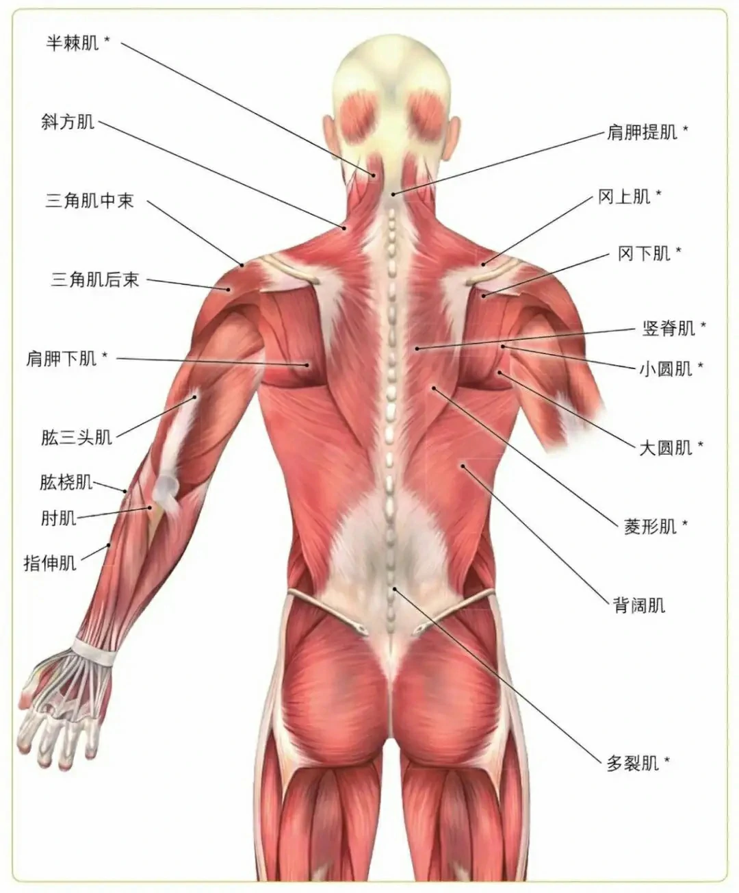
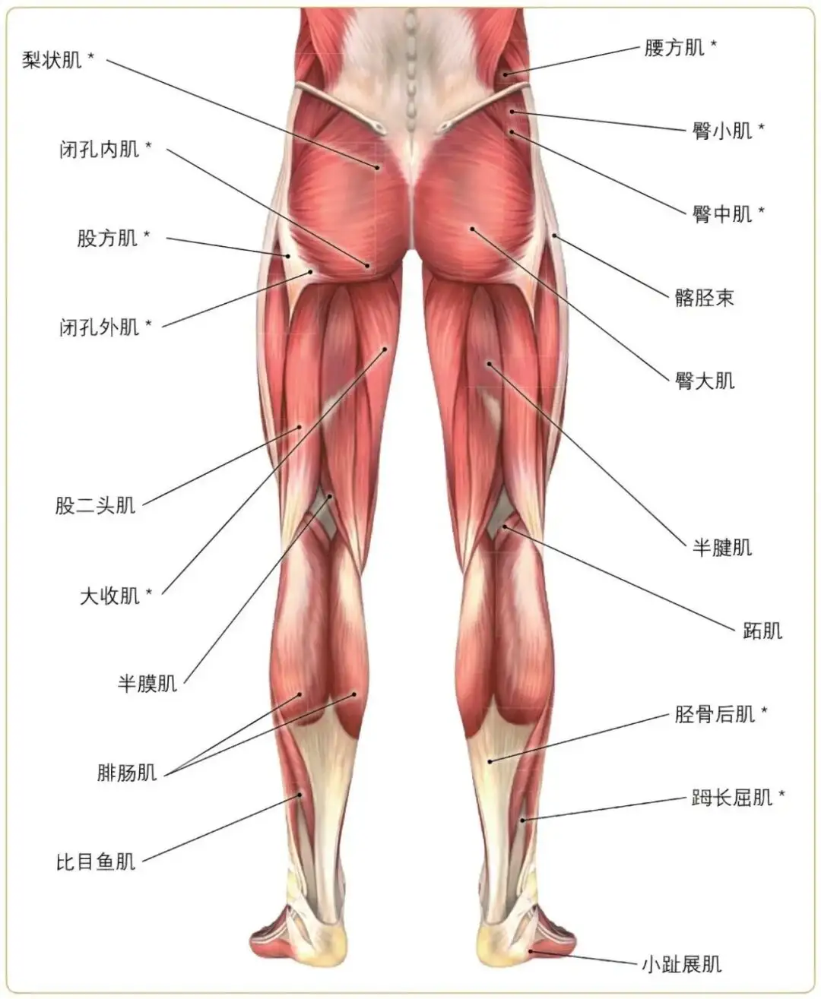

<!-- more -->

## 初级阶段

:::tip
初级阶段的训练主要面向健身小白或者许久未练的群体，此阶段主要掌握肌肉刺激感觉，掌握动作要领，不要过去追求器材的重量，掌握肌肉刺激点才是主要目的，哪怕多做几组一样是有效果的。
:::

目标肌肉：胸大肌，腹肌：
- 平板杠铃卧推4/12
- 上斜杠铃卧推4/12
- 上斜哑铃飞鸟4/12
- 平板哑铃飞鸟4/12
- 上下腹训练2/4/20

目标肌肉：背阔肌，腰大肌肉，腹肌：
- 高位下拉4/12
- 坐姿划船4/12
- 杠铃硬拉4/12
- 上下腹训练4/40

目标肌肉：肱二头肌，肱三头肌，腹直肌热身：
- 杠铃二头弯举4/15
- 哑铃二头弯举4/15
- 绳索下压三头4/15
- 坐姿臂屈伸三头4/15
- 上下腹肌4/40

目标肌肉：三角肌，腹肌
- 史密斯坐姿推肩4/15
- 哑铃侧平举4/15
- 哑铃前平举4/15
- 俯身侧平举4/15
- 下腹，4/30

训练目标：腹肌，功能性训练，以核心爆发燃脂为主。
- 开合跳/4/50
- 原地砸球/4/20
- 壶铃摇摆/4/20
- 屈腿左右击掌4/20

训练目标：腹肌，功能性训练，以核心爆发燃脂为主。
- 开合跳/4/50
- 原地砸球/4/20
- 壶铃摇摆/4/20
- 屈腿左右击掌4/20

肌肉名图解：  

