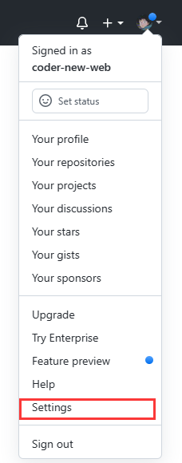
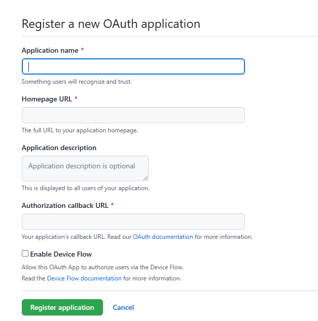
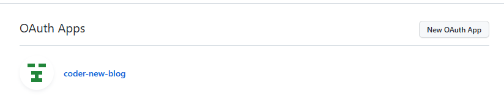

## 问题背景


waline评论在选择以GitHub方式登录时出现报错信息：

```tex
{"errno":500,"errmsg":"Not initialized"}
```

初步分析原因：GitHub没有开放第三方授权登录，所以登录不上去waline评论系统

## 解决方式

[参考解决方式](https://cloud.tencent.com/developer/article/2067289)

- GitHub注册用户凭证

  1. GitHub中点击`Settings`  
  

  2. 下滑找到`Developer settings`，然后选择`OAuth Apps`，然后点击`New OAuth App`。  
  3. 注册OAuth application  
  

  `Application name`，应用名字，虽然说可以随便取，但是最好还是取一个易于区分的名字。  

  `Application name`，你的博客链接。  

  `Authorization callback URL`，你的评论链接，格式为：`https://xxx.com/oauth/github`，也就是最后加上`/oauth/github`，然后点击`Register application`。

  4. 你刚刚注册好的可以通过第二步找到对应的位置。  
  
  
  5. 点进去找到`Client ID`和`Client secrets`，如果没有`Client secrets`可以点击右侧的`Generate a new client secret`。`Client ID`和`Client secrets`需要记录一下，待会用的到。

- Vercel将`Client ID`和`Client secrets`添加到项目环境变量里面去，参考下面的key和value。

  |      key      |            value            |
  | :-----------: | :-------------------------: |
  |   GITHUB_ID   |   对应第三步的 Client ID    |
  | GITHUB_SECRET | 对应第三步的 Client secrets |

- 环境变量添加成功后，需要重启评论系统。注意：Vercel部署你的静态网站跟你部署的评论系统是两个东西

- 等待重启完，发现waline登录自己的GitHub进行评论就没问题了。
