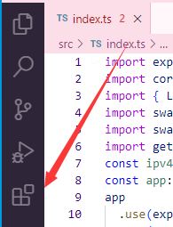
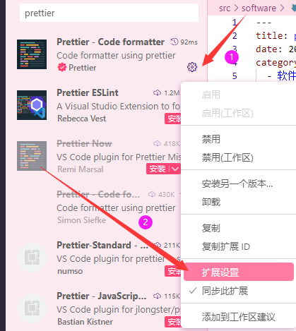
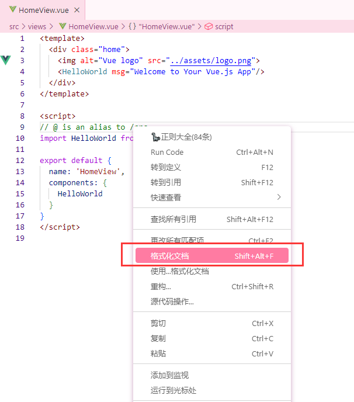
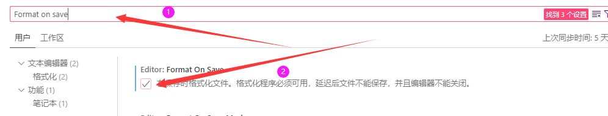

## 下载插件

  

输入`Prettier`，第一个就是，全名就叫`Prettier - Code formatter`

  

## 设置插件

1. 安装后插件选择扩展设置：

  

2. 下滑找到`print width`，设置为1000，这可以解决标签属性换行问题。如果还是不够可以再把值设大一点。  
  

3. 打开一个SFC文件，在代码里右键选择`使用...格式化文档`:

  

4. 设置好后可以重复第三步步骤，检查一下是否设置成功，如果显示右边有括号默认值即代表设置成功。此时默认以后的以`.vue`结尾的文件都会用`Prettier`进行格式化，同理，如果你想在`.ts`、`.js`、`.scss`文件结尾都可以重复此步骤。

  

## 开始格式化代码
按以上步骤设置好后，有两种格式化代码方式：
1. 未设置保存时候格式化代码，此时你需要手动进行格式化，同样打开SFC文件，在代码里右键选择`格式化文档`:
  
2. 设置了保存时候格式化代码后，就不用管了，当你`ctrl + s`保存即自动格式化代码。如果开启保存自动格式化代码见`补充`章节。

## 注意事项

1. 有些按照步骤后配置好，但是第一次进行格式化没有反应。此时建议你先手动弄为一行，再进行格式化看是否有效果。因为可能有特殊字符导致`Prettier`格式化不了。
2. 如果不起作用，建议可以重启vscode试试。

## 补充

### 如何开启保存时候自动格式化
1. 打开设置  

2. 输入`Format on save`，然后勾选上`Format on save`，即可，这样保存时候就能自动格式化代码  

### 为什么推荐Prettier
1. 支持多种文件格式化，如js、ts、vue、jsx、tsx、css、html、scss、less等。
2. 代码结尾自动加分号
3. 支持项目中新建`.prettierrc`文件，更适合在团队开发过程中来约束项目代码质量。[配置文件说明文档](https://prettier.io/docs/en/configuration.html)
4. 更多设置可查看插件介绍或[文档说明](https://prettier.io/)  

