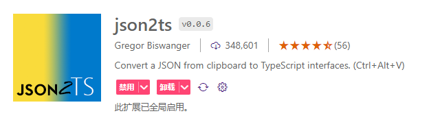

<!-- more -->

## 必备插件

vscode安装json2ts插件

## 数据来源

如果在控制台：
1. 可以直接对打印出来的数据，直接右键选择“复制Object”，此时数据就已经复制到剪贴板了
2. 或者可以右键控制键打印出来的数据，右键选择“存储为全局变量”，此时出现temp1，然后输入copy(temp1)回车后显示undefined即可复制到剪贴板
3. 如果用postman那就简单一批了，调试通后返回结果直接右边就有复制按钮

## 如何生成TS声明类型

上述步骤将数据复制到剪贴板后，在ts文件在，windows按ctrl+alt+v即可一键生成。mac按command+option+v。

## 注意事项

1. 可能变量开头字母为大写的，在生成ts声明类型时会转化为小写，此时生成后建议再检查检查。
2. 有这个插件，ts声明谁用谁舒服。