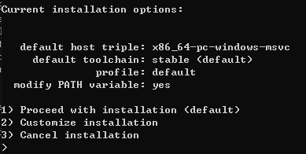
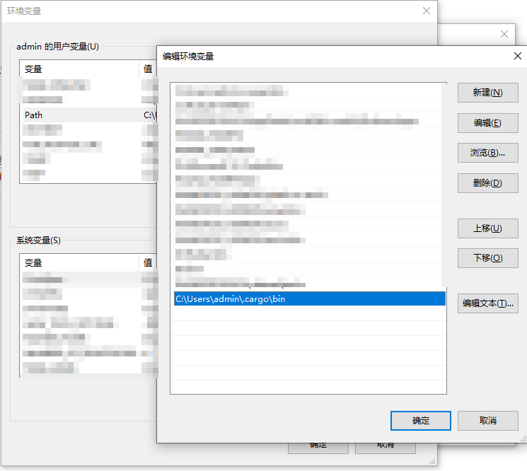

## 下载

[下载地址](https://www.rust-lang.org/zh-CN/tools/install)


## 运行

1. 下载后的文件叫`rustup-init.exe`，双击运行，到下图输入`1`后回车：

2. 等待下载完成，会提示让你回车以继续`press enter to continue`
3. 安装目录在`C:\Users\admin\.cargo\bin`
4. 将上面的安装目录添加进Path环境变量

5. 终端输入`rustup`回车后不报错即安装成功
6. [rust使用参考文档](https://www.rust-lang.org/zh-CN/learn)


## 常用命令
1. 更新
```bash
rustup update
```
2. 卸载
```bash
rustup self uninstall
```
3. 查看版本
```bash
rustc --version
```