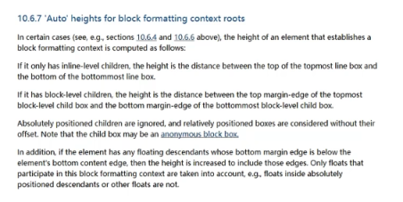
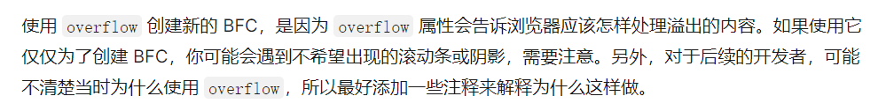

<!-- more -->

## FC(Formatting Context)
FC全称是formatting context(格式化上下文)，无论是块级元素还是行内元素，在标准流里面都是属于一个FC的；
块级元素属于BFC，行内元素属于IFC。

理解布局是有用的

Boxes in the normal flow belong to a formatting context,which may be block or inline, but not both simultaneously Block-level boxrs particepate in a block formatting context. Inline-level boxes participate in an inline formatting context.

### BFC(Block Formatting Context)
**块格式化上下文**（Block Formatting Context，BFC）是 Web 页面的可视 CSS 渲染的一部分，是块级盒子的布局过程发生的区域，也是浮动元素与其他元素交互的区域。

下列方式会创建块格式化上下文：

- 根元素`html`;
- 浮动元素(float值不为none)
- 绝对定位元素(position值为absolute或fixed)
- 行内块元素(display值为inline-block)
- 表格单元格(display值为table-cell,HTML表格单元格默认值)
- 表格标题(display值为table-caption，HTML表格标题默认值)
- 匿名表格单元格元素(display值为table、table-row、table-row-group、table-header-group、table-footer-group(分别是HTML table、tr、tbody、thead、tfoot的默认值)或inline-table)
- overflow值不为visible、clip的块元素
- display值为flow-root的元素，兼容性不好
- contain值为layout、content或paint的元素
- 弹性元素(display值为flex或inline-flex元素的直接子元素)，如果它们本身既不是flex、grid也不是table容器
- 网格元素(display值为grid或inline-grid元素的直接子元素)，如果它们本身既不是flex、grid也不是table容器
- 多列容器(column-count或column-width(en-US)值不为auto，包括column-count为1)
- column-span值为all的元素始终会创建一个新的BFC，即时该元素没有包裹在一个多列容器中

格式化上下文影响布局，通常，我们会定位和清除浮动创建新的BFC，而不是更改布局，因为它将：

- 包含内部浮动
- 排除外部浮动
- 阻止外边距重叠

#### BFC作用
In a block formatting context, boxes are laid out after the other, vertically, beginning at the top of a containing block. The vertical distance between two sibling boxes is determined by the 'margin' properties. Vertical margins between adjacent block-level boxes in a block formatting context collapse.
可以帮助块级元素产生距离或者重叠，margin，浏览器创建的BFC

In a block formatting context, each box's left outer edge touches the left edge of the containing block (for right-to-left formatting, right edges touch). This is true even in the presence of floats(although a box's line boxes may shrink due to the floats), unless the box establishes a new block formatting context(in which case the box itself may become narrower due to the floats).

简单概括如下：

- 在BFC中，box会在垂直方向上一个挨着一个排列；
- 垂直方向的间距由margin属性决定；
- 在同一个BFC中，相邻两个box之间的margin会折叠(collapse)；
- 在BFC中，每个元素的左边缘是紧挨着包含块的左边缘的；

作用概况：

- 解决margin的折叠问题
- 解决浮动高度塌陷问题

原本都是在html同一个BFC，但是一些情况会创建新的BFC，也就是会不止一个BFC。但是还是在同一个BFC中。

不能触发bfc：
```html
<!DOCTYPE html>
<html lang="en">

  <head>
    <meta charset="UTF-8">
    <meta http-equiv="X-UA-Compatible" content="IE=edge">
    <meta name="viewport" content="width=device-width, initial-scale=1.0">
    <title>Document</title>
    <style>
      * {
        margin: 0;
      }

      .box1 {
        height: 200px;
        width: 400px;
        background-color: orange;
        margin-bottom: 30px;
        overflow: auto;
      }

      .box2 {
        height: 150px;
        background-color: pink;
        margin-top: 50px;
      }
    </style>
  </head>

  <body>
    <div class="box1"></div>
    <div class="box2"></div>
  </body>

</html>
```
可以触发bfc：
```html
<!DOCTYPE html>
<html lang="en">

<head>
    <meta charset="UTF-8">
    <meta http-equiv="X-UA-Compatible" content="IE=edge">
    <meta name="viewport" content="width=device-width, initial-scale=1.0">
    <title>Document</title>
    <style>
        * {
            margin: 0;
        }

        .container {
            overflow: auto;
        }

        .box1 {
            height: 200px;
            width: 400px;
            background-color: orange;
            margin-bottom: 30px;
            overflow: auto;
        }

        .box2 {
            height: 150px;
            background-color: pink;
            margin-top: 50px;
        }
    </style>
</head>

<body>
    <div class="container"><!- 这里形成了一个新的bfc->
        <div class="box1"></div>
    </div>
    <div class="box2"></div>
</body>

</html>
```
此时margin就不会重叠了

## 补充
### bfc解决浮动元素的父元素高度塌陷问题
浮动和定位，说BFC能解决浮动元素高度塌陷是不准确的，就比如说定位问题。



使用overflow清除浮动的条件：
- 高度为auto，默认就是auto
- 父元素触发bfc形成独立的块级格式化上下文



bfc的高度是auto的情况下，是如下方法计算高度的：

1. 如果只有行内元素，是行高的顶部和底部的距离（行盒）
2. 如果有块级元素，是由最底层的块上边缘和最底层块盒子的下边缘之间的距离
3. 如果有绝对定位元素，将会被忽略
4. 如果有浮动元素，那么会增加高度以包括这些浮动元素的下边缘


