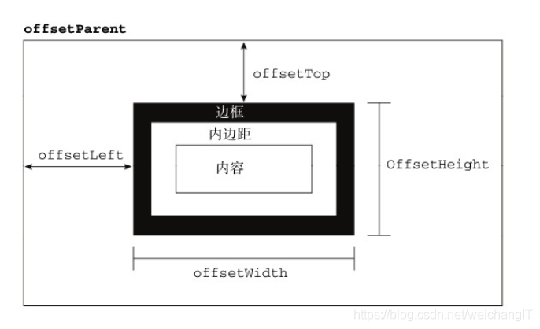

<!-- more -->

## screen
1. screenX——屏幕宽度
2. screenY——屏幕的高度

## client
1. clientX——鼠标点击位置距离浏览器可视区左边的距离
2. clientY——鼠标点击位置距离浏览器可视区上面的距离

## page
1. pageX——鼠标点击位置距离文档左边的距离
2. pageY——鼠标点击位置距离文档上边的距离

**注意**
1. 该事件对象一样是需要通过鼠标点击或手指触摸才会触发的事件对象。
2. 为什么说是距离文档的左边或上边的距离呢，因为当页面出现横向滚动或纵向滚动的时候，page也会把这部分距离加上

## offset
以下是点击之后再会有的，也就是事件对象里的：
1. offsetX——鼠标点击位置距离点击容器左边的距离
2. offsetY——鼠标点击位置距离点击容器上面的距离

以下是容器本身所具备的：
1. offsetLeft——目标容器距离浏览器可视区左边的距离
2. offsetTop——目标容器距离浏览器可视区上面的距离
3. offsetWidth——目标容器的宽度
4. offsetHeight——目标容器的高度
5. offsetParent——目标容器的父容器

## 图片解析

