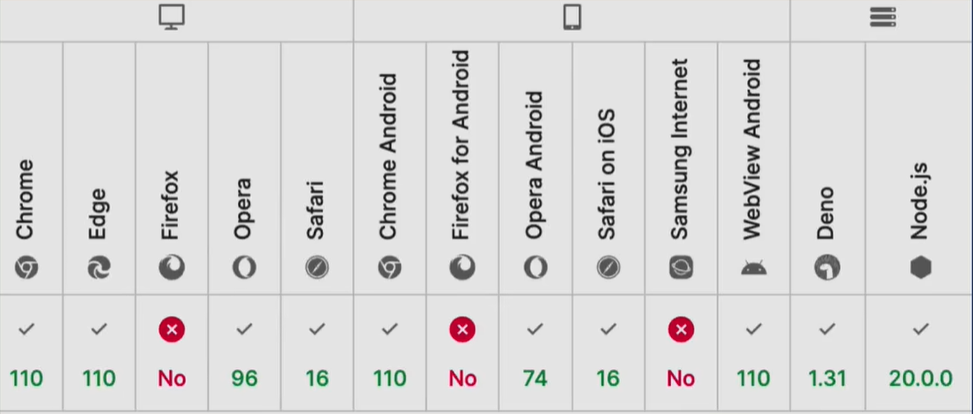

<!-- more -->

## ES2023 ES14

### 数组副本

数组中很多方法可以改变数组本身，比如sort splice，类似的方法还有：toReversed、toSpliced、with


```js
const arr = [3, 2, 1];
const sortArr = arr.sort();
console.log(arr, sortArr);// [1, 2, 3]  [1, 2, 3]

const arr2 = [3, 2, 1];
const sortArr2 = arr2.toSorted();
console.log(arr2, sortArr2);//[3, 2, 1]   [1, 2, 3]
```

### with

with表示修改指定索引值，返回新的数组

```js
const arr = [1, 2, 3];
const withArr = arr.with(1, false);
console.log(arr, withArr); //[1, 2, 3]   [1, false, 3]
```

### 从尾部查找(findLast findLastIndex)

```js
//findLast
const isEven = (number) => number%2 === 0;
const arr = [1, 2, 3, 4];
const result = arr.findLast(isEven);
console.log(result); // 4

//findLastIndex
const isEven = (number) => number % 2 === 0;
const arr = [1, 2, 3, 4];
const result = arr.findLastIndex(isEven);
//result: 3
```

### WeakMap支持Symbol作为key

```js
const weak = new WeakMap();
const key = Symbol("symbol");
weak.set(key, "ECMAScript 2023");
const result = weak.get(key);
console.log(result); // ECMAScript 2023
```

### Hashbang语法

Hashbang也叫Shebang，是由一个井号和叹号组成的字符序列。，用来指定使用哪种解释器进行执行这个文件。  
nodejs中很早就进行了应用，之前在执行js文件的时候，使用的是node对应的js文件，有了Hashbang之后，可以直接执行对应的js文件。

```js
#!/usr/local/bin/node
console.log("Hello world!");
```
执行文件： ./test.js  （注意这是在macos下的运行命令）

该语法兼容性：  



