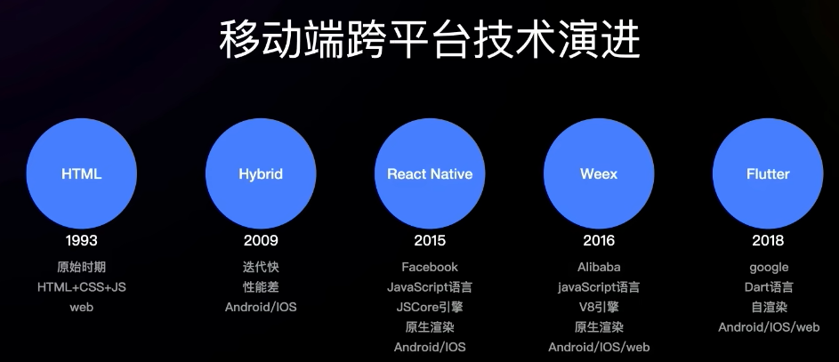
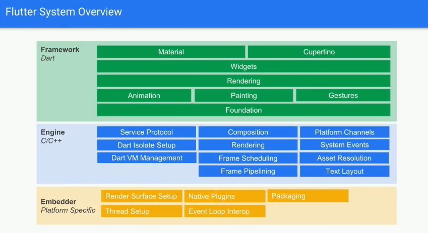
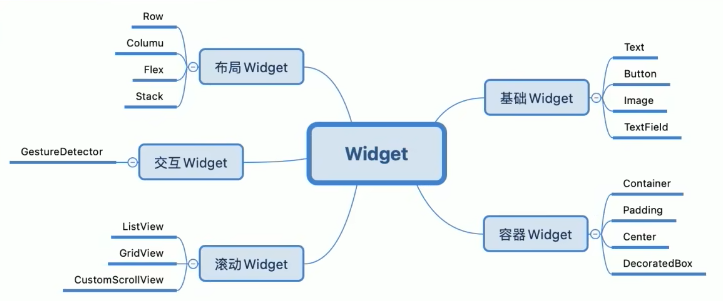
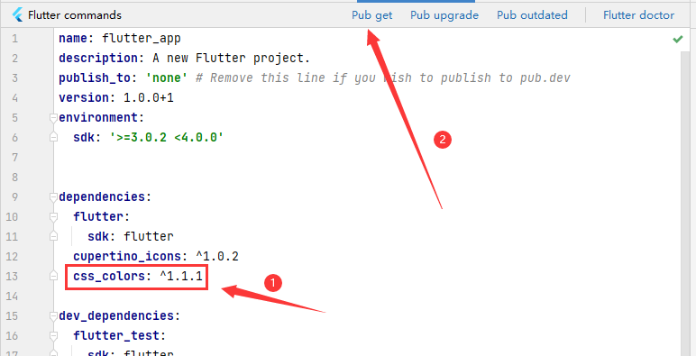
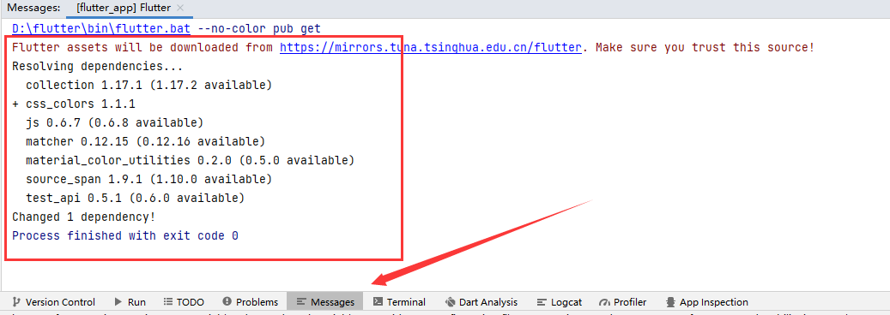

<!-- more -->

## 移动端跨平台技术演进  
  

## 垮端技术四要素  
- 高效率——研发效率、迭代速度
- 高性能——流畅度、内存表现、加载市场、包大小等
- 动态化——及时更新迭代
- 高一执性——多端UI展示一致


## Flutter特性和优势
1. 跨平台：一份代码多端运行，兼顾Android、IOS、Web、Windows、MacOS和Linux六个平台，减少平台差异适配，UI高度一致。
2. 高性能：release模式下的AOT编译Skia高性能自绘引擎，接近原生体验。
3. 高效：热重载、快速构建、开发效率高。
4. 开源协作：Google支持，开源、透明、可靠。
5. Dart语言：语言简洁、容易上手。


## Dart语言
1. 简单易学
2. JIT编译：高效开发
3. AOT编译：快速
4. 现代编程语言
5. 面向对象


国内大厂应用：阿里巴巴、字节跳动、百度、京东、美团、快手、贝壳。


## Flutter框架层次分析
  
从框架图可以看到，一共分为三层：
- 上层Framework层：纯Dart语言实现的一个响应式框架
- 中层Engine层：绝大部分由C++实现，也是flutter系统的核心引擎，提供了一系列的Flutter和核心的API底层的实现，如图形文字布局文件之类，是连接框架和系统的一个桥梁
- 底层的嵌入层：由平台对应的语言实现，在安卓上就是Java和C++，在iOS上由Objective-C/Objective-C++实现，嵌入层为Flutter系统提供了一个入口。Flutter系统通过入口访问底层系统提供的服务，比如输入法，绘制surface等。


## Flutter Engine线程模型
- Platform Task Runner：运行在平台上的主线程
- UI Task Runner：执行Dart root isolate
- GPU Task Runner：执行设备的GPU命令
- IO Task Runner：文件读取资源加载


## Flutter生命周期

Flutter理念，万物皆Widget：
  
核心思想使用Widget来构建你的UI界面，搭建界面，包括视图和交互处理。

Flutter中所说的生命周期，主要是指的statefullWidget的生命周期，主要包含下面几个阶段：
1. createState：是StatefullWidget中创建State的方法，当StatefullWidget被调用时会执行createState
2. initState：初始化state的初始化调用，一般在这里会执行state各个变量的初始赋值，同时也会在这里与服务端进行交互，即请求服务端的数据来调用state设置state
3. didChangeDependencies：当state对象的依赖发生变化的时候会被调用
4. Build：返回需要渲染的widget，由于build会被调用多次，因此在这个函数里面只能返回widget的相关逻辑，避免因为多次执行一些状态的异常。
5. reassemble：在debug模式下，每次热重载都会调用这个函数。
6. didUpdateWidget：在widget重新构建时，Flutter framework会调用Widget.canUpdate来检测Widget树中同一位置的新旧节点，然后决定是否需要更新。如果Widget.canupdate返回的是true，就会调用回调方法，父组件发生build情况下，子组件的这个方法才会被调用，这个方法调用后，一定会再次调用后面的build方法。
7. deactivate：在组件中被移除节点后会被调用。
8. dispose：如果组件被移除节点，然后还没有被插入到其它节点时，则会继续调用，dispose永久的给它删除掉，永久删除组件，并且释放它的组件资源


总结来说就是四个阶段：
1. 初始化阶段：createState 和 initState。
2. 组件创建阶段：didChangeDependencies 和 build。
3. 触发组件build：didChangeDependencies 和 setState 或 didUpdateWidget都会引发组件重新build
4. 销毁阶段：deactivate 和 dispose。


## 常用Widget用法


1. Text用法
```java
const Text(
  'You have pushed the button this many times:',//文字内容
  textAlign: TextAlign.right,//文本方向
  maxLines: 1,//文字行数
  overflow: TextOverflow.ellipsis,//文字溢出规则
  style:TextStyle(
    color: Colors.blue,//字体颜色
    fontSize: 18.0,//字体大小
    height:1.2,//字体高度
    fontFamily: "Courier",//字体样式
    backgroundColor: Colors.yellow,//字体背景颜色
    decoration: TextDecoration.underline//字体装饰
  )
),
```
2. Image用法
- 如果是网络图片
```java
Image(
    image: NetworkImage("https://www.baidu.com/img/PCtm_d9c8750bed0b3c7d089fa7d55720d6cf.png"),
    width: 200.0,
)
```
- 如果是本地图片，项目根目录下新建对应的静态资源文件，比如名叫`images`，然后`pubspec.yaml`文件下进行配置
```yaml
flutter:
  uses-material-design: true
  assets: [images/] # 加这一行
```
紧接着在项目内使用：
```java
Image(
    image: AssetImage("images/flutter.png"),//图片资源路径
    width: 200.0,//图片宽度
    height: 200.0,//图片高度
    alignment: Alignment.center,//图片对齐方式
    fit: BoxFit.contain,
    ),
```
`BoxFit`：图片的适应模式，有fill（拉伸填满至指定宽高）、contain（默认，不被拉伸，靠缩放来适应宽高的值）、cover（等比放大或居中填满，图片不会变形，超过部分会被裁剪）、fitWidth（宽度缩放指定宽度）、fitHeight（高度缩放指定高度）、none（图片无适应策略）
3. Column
4. Container
```java
class _MyHomePageState extends State<MyHomePage> {
  int _counter = 0;

  void _incrementCounter() {
    setState(() {
      _counter++;
    });
  }

  @override
  Widget build(BuildContext context) {
    return Scaffold(
      appBar: AppBar(
        backgroundColor: Theme.of(context).colorScheme.inversePrimary,
        title: Text(widget.title),
      ),
      body: const ContainerTest(),
    );
  }
}

class ContainerTest extends StatelessWidget{
  const ContainerTest({Key? key}) : super(key: key);

  @override
  Widget build(BuildContext context){
    return _buildImageColumn();
  }

  Widget _buildImageColumn(){
    return Column(
      children: [
        Container(
          decoration: BoxDecoration(
            border: Border.all(width: 10,color: Colors.black38),
            borderRadius: const BorderRadius.all(Radius.circular(8))
          ),
          margin: const EdgeInsets.all(4),
          child: Image.asset("images/flutter.png"),
        ),
        Container(
          margin: const EdgeInsets.all(20.0),
          color: Colors.orange,
          child: const Text("I am Flutter."),
        ),
        Container(
          padding: const EdgeInsets.all(20.0),
          color: Colors.orange,
          child: const Text("I am Flutter."),
        )
      ],
    );
  }
}
```
4. Row
```java
class RowTest extends StatelessWidget{
  const RowTest({Key? key}) : super(key: key);

  @override
  Widget build(BuildContext context){
    return _buildImageColumn();
  }

  Widget _buildImageColumn(){
    return const Column(
      crossAxisAlignment: CrossAxisAlignment.start,
      children: <Widget>[
         Row(
          mainAxisAlignment: MainAxisAlignment.center,
          children: [
             Text("Hello World!"),
             Text(" Flutter.")
          ],
        ),
        Row(
          mainAxisSize: MainAxisSize.min,//主轴方向所占用的空间
          mainAxisAlignment: MainAxisAlignment.center,
          children: [
            Text("Hello World!"),
            Text("Flutter."),
          ],
        ),
        Row(
          mainAxisAlignment: MainAxisAlignment.start,
          textDirection: TextDirection.rtl,//表示水平方向子组件的布局顺序
          children: [
            Text("Hello World!"),
            Text("Flutter."),
          ],
        )
      ],
    );
  }
}
```
5. Flex
```java
class FlexTest extends StatelessWidget{
  const FlexTest({Key? key}) : super(key: key);

  @override
  Widget build(BuildContext context){
    return Column(
      children: <Widget>[
        Flex(
          direction: Axis.horizontal,
          children: <Widget>[
            Expanded(//Flex配合Expanded实现弹性布局
                flex: 1,
                child: Container(
                  height: 30.0,
                  color: Colors.red,
                )
            ),
            Expanded(//Flex配合Expanded实现弹性布局
                flex: 2,
                child: Container(
                  height: 30.0,
                  color: Colors.green,
                )
            )
          ],
        ),
        Padding(
            padding: const EdgeInsets.only(top: 20.0),
            child: SizedBox(
              height: 100.0,
              child: Flex(
                direction: Axis.vertical,
                children: <Widget>[
                  Expanded(
                    flex: 2,
                    child: Container(
                      height: 30.0,
                      color: Colors.red,
                    ),
                  ),
                  const Spacer(
                    flex: 1,
                  ),
                  Expanded(
                    flex:1,
                    child: Container(
                      height: 30,
                      color: Colors.green,
                    ),
                  )
                ],
              ),
            ),
        )
      ],
    );
  }
}
```
6. ListView
```java
class ListViewTest extends StatelessWidget{
  const ListViewTest({Key? key}) : super(key: key);

  @override
  Widget build(BuildContext context){
    return _buildList();
  }

  Widget _buildList(){
    //ListView空间排列不下就自动滚动，支持列表懒加载
    return ListView(
      children: [
        _tile("123","456",Icons.theater_comedy),
        _tile("123","456",Icons.theater_comedy),
        _tile("123","456",Icons.theater_comedy),
        _tile("123","456",Icons.theater_comedy),
        _tile("123","456",Icons.theater_comedy),
        _tile("123","456",Icons.theater_comedy),
        _tile("123","456",Icons.theater_comedy),
        _tile("123","456",Icons.theater_comedy),
        _tile("123","456",Icons.theater_comedy),
        _tile("123","456",Icons.theater_comedy),
        _tile("123","456",Icons.theater_comedy),
        _tile("123","456",Icons.theater_comedy),
        _tile("123","456",Icons.theater_comedy),
      ],
    );
  }

  ListTile _tile(String title,String subtitle, IconData icon){
    return ListTile(
      title: Text(title,
        style: const TextStyle(
          fontWeight: FontWeight.w500,
          fontSize: 20
        )
      ),
      subtitle: Text(subtitle),
      leading: Icon(
        icon,
        color: Colors.blue[500],
      ),
    );
  }
}
```
或者用`ListView.builder`来创建
```java
class ListViewTest extends StatelessWidget{
  const ListViewTest({Key? key}) : super(key: key);
  ListTile _tile(String title,String subtitle, IconData icon){
    return ListTile(
      title: Text(title,
        style: const TextStyle(
          fontWeight: FontWeight.w500,
          fontSize: 20
        )
      ),
      subtitle: Text(subtitle),
      leading: Icon(
        icon,
        color: Colors.blue[500],
      ),
    );
  }
  @override
  Widget build(BuildContext context){
    return ListView.builder(
      itemCount: 100,
      itemExtent: 50.0,
      itemBuilder: (BuildContext context,int index){
        return ListTile(title: Text("$index"));
      },
    );
  }
}
```
7. GridView
```java
class GridViewTest extends StatelessWidget{
  const GridViewTest({Key? key}) : super(key: key);

  @override
  Widget build(BuildContext context){
    return GridView.extent(
        maxCrossAxisExtent: 150,
        padding: const EdgeInsets.all(4),
        mainAxisSpacing: 4,
        crossAxisSpacing: 4,
        // childAspectRatio: 2,//不填默认横宽比为1:1
        children: _buildGridTileList(30),
    );
  }

  List<Container> _buildGridTileList(int count) => List.generate(count, (i) => Container(child: Image.asset("images/flutter$i.png", fit:BoxFit.fill)));

}
```
8. Gesture
```java
class GestureTest extends StatefulWidget{
  const GestureTest({Key? key}) : super(key: key);

  @override
  State<StatefulWidget> createState(){
    return _GestureTestState();
  }
}

class _GestureTestState extends State<GestureTest>{
  String _operation ="No Gesture detected!";//保存事件名
  @override
  Widget build(BuildContext context){
    return Center(
      child: GestureDetector(
        child:Container(
          alignment: Alignment.center,
          color: Colors.blue,
          width: 200.0,
          height: 100.0,
          child:Text(
            _operation,
            style: TextStyle(color: Colors.white),
          ),
        ),
        onTap: () => updateText("Tap"),//点击
        onDoubleTap: () => updateText("DoubleTap"),//双击
        onLongPress: () => updateText("LonePress")//长按
      ),

    );
  }

  void updateText(String text){
    //更新显示的事件名
    setState(() {
      _operation=text;
    });
  }
}
```

---

## Flutter路由管理

Flutter中的理由管理和原生开发类似，无论是安卓还是IOS导航管理都会维护一个路由栈，路由入栈操作对应打开一个新的页面，路由出栈对应页面关闭的操作，而路由管理主要是指如何来管理路由栈。  
Flutter中通过Navigator组件来实现路由管理，`Navigator`方法会跳转到一个新的页面，pop会回退界面并且返回数据给主屏界面，pop方法可以接受第二个参数它是可选的，如果传递这个参数，数据会通过future的方法传递返回值


## 网络请求和序列化数据


1. 在`AndroidManifest.xml`添加网络请求权限(在application标签之外即可)：
```xml
<uses-permission android:name="android.permission.INTERNET"/>
```
## 包管理工具
1. Android使用Gradle来管理依赖
2. IOS使用Cocoapods来管理依赖
3. Node使用npm来管理依赖
4. flutter用yaml作为包管理工具，默认的配置文件是`pubspec.yaml`

如添加`css_colors`，然后点击`Pub get`：  

下载日志：  


或者在`pubspec.yaml`文件里添加后`css_colors`和其对应的版本号后，在项目终端运行以下命令：
```shell
flutter packages get
```

使用`css_colors`示例：
```java
import 'package:flutter/material.dart';
import 'package:css_colors/css_colors.dart';

void main() {
  runApp(
    Container(
      color: CSSColors.green,
    )
  );
}
```

## 如何引入dart文件

```java
import 'package:你的项目名/xxx.dart';
```

项目名对应的是在`pubspec.yaml`可以看到，即`name`的值


## 与原生平台通信——Platform Channel

   

## Flutter渲染原理


## Flutter常见优化策略
- 提供build效率：setState刷新数据尽量下发到底层节点。
- 提高paint效率：可以通过RepaintBoundry创建单独的layer减少重绘区域
- 减少build中逻辑处理：因为Widget在页面刷新过程中，会通过build重建，会被频繁调用，尽量仅在这里处理跟UI有关的逻辑
- 减少Opacity使用，尤其是在动画中，因为它会导致Widget的每一帧都会被重建，可以使用AnimatedOpacity 或 FadeInImage进行代替，尽量减少它的使用。
- 减少ClipPath、savaLayer使用：savaLayer会在GPU分配一块新的绘图缓冲区，切换绘图目标，这个操作是十分耗时的。而ClipPath会影响每个绘图指令，做一些相交的操作，相交之外的部分会被剔除掉，这也是一个比较耗时的操作。