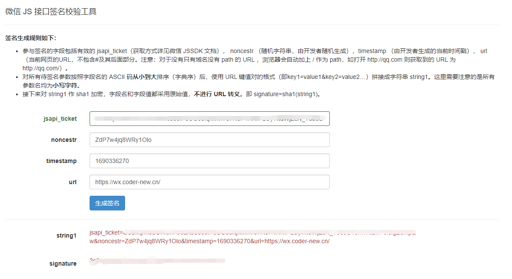
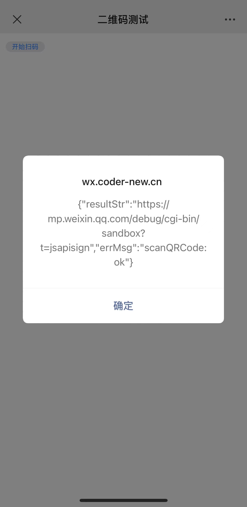

业务场景：在H5平台使用手机摄像头识别二维码，不想手搓代码，可以直接使用微信JS-SDK来实现。


<!-- more -->

## 引入JS-SDK


以下教程几乎可以在这里找到对应出处：[JSSDK使用步骤](https://developers.weixin.qq.com/doc/offiaccount/OA_Web_Apps/JS-SDK.html#2)

```html
<!-- 此链接同时支持http和https，最好使用https，以免生产环境是https调用不了http -->
<script src="https://res2.wx.qq.com/open/js/jweixin-1.6.0.js"></script>

<!-- 以下是备选链接，选一个即可，也是都支持的http和https -->
<script src="https://res.wx.qq.com/open/js/jweixin-1.6.0.js"></script>
```

## 通过config接口注入权限验证配置

```js
wx.config({
  debug: true, // 开启调试模式,调用的所有api的返回值会在客户端alert出来，若要查看传入的参数，可以在pc端打开，参数信息会通过log打出，仅在pc端时才会打印。
  appId: '', // 必填，公众号的唯一标识
  timestamp: , // 必填，生成签名的时间戳
  nonceStr: '', // 必填，生成签名的随机串
  signature: '',// 必填，签名
  jsApiList: [] // 必填，需要使用的JS接口列表
});
```


注意点：
1. 由于注册正式的公众号需要营业执照那些，很麻烦。因此官方给出了一键注册仅用于测试的公众号，[一键传送](https://mp.weixin.qq.com/debug/cgi-bin/sandbox?t=sandbox/login)。
2. appid想必有过小程序和公众号开发经验的并不陌生，这里介绍生成签名的过程，[官方对签名介绍文档](https://developers.weixin.qq.com/doc/offiaccount/OA_Web_Apps/JS-SDK.html#62)，简单来说这个过程，需要先根据你`appid`和`secret`获取`access_token`（测试公众号也有`appid`和`secret`，链接在第一点），然后根据返回的`access_token`再获取到`ticket`，这个返回的`ticket`用于生成签名。生成签名的规则可以看这一点链接的文档，官方也给出了工具以便[在线生成签名](https://mp.weixin.qq.com/debug/cgi-bin/sandbox?t=jsapisign)，这里尤其注意用于签名的`timestamp`、`nonceStr`、和`url`，特别是url！！！
3. jsApiList需要填写你所使用的JS接口列表，这里由于我们要使用微信的扫一扫，则填`scanQRCode`即可，更多的功能，可[查看这里](https://developers.weixin.qq.com/doc/offiaccount/OA_Web_Apps/JS-SDK.html#63)。
4. 然后在公众号下要添加安全的JS安全域名(有正式的公众号直接在[微信公众号平台](https://mp.weixin.qq.com/)登录，没有就在第一点介绍的[测试公众号平台](https://mp.weixin.qq.com/debug/cgi-bin/sandbox?t=sandbox/login)登录)。域名支持http和https，即80端口和443端口，端口号不用写，协议不用写。即如果我的域名是`https://test.coder-new.cn`，那你添加安全域名的时候只需要填`test.coder-new.cn`即可。
5. 记得将`debug`设为true，然后尽量在手机微信里打开，会有提示信息，一般如果没有配置正确，也是会提示`config`没有配置正确，如果报错就不用继续下一步了。报错信息指南可以看这里，对应也有相应的解决办法。[一直下滑到“附录5-常见错误及解决方法”](https://developers.weixin.qq.com/doc/offiaccount/OA_Web_Apps/JS-SDK.html#62)


当你完全配置好后，`debug`设为true，且在手机上打开测试链接，`config`配置成功会有以下提示弹窗：  
  

若没有，就不必进行下一步，请根据上面介绍的或给出的链接里自查。

附贴在线签名配置图：


## 调用微信扫一扫

需要注意的是，该api需要放在`wx.ready`方法里面，可查看[在线示例网站](https://www.weixinsxy.com/jssdk/)或者[下载源代码](https://www.weixinsxy.com/jssdk/sample.zip)

这里贴出我的示例代码：
```js
wx.ready(() => {
  document.querySelector("#btn").addEventListener("click", () => {
    wx.scanQRCode({
      needResult: 1,
      scanType: ["qrCode"],
      success: res => {
        // 这里为啥停留一秒，有社区说是bug问题，直接扫描可能会不返回结果（无反应），可查看：https://developers.weixin.qq.com/community/develop/doc/00040aa59e828087e59a70e2b51c00
        //或者参考下面完整的示例代码，用了async和await
        let timer = setTimeout(() => {
          alert(JSON.stringify(res));
          clearTimeout(timer);
        }, 1000);
      },
      error: error => {
        alert(JSON.stringify(error));
      },
    });
  });
});
```

[官网示例代码](https://developers.weixin.qq.com/doc/offiaccount/OA_Web_Apps/JS-SDK.html#49)


## 完整示例代码

```html
<!DOCTYPE html>
<html lang="zh-CN">
  <head>
    <meta charset="UTF-8" />
    <meta name="viewport" content="width=device-width, initial-scale=1.0" />
    <title>二维码测试</title>
    <script src="https://res2.wx.qq.com/open/js/jweixin-1.6.0.js"></script>
  </head>
  <body>
    <button id="btn">开始扫码</button>
  </body>
  <script>
    wx.config({
      debug: true,
      appId: "wx53eedcf27e57facf",
      timestamp: 1690336270,
      nonceStr: "ZdP7w4jq8WRy1Olo",
      signature: "3e063320b213cc14a27791b89910e4e970c6632e",
      jsApiList: ["scanQRCode"],
    });

    wx.ready(() => {
      document.querySelector("#btn").addEventListener("click", () => {
        wx.scanQRCode({
          needResult: 1,
          scanType: ["qrCode"],
          success: async res => {
            const result = await JSON.stringify(res.resultStr)
            alert(result);
          },
          error: error => {
            alert(JSON.stringify(error));
          },
        });
      });
    });
  </script>
</html>

```

## 调用扫一扫成功返回的结果

