## OSI网络参考模型
之所以说是参考，因为OSI网络实际中并不使用，我们只是把OSI网络模式作为参考。在网络出现问题的时候，可以从一个宏观的整体去分析和解决问题，而且搭建网络的时候也不并不一定需要划分为七层。
但是当今互联网广泛使用的是TCP/IP网络模型，它原本只有四层，随着人们的不断实践后发现，其实划分为5层会更加符合实际。
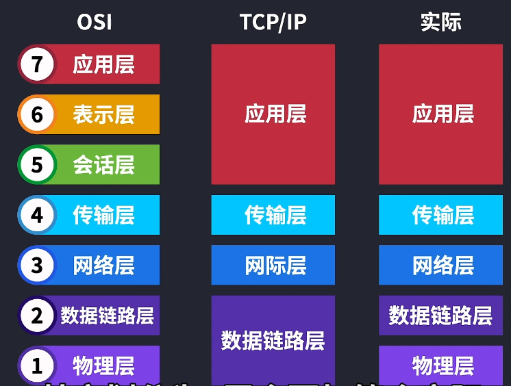

## OSI模型的目的
### 应用层
很简单，就是为了解决主机之间的网络通信，如华为和苹果电脑没法之间进行互联，但是可以通过OSI网络模型来进行沟通。就比如苹果电脑运行了一个项目，华为电脑用浏览器访问网站，这就可以交给应用层来进行交互了。常见的应用层协议就是HTTP。使得应用层就是最进阶用户的那一层，但是此时的应用层不过是逻辑上把两个应用连通，而实际连通是需要物理层的。

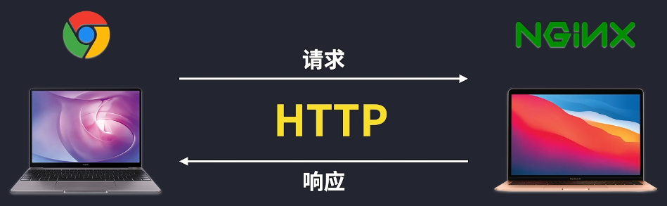

### 物理层
物理层传输的东西叫比特，就是无数0和1构成，可以用电、光或其它形式的电磁波来传输信号，数据从网络接口出去的以后会经过不同的网络拓扑，并不是一条线走到底的。因此也就需要中继器和集线器这样的设备

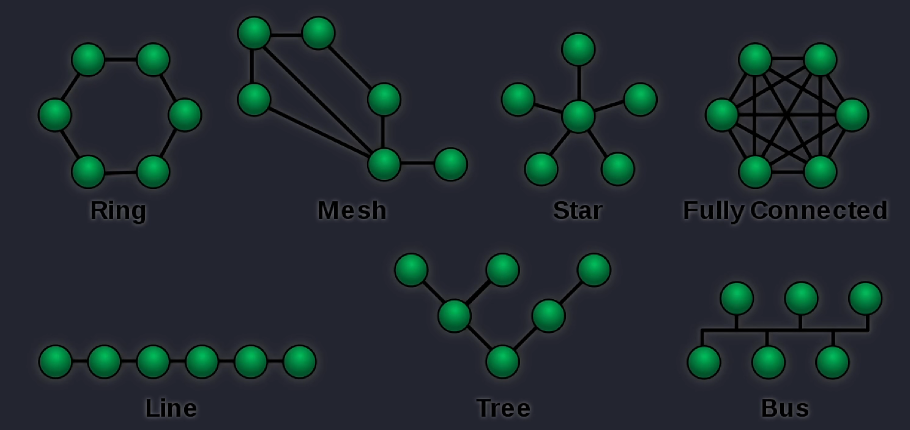

### 数据链路层
但还是只有中继器和集线器还是不够的，因为信号渠道哪台设备是需要定向的，因此需要高级一点的网络模型。在数据链路层这里，比特会被封装成帧，所谓帧就是这一层表示数据的特殊名字而已，在封装的时候会加上MAC地址（物理地址），网卡出厂的时候就有全球唯一的MAC地址，为的是可以通过MAC地址对不同设备进行数据的传输，就出现了交换机，这里说的是二层交换机。
举例：比如这里有一台交换机连接三台主机，当发送端发送数据的时候，交换机就知道了发送端的MAC地址，如果此时交换机也知道接收端的MAC地址，就可以把数据直接发送过去了。

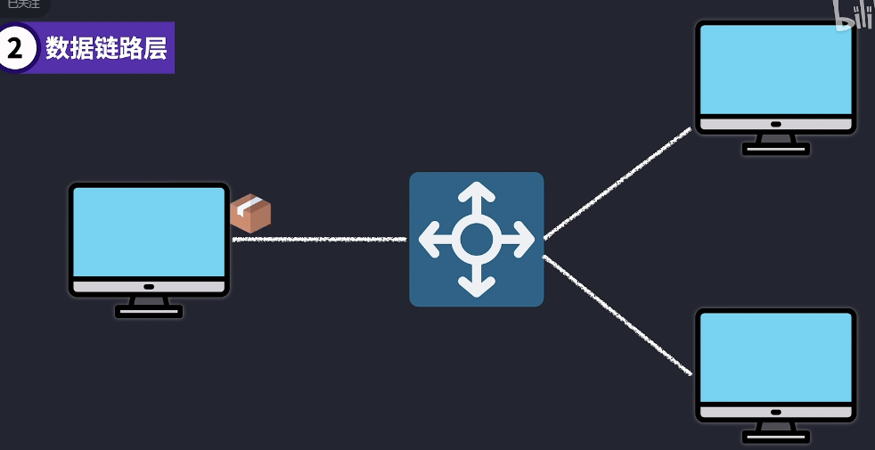

另外在物理层传输的时候，可能0会变成1，而1会变成0，这时候就会进行差错检测，以及一定的差错纠正，另外设备之间的传输能力以及接收能力也是一个问题。就比如一边“喷水式”发送，一边“夹水式”接收。因此需要流控制来避免这种不对称。

### 网络层
互联网是一张大网，这一层所在的是网络层，所以用MAC物理地址来作为唯一的寻址方法是不科学的。因为如果两张网卡的MAC地址相差就一个字母或数字，但是两张网卡却是天各一方，物理地址此时就很难做出快速地位。相当于我有你的名字，但是不知道你住哪里。因此需要IP地址来进行寻址和路由选择。IP这样的逻辑地址就是实现端到端的基础了，而不是物理地址那样跳到跳的传输。
说到路由选择，也就是路由器也是网络层的核心。包就是网络层里数据的名字，在封装为二层的帧之前就是包。

路由器根据包里的IP地址进行路由转发，地址管理和路由选择就是这一层的核心。

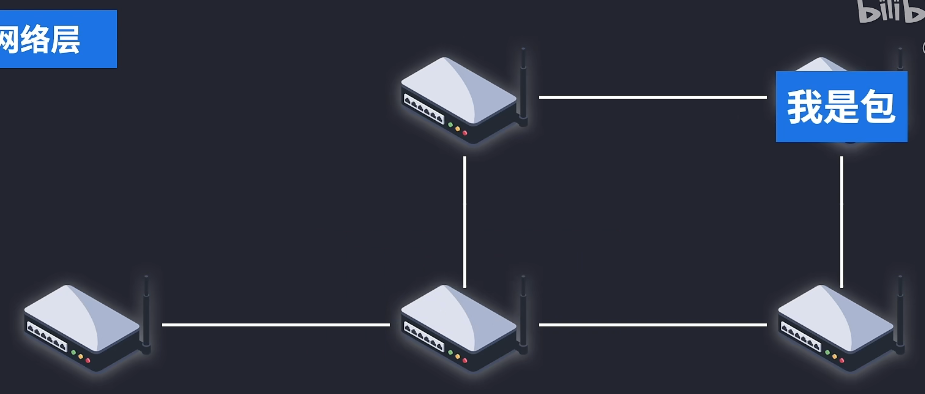

### 传输层
虽然有MAC地址和IP地址可以抵达对方主机，但是对方主机可能运行着无数多个软件进程，此时就需要用到端口号来做为地址来定位了。如客户端这里生成不同的端口号，即使同时访问HTTP端口号80也是没有问题的，因为此时可以根据不同的源端口号来做出响应就可以了，所以传输层（运输层）在网络层的端到端基础上实现了服务进程到服务进程的传输。

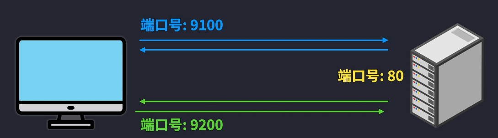

段就是传输层里数据的名字，在封装为三层包之间就是段，传输层管理两个节点之间的数据的传输，负责可靠传输和不可靠传输，也就是熟悉的TCP（可靠传输）和UDP（不可靠传输），另外还有新的名字叫QUIC。

其中TCP允许应用把字节流变成多份段，还不是整个字节数据完整地发送出去，传输层还有**流量控制**包确保传输速度，再加上**错误控制**来进行数据完整的接收

### 会话层
比如用户登录了某个网站，网站服务可以保持你登录状态，不用每次都输入账号和密码。当然网站服务会管理和控制登录状态，另外会话层会负责同步服务。如看电影看到一半关掉网站，再次打开网站登录账号会自动同步到上次看到的时间段。
### 表示层
不同计算机内部的各自表达方式可能不太相同，表示层就是来负责这样的转换，也就是编码和转码。数据往往还要进行加密，比方说HTTPS（SSL/TLS）就会对我们的数据进行加密和解密，另外还可能对文件进行压缩

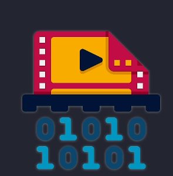

## 应用数据
应用层、表示层和会话层的数据统称为应用数据，或者应用负载，也可以叫上层数据，同时也叫报文。

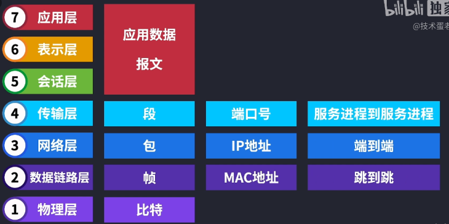

## 全部关联
客户端要发送数据，也就是报文，报文来到传输层，加上端口号，封装成段。
段来到网络层，加上IP地址，封装成包，注意这里的包是含有目标IP地址的，比较要知道数据要发送到什么地方，但是因为目标IP地址不是同一个网络下的。

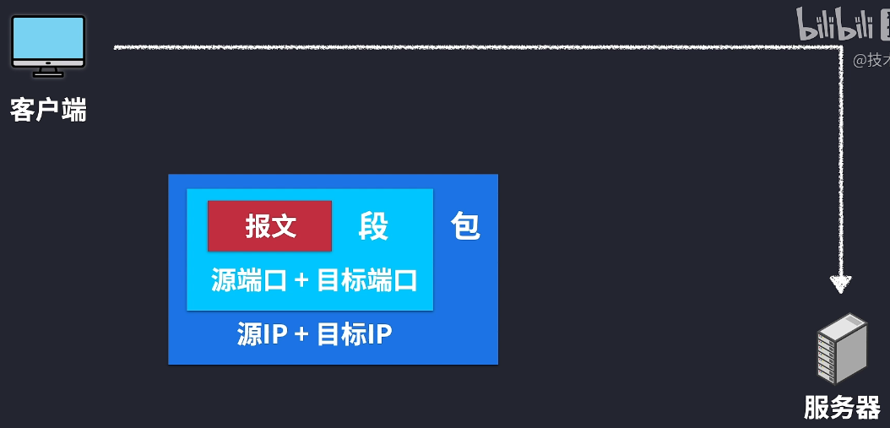

要发送到其它网络，就需要经过默认网关。

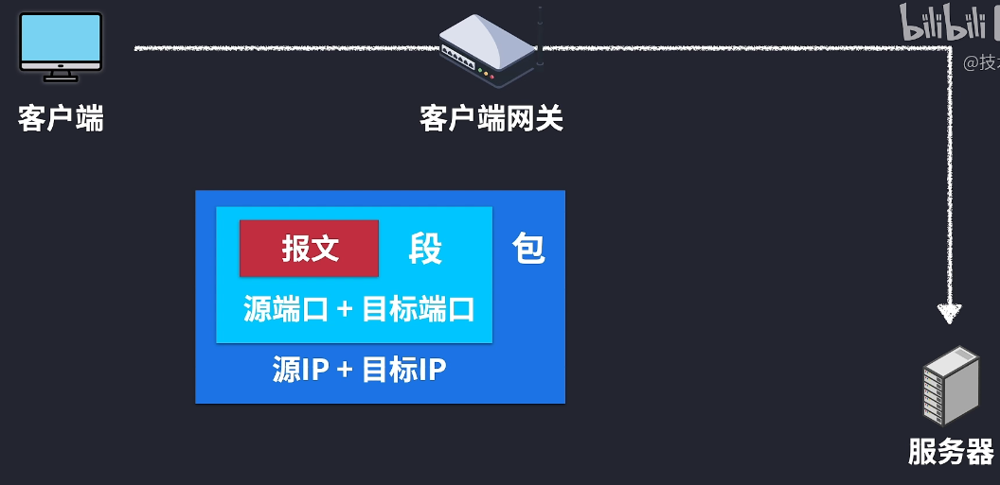

但是客户端主机最初并不知道默认网关的MAC地址，没有办法封装成帧，这个时候就可以用ARP协议来进行广播，找到网关IP对应的MAC地址，把包封装成帧，源MAC地址填自己的，目标MAC地址填广播的地址。

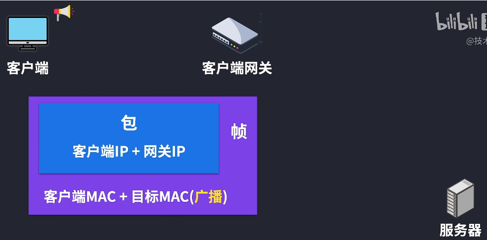

假设当前网络有个二层交换机，这个交换机只需要记录不同的接口对应的MAC地址就好了，交换机收到广播后就帮忙发送出去，“人手一份”。

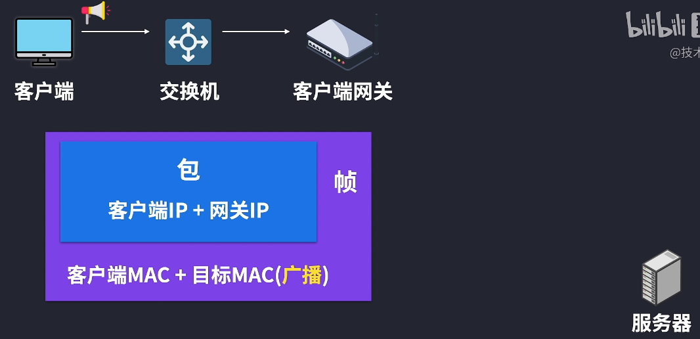

所以当默认网关收到消息后，查看了帧，发现了发送端的MAC地址。再解封发现包里面的IP地址，就会把客户端MAC地址和IP地址关联为一台主机，同时默认网关会把自己的IP地址放入包里，再结合自己的MAC地址封装成帧，默认网关就这样做出了响应。

这样原路访问就知道默认网关的MAC地址了。

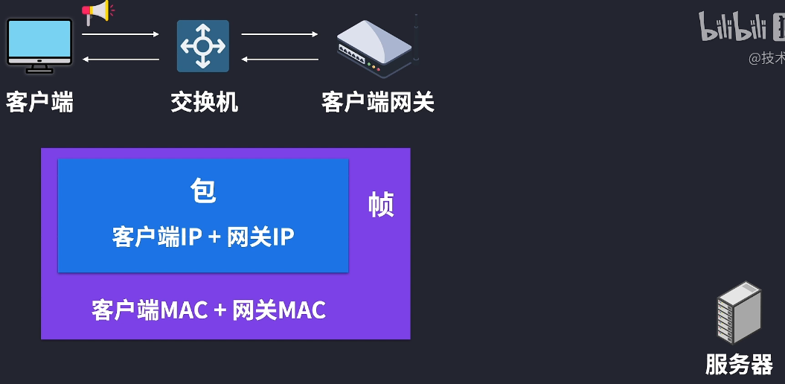

现在就可以封装成帧并且发送数据

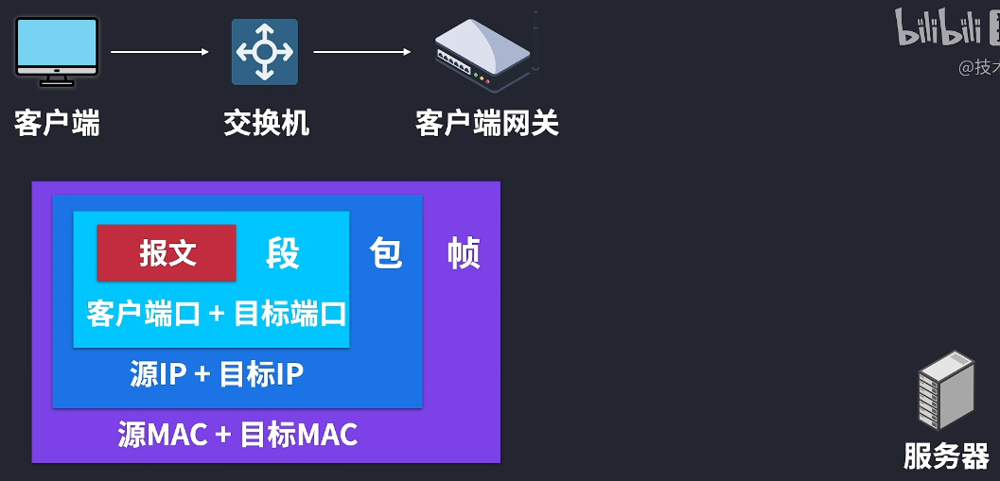

比特流到了默认网关的时候，解封为帧发现是发送给自己的。

再解封为包查看目标IP地址是在另一网络中，就会进行路由转发，最终到达目的网络，如果目标的网关知道目标IP地址和MAC地址是哪台主机，封装成帧就可以直接发送过去了。

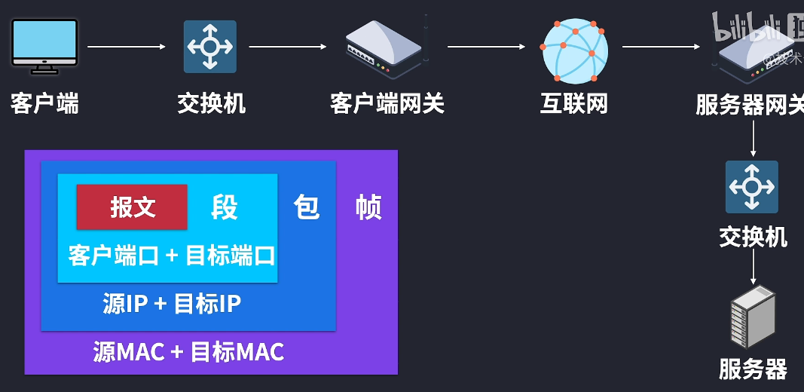

如果不知道，也还是可以用ARP进行广播，目标主机收到包确认是自己的IP地址以后

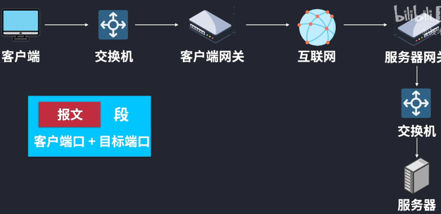

再次进行解封查看段可以发现源和源目标端口号	，用目标端口号给到指定的应用程序。

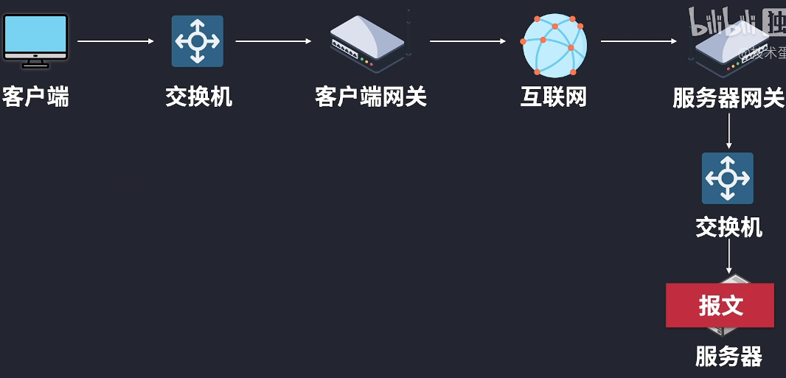

应用程序处理好后，就可以按照源的信息做出响应，回去的原理也是一样的

