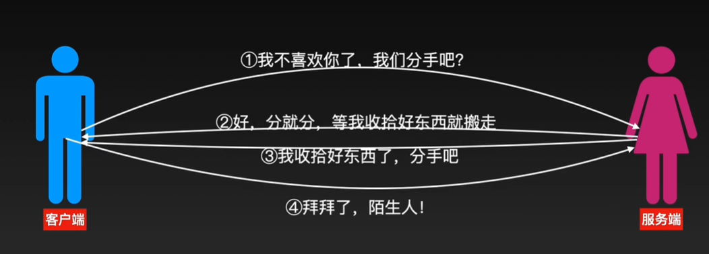
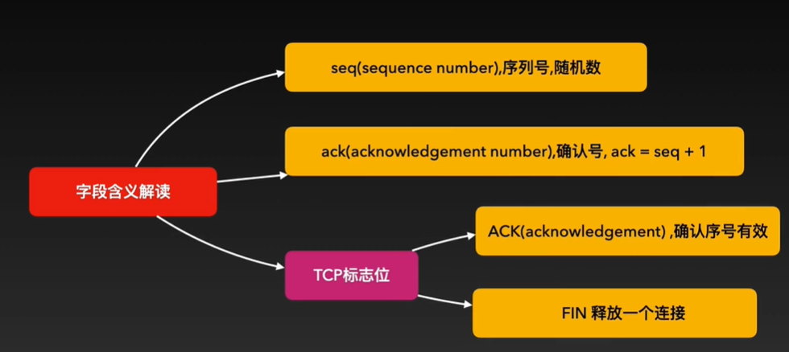
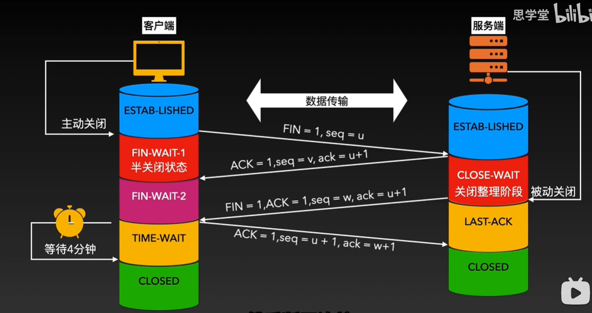

TCP四次挥手像极了一对即将分手的恋人：

真正了解四次挥手的时候需要知道以下以下字段的概念：

seq值代表序列号随机数的意思，小写ack代表确认号的意思，它的值一般等于发送方的seq值加一。
TCP标志位：
ACK的值为1，代表确认序号有效
FIN的值为1，代表释放一个连接

在TCP四次挥手之前，客户端和服务端都处于数据传输阶段，当断开一个连接的时候，客户端是主动关闭方，服务端是被动关闭方，客户端首先给服务端发送一条报文，FIN值等于1，代表释放一个连接，seq值等于u代表自己的一个随机序列号，此时客户端进入了fin wait 1阶段，也就是半关闭状态。
服务端收到客户端发来的报文后，知道了客户端有断开连接的需求，服务端立马回复客户端一条报文，大写的ACK值等于1代表收到了客户端的报文，seq值等于v，代表自己的一个随机序列号，小写的ack值等于u加1，也就是在客户端seq值基础上加1，代表收到了客户端的seq值，此时服务端进入了CLOSE-WAIT阶段，也就是做关闭整理工作。当客户端收到服务端的此条报文后，知道了服务端同意断开连接，然后就进入了FIN-WAIT2阶段，等待服务端做好关闭整理工作。
当服务端做好关闭整理工作后，会向客户端发送一条报文FIN值等于1，代表释放一个链接ACK值等于1，代表释放连接，seq值等于w，代表自己的一个随机序列号，小写的ack指令等于u加1，也就是在客户端seq基础上加1，此时服务端进入了last ack阶段，也就是最后确认阶段。
当客户端收到服务端发来的报文后，就立马回复服务端一条报文，大写的ACK值等于1，代表收到了服务端的报文。seq值等于u+1，也就是在上次seq基础上加1，小写的ack值等于w+1，也就是代表收到了服务端的seq值，此时客户端进入了TIME-WAIT阶段，在这个阶段客户端会等待4分钟，等待4分钟的目的就是确认服务端收到了自己发给服务端的报文，当服务端收到客户端发来的报文后，服务端就进入了closed阶段，然后客户端在等待4分钟后，确认服务端收到了自己的报文后，也进入了closed阶段，然后断开连接。

