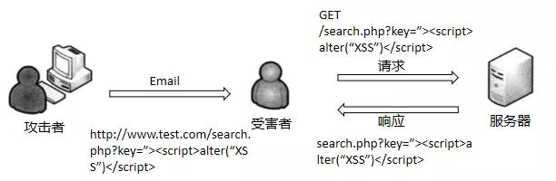

<!-- more -->


## XSS 概念

&emsp;&emsp;Cross-Site Scripting（跨站脚本攻击）简称XSS，是一种**代码注入攻击**。攻击者通过在目标网站注入恶意脚本，使之在用户的浏览器上运行。利用这些恶意脚本，攻击者可获取用户的敏感信息如Cookie、SessionID等，进而危害数据安全。为了和 CSS 区分，这里把攻击的第一个字母改成了 X，于是叫做 XSS。

&emsp;&emsp;XSS一直被认为是Web安全中危害较大的漏洞，在owasp的top10排行（OWASP是一个开源的、非盈利的全球性安全组织，致力于应用软件的安全研究）中一直处于前三。

本质的原理包含：  
在HTML中内嵌的文本中，恶意内容以`script`标签形成注入：
```html
<!-- 本来 div 里面要渲染的是123 -->
<div>123</div>

<!-- 结果注入了一个 script 标签加载了一段恶意代码 -->
<div><script src="xxxx"></script></div>
```

在标签属性中，恶意内容包含引号，从而突破属性值的限制，注入其它属性或者标签：
```html
<!-- 本来 value 里面要渲染123 -->
<input value="123">

<!-- 一段恶意代码 -->
<input value="1"><script src="xxx"></script>"> 
1"/><script src="xxx"></script> 

```

在标签的`href`、`src`等属性中，包含 JavaScript等可执行代码：
```html
<!-- 本来 href 里面要渲染一个跳转地址 -->
<a href="xxx">跳转</a>

<!-- 结果里面加入了js代码 -->
<a href="javascript:alert(1);">跳转</a>
```

在`onload`、`onerror`、`onclick`等事件中，注入不受控制代码：
```html
<!-- 本来 value 里面要渲染123 -->
<input value="123">

<!-- 一段恶意代码 -->
<input value="123"/>   
```

在`style`属性和标签中，包含类似`background-image:url("javascript:...")`的代码。

**注意：很多新版本浏览器已经可以防范**


## XSS 的分类

#### 反射性 XSS

&emsp;&emsp;有些情况下用户在请求后台时候，会携带一部分数据。当客户端进行访问某条链接时，攻击者可以将恶意代码植入到URL，如果服务端没有对URL携带的参数做判断或者进行过滤处理，直接返回响应页面，那么XSS攻击代码就会一起被传输到用户的浏览器，从而触发反射性XSS。


例如，当用户进行搜索时，返回结果通常会包括用户原始的搜索内容，如果攻击者精心狗仔包含XSS恶意代码的链接，诱导用户点击并成功执行后，用户的信息就可以被窃取，甚至可以模拟用户进行一些操作。它的利用过程如图：  



反射性特点：
&emsp;&emsp;反射型XSS不会永久存储用户的数据，仅发生在用户的一次访问过程之后。这个过程就像一次反射，因此得名反射XSS的触发条件比较苛刻，需要攻击者想方设法引导用户点击链接，但产生的危害不容忽视