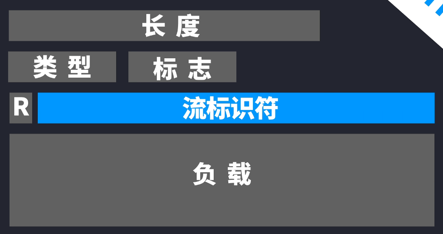
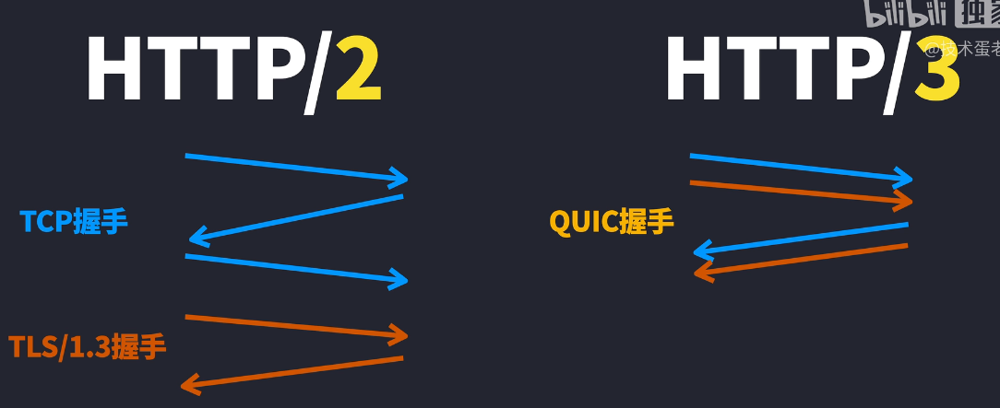
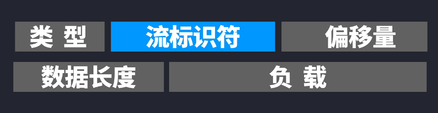
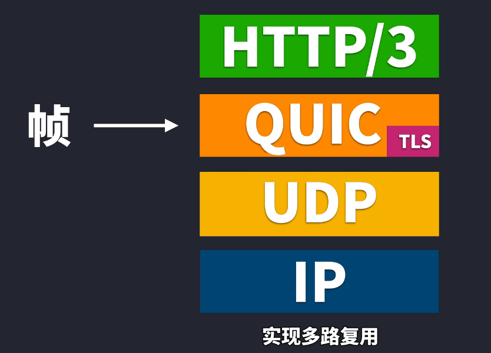
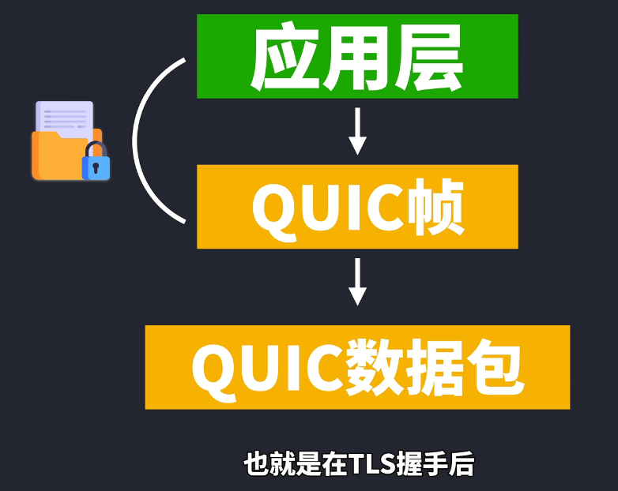
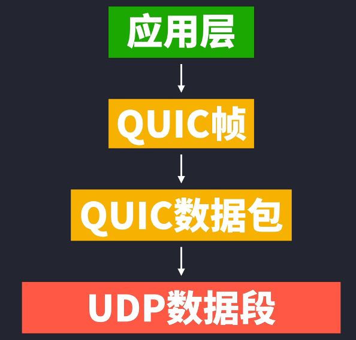
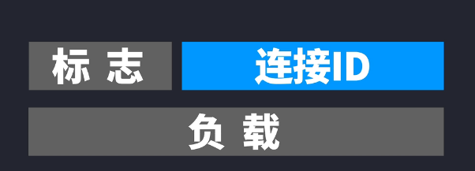

### HTTP/1.1
HTTP/1.1公布是1997年，“一次一份”是HTTP/1.1的核心，因为你发送一个HTTP请求的时候，是需要等收到HTTP响应，才可以再发送下一个HTTP请求。
一个网页假设只有HTML、CSS、JS文件组成，当用户打开一个网页需要与服务器进行TCP三次握手，建立TCP连接，此时服务器给客户端发送HTML文件，当浏览器收到HTML文件会根据文件再依次请求CSS、JS等文件。整个过程都是浏览器帮我们完成，因此给用户的直接感觉就是我只操作了一次，就完成了所有的事，其实不然。但是若在依次请求的队伍里有一个文件没收到，后续的文件也不会收到。这就会造成HTTP队头阻塞。
虽然对于HTTP1.1来说默认是持久连接（keep-alive）的，也就是保持这个TCP连接。就不需要对每个请求再来一轮TCP握手，请求和响应都可以放在同一个连接里面，但是自然而然一个连接肯定就会太慢了，连接太多又怕造成DDos攻击，因此各家浏览器允许的持久连接数都大不相同。Chrome默认的是同时6个连接，但是连接多也有问题，如果恰好一个文件没收到，比如HTML文件没收到就会导致页面没法渲染，这就会造成HTTP的队头阻塞。
为解决HTTP/1.1队头阻塞问题，HTTP/1.1里有个叫管线化的技术，意思就是单个连接可以发送多个请求。但是接收的时候，接收顺序必须按照发送顺序依次对应。这也造成很大的执行难度，如果第一个发送的响应，第二三个请求已经响应已经等到，但是迟迟等不来第一个请求响应。如果因为网络情况丢包了，那就GG了。请求的跟响应就没法依次对应。所以这也是很难看到浏览器会实际会用管线化这个技术。
网络协议方面也就没法解决这个问题，那就有些开发的黑科技了，以减少请求为目的。比如：
1. 把图片合并在一次，比如把点赞.jpg、收藏.jpg、投币.jpg合并成一张图片：一键三连.jpg，通过css来控制显示，这种图就叫精灵图或者雪碧图，可以减少请求次数。
2. Data URLs是另一种代替方案，就比如把图片进行base64，然后就可以以字符形式写进HTML或CSS等，就不要单独的一个图片文件。但是都知道base64很长，很不方便的代码维护，但是比如vite在打包的时候，当图片很少，它可以自动把图片转成base64，
3. 不把所有资源放在一台服务器上。前面说到浏览器会限制同一连接的请求数，其实是限制每个域的连接数，因此有些音视频、图片资源可以放在其它域名的服务器或者oss存储服务中，这时就可以通过网络地址访问这些资源，使得浏览器可以同时下载这些资源，就不用等前面资源下载后轮到下载音视频、图片这类资源。这种做法就是域名分片，缺点就是开发的复杂度被硬生生地提高了。
4. JS和CSS代码合并或把CSS、JS都整合到HTML文件里。
虽然减少请求方式可行，但是后面越来越多的访问都是HTTPS通信，否则网站就会提示用户站点不安全，导致原本通信前需要进行TCP三次握手，HTTPS里的TLS/1.2又要进行握手，握手后才可进行加密通信。虽然后面的TLS/1.3减少了来回次数，但是对于HTTP/1.1来说，这一来一回的负担还是太重了。因为网络是可能丢包的还有中间件出故障等等。
TCP除了三次握手的固定开销外，还会有个TCP慢启动，因为要进行拥塞控制。为什么会有TCP慢启动，因为要进行拥塞控制，也就是为了避免造成网络拥堵并且不知道网络的实际情况（有网、没网、网快、网慢、是否会丢包），因此一开始只会发送较小量的TCP数据段，到了后面会慢慢增加，因为会导致新访问网页刷新速度较慢，这就是TCP的开销。但是除了TCP的固定开销外，HTTP本身也会产生固定开销，请求和响应都是有各种首部的，且大部分首部都是重复的，也就是发完一次下一次还要发送，就比如cookie，每次请求都会携带cookie，或者token。这些不仅字符长，还每次请求都要携带，再加上HTTP/1.1是明文传输的，首部也并没有进行压缩，使得大部分首部又累赘又臃肿，于是后面就有了HTTP/2。

### HTTP/2
HTTP/2是在2015年公布的。HTTP/2的一大核心就是多路复用，多路复用的出来就是解决HTTP/1.1队头阻塞的问题。也许单个TCP连接就可以进行交错发送请求和响应，且单个请求和响应之间不影响，这样看起来没啥问题，但是忽略了一个重要问题就是：HTTP/2并不是单个文件就这样直接响应过去的，请求和响应报文都被划分为各个不同的帧，这个帧分为首部帧和数据帧，其实就是把原本HTTP报文的首部和实体给拆分为两部分，所以原本的HTTP报文就不再是原来的报文了，而有点像数据链路层的帧。

而这里因为新增了流标识符，使得帧可以不用按照顺序抵达对方那里，因为即使不按顺序到达，最终因为根据这个流标识符就可以按照顺序进行组合，而且帧类型里还可以设置优先级来标注流的权重。听起来貌似HTTP/2的多路复用很爽快地解决队头阻塞，但是还是既有优点又有缺点，就比如之前的HTTP/1.1报文主体压缩，首部压缩，但是HTTP/2这回就把首部也给压缩了，是因为引入了叫HPACK的压缩算法。
HPACK算法要求浏览器和服务器都保存一张静态只读的表。比如：“HTTP/1.1 200 OK”起始行，在HTTP/2里就变为“:status:200”，这带来的好处就是重复的首部在二次请求和响应的时候就可以直接去掉，另外像cookie这样的首部，可以作为动态信息加入动态表里，这样节省下来的资源更是客观的。再加上这个HTTP/2的帧并不是ASCII编码的报文，而是提前被转化为二进制的帧，解析出来更有效率。
HTTP/2还有逆天的技术就是服务器推送。很好理解就是，当浏览器请求服务器的时候，比如说要HTML文件，此时服务器会同时返回可能需要的文件，如CSS、JS等一次性全部发送出去。好处就是渲染更快，但是坏处就是如果用户不小心点错了，浏览器的缓存也就会更多了。服务器推送也可能会造成DDos非对称攻击，因此服务器推送也隐含着安全性问题。
但实际上HTTP/2比HTTP/1.1要安全很多，也可以说是其优点：
1、首先就是报文变为二进制帧，直接可读性更难、解析效率更快。
2、首部使用了HPACK的压缩算法进行压缩。
3、其次虽然HTTP/2并没有规定一定使用TLS加密，但是一般使用了HTTP/2都会默认使用TLS加密，不然可能大牌浏览器提示你站点不安全。而且HTTP/2的多路复用减少等待时间，久而久之HTTP/2必须用TLS了
缺点：
只是解决了HTTP应用层面的对头阻塞问题，但是还有传输层，HTTP是基于TCP的，HTTP/2的帧下来以后就要由TCP处理了，TCP不知道帧里面的内容哪个跟哪个是一次的。TCP还是按照自己的数据段来传送，如果中途有丢失的，还得重传，夸张点说，其实丢失的TCP数据段刚好是一行代码注释，也没办法，也得继续等待，这就是TCP层面的队头阻塞，比较好的方法就是把TCP也变成HTTP/2的帧那样，但是TCP协议是由操作系统的内核实现的，而短时间内我们也没法让整个世界所有电脑的操作系统进行一次革新升级。于是就有了HTTP/3的出现

### HTTP/3
HTTP/3是在2019年公布的。HTTP的一大核心就是“整合”。虽然我们很难把TCP进行快速地升级并且广泛应用，但是HTTP/3把TCP和TLS的握手过程整合在一起，直接减少了来回带来的开销

如果是恢复的会话，还可以不用握手，实现了0-RTT，但是TCP协议和TLS协议也不是说整合就整合的，实际上为了能够让HTTP/3进行部署，只能选择传输层的UDP协议了，并且基于UDP协议上新增了一个协议，也就是QUIC，QUIC整合了TCP和TLS，使得HTTP/3默认就是使用加密传输的，也可不严谨的说，是TCP/2.0。

但不能说的是UDP/2.0，很多人觉得使用TCP就慢，使用UDP就是快，所以QUIC快的原因就是基于UDP的缘故，QUIC其实也是因为要能够广泛部署才只能用UDP的，但实际上大部分机制还是采用UDP的，但是QUIC必须要解决TCP队头阻塞的问题。从应用层那边过来的数据就会被封装成QUIC帧，QUIC帧就与HTTP/2的帧很像，也是加了“流标识符”。

但和HTTP/2不同的是，HTTP/3的应用层上并没有所谓的帧概念，把数据帧移到了QUIC里面，相当于传输层就有了数据帧，从源头解决了队头阻塞的问题，实现多路复用。

而QUIC帧又再次被封装为QUIC帧又再次被封装为QUIC数据包，QUIC数据包会加上一些信息，这里最重要的就是加了Connection ID连接ID，如果网络发生全面改变，比如从wifi切换到移动流量，虽然IP地址发生改变，但是因为客户端和服务端都协商好了连接ID，因此可以用连接ID来识别为同一个连接，避免再次握手，这是QUIC其中一个速度快的原因之一。且QUIC数据包会把里面的QUIC帧也给加密了，也就是在TLS握手后，QUIC帧的内容被加密了，接着QUIC数据包会被UDP封装成数据段，UDP就会加上端口号。当我们选择HTTP/3通信的时候，QUIC就像TCP那样开启连接，QUIC数据包就是在这连接通道里收发的。

