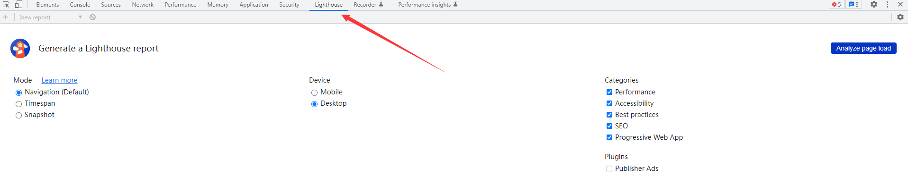

## 什么是Lighthouse

Lighthouse是一种用于提高网页质量的开源自动化工具。可以针对任何网页、公共网页或需要身份验证的网页运行它。它对性能、可访问性、渐进式Web应用程序、SEO等进行审核。


## 如何使用Lighthouse
可以在Chrome DevTools中使用或作为Node模块运行Lighthouse。使用的时候为Lighthouse提供一个需要审核的URL。它会对页面运行一系列审核，然后生成一份关于页面运行情况的报告。从那里，使用失败的审核作为如何改进页面的指标。每个审计都有一个参考文档，解释为什么审计很重要，以及如何解决它。  
同时还可以使用Lighthouse Cli来防止网页性能下降。

**具体使用**
1. Chrome DevTools
   按F12即可找到：  
   
2. From the command line
   - 使用Node全局安装`Lighthouse`
     ```bash
        npm install -g  lighthouse
     ```
   - 测试网站
     ```bash
        lighthouse <url>
     ```
3. As a Node module
   [参考代码](https://github.com/GoogleChrome/lighthouse/blob/main/docs/readme.md#using-programmatically)
4. From a web UI
   一个在线网站，输入对应网址进行分析，[点击跳转](https://pagespeed.web.dev/)  
   对应的[指标说明文档](https://developers.google.com/speed/docs/insights/v5/about?hl=zh-cn#categories)