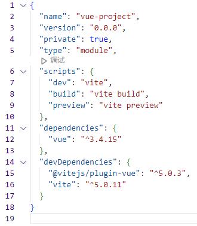
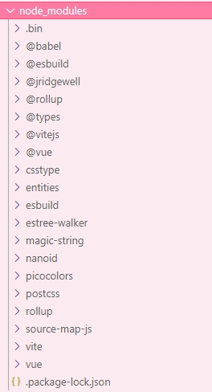
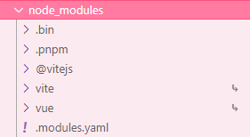

:::info 摘要
幻影依赖也叫幽灵依赖，通过本文你将了解什么叫幻影依赖。
:::

## 1 什么是幻影依赖

通过一个例子来说明什么是幻影依赖：
1. 首先打开终端，输入`npm init vue@latest`创建一个vue的项目。
2. 创建完成项目后，打开项目根目录下的`package.json`文件，可以看到生产依赖和开发依赖。
     
   &emsp;&emsp;其中可以看到`vue`属于生产依赖，也就是打包时(运行`npm run build`)，会将vue打包进去，而`@vitejs/plugin-vue`和`vite`都属于开发依赖，即只是在开发环境会用到，打包的时候是不会将这些打包进正式包的。  
   &emsp;&emsp;也由此可见，这个项目理应只是需要三个依赖包，即`vue`、`@vitejs/plugin-vue`和`vite`。此时就运行`npm run install`。
3. 运行完成后，观察根目录下的`node_modules`的文件，可以看到不止有`package.json`下所涉及到的依赖：  
     
   在`package.json`下所多出来的依赖，就是幻影依赖了，本质上是`vue`、`@vitejs/plugin-vue`、`vite`所涉及的其它依赖，也会下载到项目当中

## 2 幻影依赖所造成的问题

&emsp;&emsp;根据上一节所说的，我们可以知道幻影依赖就是在`package.json`中没有开发者主动声明安装的依赖，而是所安装依赖中所涉及的依赖它自己自动安装的。而幻影依赖所造成的问题，也就是我们可以在项目中使用我们没有主动声明安装的库。

&emsp;&emsp;例如：如果幻影依赖中`lodash`，我们可以直接引用，并且可以正常使用，但是`lodash`并不是开发者主动声明安装的。这种现象也就是所谓幻影依赖或幽灵依赖取名的来源，莫名其妙没有安装但是能够使用。

这看起来是个好处，但是会造成一些比较严重的问题：
1. 版本问题。比如当安装的依赖所涉及的幽灵依赖的版本是v1，我们在项目中引用了幽灵依赖，并且调用了比如`chunk`方法。但是如果某一天安装的依赖版本升级了，并且可能所涉及的幽灵依赖的版本也会跟着升级了，升级成了v2，正好删除了`chunk`方法或者更改了一下方法名，此时可能会因此产生连锁的问题，给我们开发者的感觉就是，没升级之前好好的，升级之后全部报错，并且项目也启动不了了。此时这种问题是非常耗费时间和精力排查问题的，并且还可能修改代码或者自己再手动重新安装之前对应的版本。

2. 依赖丢失问题。 有些依赖只是在开发环境中使用的，打包时候并不会跟着打包进去，此时如果使用了开发环境所需的幽灵依赖，就会造成开发环境可以正常运行，但是在生产环境中就运行不起来了。这就造成了依赖丢失的问题。

3. 大规模项目或团队协作开发造成的问题。当项目达到一定规模后，会安装上很多依赖，当我们决定是否导入某个库的时候，并不一定会老是看`package.json`找是否安装了某个依赖，而是直接先引入看看有没有智能提示，如果有只能提示代表已经安装，如果没有则没有安装，但是前面也提到了，如果使用npm管理包，那么引入的可能并不是开发者主动声明安装的，而是引用了幽灵依赖，此时是会造成一些问题的。

## 3 幻影依赖解决办法

&emsp;&emsp;解决幽灵依赖的方法是换一个包管理工具，即不用npm或yarn，可以使用pnpm来管理包，它出色的点在于：
1. 解决了幽灵依赖。核心思想是将下载的包存在一个文件夹里边，然后`node_modules`里面只是正常的在`package.json`里声明所需的依赖，而重复的依赖包pnpm会用软链接的方式链接到公共的包仓库里。  

2. 大大节省了磁盘空间，避免一个项目重复下载某一版本的库，
   
如何用pnpm管理包：
1. 电脑上装有node
2. 如果项目根目录下有`node_modules`一定要删除。
3. 查看电脑上是否全局安装了pnpm，可以用`pnpm -v`回车看是否打印了版本号。如果打印不出来，就使用`npm i pnpm -g`来进行全局安装
4. 下载完成后，打开终端，在以项目的根目录的路径下输入`pnpm i`等待安装完成，此时可以再次查看`node_modules`下的依赖：  
  
&emsp;&emsp;其中`.pnpm`文件夹下的文件就是由`pnpm`进行的软链接幽灵依赖，同时也大大节省了磁盘空间并且解决了幽灵依赖的问题

## 4 软链接和硬链接

何为软链接和硬链接，待补充

